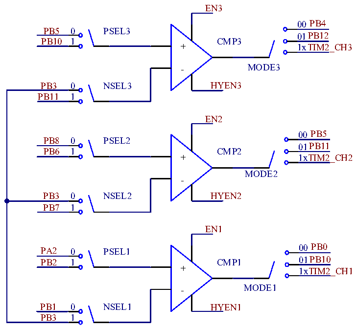

<!-- source-page: 291 -->

[← p.290](0290.md) · [index](../README.md) · [PDF p.291](https://ch32-riscv-ug.github.io/CH32L103/datasheet_zh/CH32L103RM.PDF#page=291) · [p.292 →](0292.md)

<!-- header: CH32L103应用手册 https://wch.cn -->

图23-2 CMP结构图  
 <!-- rendered from the PDF; verify at https://ch32-riscv-ug.github.io/CH32L103/datasheet_zh/CH32L103RM.PDF#page=291 -->

🖼 Text parsed from the figure above

EN3  
00PB4  
PB5 0 PSEL3  
01PB12  
PB10 1 CMP3  
+ 1xTIM2_CH3  
MODE3  
PB3 0 NSEL3 HYEN3  
PB11 1  
EN2  
00PB5  
PB8 0 PSEL2  
01PB11  
PB6 1 CMP2  
+ 1xTIM2_CH2  
MODE2  
-  
PB3 0 NSEL2 HYEN2  
PB7 1  
EN1  
00PB0  
PA2 0 PSEL1  
01PB10  
PB2 1 CMP1  
+ 1xTIM2_CH1  
MODE1  
PB1 0 NSEL1 HYEN1  
PB3 1  

注：如果比较器输出使用定时通道，通过定时器捕获用于查看比较器输出状态。  

### 23.2.7 比较器CMP 中断

比较器专属的外部中断（EXTI）线 — EXTI22(COMP唤醒事件)，可产生中断或事件，可用于SLEEP、  
STOP低功耗模式下唤醒。  
使用外部中断唤醒时，所需条件为：  
1）配置对应的外部中断通道的事件使能位（EXTI_EVENR）；  
2）配置比较器输出电平触发沿，选择上升沿触发、下降沿触发或双边沿触发；  
3）在内核的PFIC中配置EXTI中断，以保证其可以正确响应。  
4）使能CMP。  
使用事件时，所需条件为：  
1）配置对应的外部中断通道的事件使能位（EXTI_EVENR）；  
2）配置比较器输出电平触发沿，选择上升沿触发、下降沿触发或双边沿触发；  
3）使能CMP。  
通过配置WKUP_MD[1:0]来选择CMP输出信号的唤醒源。  

<!-- p291-table-001 (table-23-1@1) -->
<table><caption>表23-1 CMP输出信号的唤醒源选择</caption><tr><th>设置WKUP_MD[1:0]</th><th>01</th><th>10</th><th>11</th><th>00</th></tr><tr><td>唤醒CMP输出信号的电平</td><td>双边沿</td><td>上升沿</td><td>下降沿</td><td>无效</td></tr></table>

注：当CMP将产生一个中断请求，对应的中断线22标志位也会被置位。对标志位写1可以清除该标  
志位。  
<!-- image: p291-draw-image-00001 bbox=[507.84, 786.36, 527.28, 796.68] -->
<!-- footer: V2.2 286 -->
