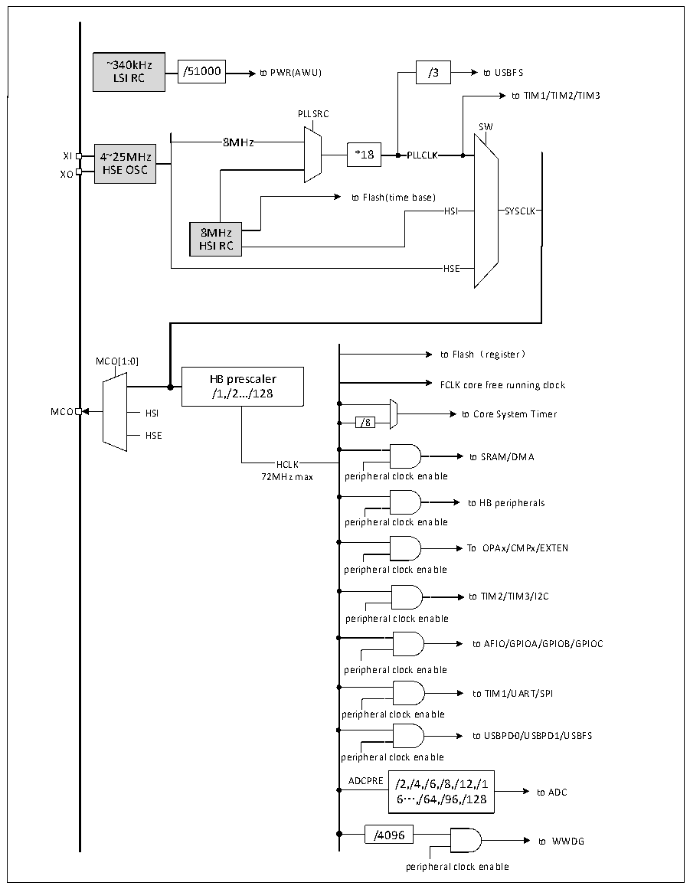

<!-- source-page: 8 -->

[← p.7](0007.md) · [index](../README.md) · [PDF p.8](https://ch32-riscv-ug.github.io/CH32M030/datasheet_en/CH32M030DS0.PDF#page=8) · [p.9 →](0009.md)

<!-- header: CH32M030 Datasheet https://wch-ic.com -->

Figure 1-3 Clock tree block diagram  
 <!-- rendered from the PDF; verify at https://ch32-riscv-ug.github.io/CH32M030/datasheet_en/CH32M030DS0.PDF#page=8 -->

🖼 Text parsed from the figure above

~340kHz  
/51000  /51000  
LSI RC /51000 to PWR(AWU) /3 to USBFS  
to TIM1/TIM2/TIM3  
PLLSRC  
SW  
8MHz  
XI 4~25MHz *18  
HSE OSC  
XO  
to Flash(time base)  
HS  HS  
SYSCLK  SYSCLK  
HSI SYSCLK  
8MHz  
HSI RC  
HSE  HSE  
to Flash（register）  
MCO[1:0]  
HB prescaler  
FCLK core free running clock  
/1,/2.../128  
MCO HSI to Core System Timer  
/8  
HSE  
to SRAM/DMA  
HCLK  
72MHz max peripheral clock enable  
to HB peripherals  
peripheral clock enable  
To OPAx/CMPx/EXTEN  
peripheral clock enable  
to TIM2/TIM3/I2C  
peripheral clock enable  
to AFIO/GPIOA/GPIOB/GPIOC  
peripheral clock enable  
to TIM1/UART/SPI  
peripheral clock enable  
to USBPD0/USBPD1/USBFS  
peripheral clock enable  
ADCPRE /2,/4,/6,/8,/12,/1  
6…,/64,/96,/128 to ADC  
/4096  
to WWDG  
peripheral clock enable  

<!-- image: p8-draw-image-00001 bbox=[514.32, 784.08, 533.76, 794.28] -->
<!-- footer: V1.2 5 -->
