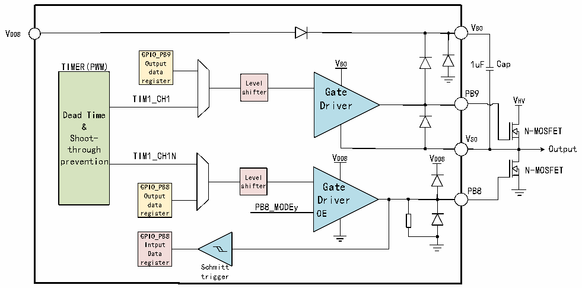

<!-- source-page: 16 -->

[← p.15](0015.md) · [index](../README.md) · [PDF p.16](https://ch32-riscv-ug.github.io/CH32M030/datasheet_en/CH32M030DS0.PDF#page=16) · [p.17 →](0017.md)

<!-- header: CH32M030 Datasheet https://wch-ic.com -->

Figure 1-4 Structural block diagram of single half-bridge driver  
 <!-- rendered from the PDF; verify at https://ch32-riscv-ug.github.io/CH32M030/datasheet_en/CH32M030DS0.PDF#page=16 -->

🖼 Text parsed from the figure above

VB0  
VDD8  
GPIO_PB9  
TIMER(PWM) Output VB0 1uF Cap  
data  
register Level  
shifter Gate PB9  
TIM1_CH1  
VHV  
Driver  
Dead Time  
&amp;  
N-MOSFET  
Shoot- VS0  
through Output  
prevention TIM1_CH1N VDD8 VDD8  
N-MOSFET  
Level  
GPIO_PB8 shifter Gate PB8  
Output Driver  
data PB8_MODEy  
register OE  
GPIO_PB8  
Intput  
Data  
register  
Schmitt  
trigger  

<em>Note: Cap is off-chip capacitor; N-MOSFET is off-chip N-type MOSFET power tube.</em>  

### 1.4.21 General-purpose Input/Output Interface (GPIO)

The system provides 3 sets of GPIO ports with 37 GPIO pins (PA0~PA8, PA10~PA15, PB0~PB15, PC0~PC5).  
All GPIO pins can be configured as outputs (push-pull or open-drain) by software, and all GPIO pins except PB7,  
PB9, PB11, PB13 and PB15 can be configured as input or multiplexed peripheral functional ports. Most GPIO  
pins are shared with digital or analog multiplexing peripherals, providing a locking mechanism to freeze the IO  
configuration to avoid accidental writing to I/O registers.  
PB8～PB15 are pre-driven MV I/O pins powered by VDD8, PB7 is a high-voltage open-drain output pin, PC5 is a  
high-voltage HV I/O pin powered by VHV, and the rest are ordinary I/O pins powered by VDD33.  
PB9, PB11, PB13 and PB15 are push-pull outputs, and the output is low by default, so input is not supported.  
Except PB7～PB15 and PC5, all GPIO pins support controllable pull-ups, among which CC1/CC2/CC3/CC4  
provide multistage pull-up current.  
PB0 and PB1 have built-in pull-down resistors that can be turned on by default, adjusted and turned off, which are  
adjusted and controlled by two groups of PDE and DAC in EXTEN_CTLR1, and can provide pull-down current;  
CC1/CC2/CC3/CC4 if there is a suffix r, it means that the controllable Rd pull-down resistor defined by the  
built-in Type-C specification is turned on by default; PA0/CC1R and PA1/CC2R pins have built-in controllable Rd  
pull-down resistors, so it is recommended to turn off the pull-down when used as GPIO push-pull output. PB8,  
PB10, PB12 and PB14 have built-in pull-down resistors that cannot be turned off; None of the other GPIO pins  
have built-in pull-down resistors.  
MV I/O pins (PB8~PB15) are powered by VDD8. Changing the power supply of VDD8 will change the high value  
of MV pin output level to adapt to the external interface level. Among them, the power supply of PB9, PB11,  
PB13 and PB15 is bootstrapping power supply based on VDD8, which is VB when high level is output and VS  
when low level is output. HV I/O pin PC5 is powered by VHV, and the external interface level can be adapted by  
changing the high value of output level of HV I/O pin. The ordinary I/O pin is powered by VDD33, and the external  
<!-- image: p16-draw-image-00001 bbox=[518.88, 784.08, 538.32, 794.28] -->
<!-- footer: V1.2 13 -->
