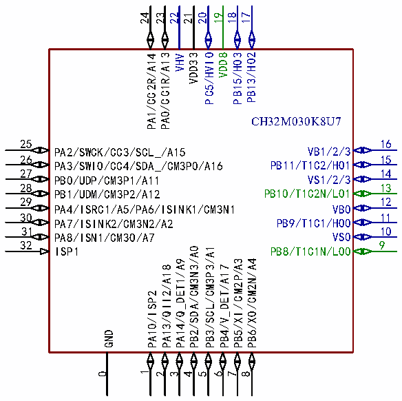

<!-- source-page: 20 -->

[← p.19](0019.md) · [index](../README.md) · [PDF p.20](https://ch32-riscv-ug.github.io/CH32M030/datasheet_en/CH32M030DS0.PDF#page=20) · [p.21 →](0021.md)

<!-- header: CH32M030 Datasheet https://wch-ic.com -->

 <!-- p20-cluster-01 uncaptioned graphics, rendered from the PDF; verify at https://ch32-riscv-ug.github.io/CH32M030/datasheet_en/CH32M030DS0.PDF#page=20 -->

🖼 Text parsed from the figure above

24  
23  
22 21  
20  
19  
18 17  
PA1/CC2R/A14 PA0/CC1R/A13 VHV VDD33 PC5/HVIO VDD8 PB15/HO3 PB13/HO2  
CH32M030K8U7  
25  
16  
VB1/2/3  
PA2/SWCK/CC3/SCL_/A15  
26  
15  
PB11/T1C2/HO1  
PA3/SWIO/CC4/SDA_/CM3P0/A16  
27  
14  
VS1/2/3  
PB0/UDP/CM3P1/A11  
28  
13  
PB10/T1C2N/LO1  
PB1/UDM/CM3P2/A12  
29  
12  
VB0  
PA4/ISRC1/A5/PA6/ISINK1/CM3N1  
30  
11  
PB9/T1C1/HO0  
PA7/ISINK2/CM3N2/A2  
31  
10  
VS0  
PA8/ISN1/CM3O/A7  
32  
9  
PB8/T1C1N/LO0  
PB2/SDA/CM3N3/A0 PB3/SCL/CM3P3/A1  
ISP1  
PA14/Q_DET1/A9  
PB5/XI/CM2P/A3 PB6/XO/CM2N/A4  
PA13/QII2/A18  
PB4/V_DET/A17  
PA10/ISP2  
GND  
1 4 5 6 7 8  
0  
2 3  

CH32M030G8R7  
1  
28  
PB1/UDM/T2C3/CM3P2/A12 PB0/UDP/T2C2/CM3P1/A11  
2 27  
PA7/ISINK2/CM3N2/A2 PA3/SWIO/CC4/T2C1/CM3P0/A16  
3 26  
PA8/ISN1/CM3O/A7 PA2/SWCK/CC3/A15  
4 25  
ISP1 GND  
5 24  
PA10/ISP2 VHV  
6 23  
PA11/ISN2/A8 VDD33  
7 22  
PB4/V_DET/A17 VDD8  
8 21  
PB5/XI/CM2P/A3/PA13/T1BK_/QII2/A18 PB13/T1C3/HO2  
9 20  
PB6/XO/CM2N/A4 VB2  
10 19  
PB8/T1C1N/LO0 VS2  
11 18  
VS0 PB12/T1C3N/LO2  
12 17  
VB0 PB11/T1C2/HO1  
13 16  
PB9/T1C1/HO0 VB1  
14 15  
PB10/T1C2N/LO1 VS1  
Note: The alternate functions in the pin diagram are abbreviated.  
Example: A: ADC_(A13: ADC_IN13)  
T: TIM_(T2C4:TIM2_CH4, T1C1N: TIM1_CH1N, T1BK:TIM1_BKIN)  
CM3: CMP3_(CM3P2: CMP3_P2, CM3N2: CMP3_N2)  
CM2: CMP2_(CM2P: CMP2_P, CM2N: CMP2_N)  
SWCK: SWCLK  
SWI0: SWDIO  
ISRC: ISOURCE  
<!-- image: p20-draw-image-00001 bbox=[518.88, 784.08, 538.32, 794.28] -->
<!-- footer: V1.2 17 -->
