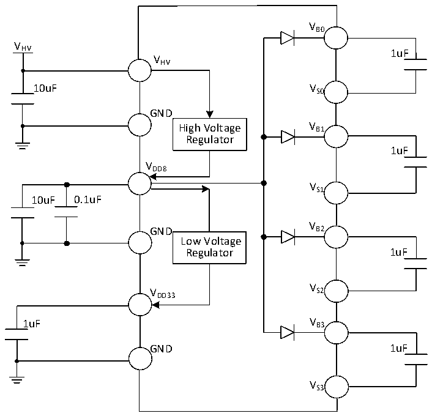

<!-- source-page: 27 -->

[← p.26](0026.md) · [index](../README.md) · [PDF p.27](https://ch32-riscv-ug.github.io/CH32M030/datasheet_en/CH32M030DS0.PDF#page=27) · [p.28 →](0028.md)

<!-- header: CH32M030 Datasheet https://wch-ic.com -->

# Chapter 3 Electrical Characteristics

## 3.1 Test Condition

Unless otherwise specified and marked, all voltages are based on GND.  
All minimum and maximum values will be guaranteed under the worst environmental temperature, power supply  
voltage and clock frequency conditions. Typical values can be used for design guidance based on one of the  
following three environments:  
1. Single VHV power supply, room temperature 25℃, VHV= 12V;  
2. External direct power supply for VDD8, room temperature 25℃, VHV= 12V, VDD8= 8V, at this time, VDD8≤  
VHV; is required;  
3. External direct power supply for VDD33 and VDD8, room temperature 25℃, VHV= 12V, VDD8= 8V, VDD33=  
3.3V, at this time, VDD33≤ VDD8≤ VHV is required.  
The data obtained through comprehensive evaluation, design simulation or process characteristics will not be  
tested in the production line. On the basis of comprehensive evaluation, the minimum and maximum values are  
obtained by statistics after sample testing. Unless otherwise specified as measured values, the characteristic  
parameters shall be guaranteed by comprehensive evaluation or design.  
Power supply scheme:  

Figure 3-1-1 Typical circuit for conventional power supply (Single VHV power supply)  
 <!-- rendered from the PDF; verify at https://ch32-riscv-ug.github.io/CH32M030/datasheet_en/CH32M030DS0.PDF#page=27 -->

🖼 Text parsed from the figure above

VB0  
V  
HV 1uF  
VHV  
10uF VS0  
GND  
High Voltage V B1  
Regulator  
1uF  
VDD8  
VS1  
10uF 0.1uF  
V  
GND B2  
Low Voltage  
Regulator 1uF  
V  
V S2  
DD33  
1uF V B3  
GND 1uF  
VS3  

<!-- image: p27-draw-image-00001 bbox=[518.88, 784.08, 538.32, 794.28] -->
<!-- footer: V1.2 24 -->
