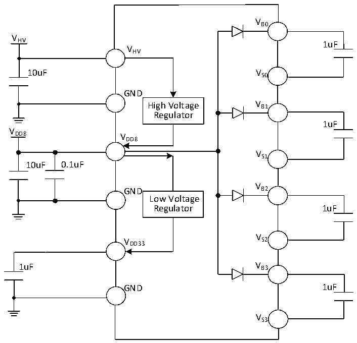

<!-- source-page: 28 -->

[← p.27](0027.md) · [index](../README.md) · [PDF p.28](https://ch32-riscv-ug.github.io/CH32M030/datasheet_en/CH32M030DS0.PDF#page=28) · [p.29 →](0029.md)

<!-- header: CH32M030 Datasheet https://wch-ic.com -->

Figure 3-1-2 Typical circuit for conventional power supply (Single VDD8 power supply)  
 <!-- rendered from the PDF; verify at https://ch32-riscv-ug.github.io/CH32M030/datasheet_en/CH32M030DS0.PDF#page=28 -->

🖼 Text parsed from the figure above

VB0  
V  
HV 1uF  
VHV  
10uF VS0  
GND  
High Voltage V B1  
Regulator  
1uF  
V  
DD8 V  
DD8  
VS1  
10uF 0.1uF  
V  
GND B2  
Low Voltage  
Regulator 1uF  
V  
V S2  
DD33  
1uF V B3  
GND 1uF  
VS3  

<!-- image: p28-draw-image-00001 bbox=[518.88, 784.08, 538.32, 794.28] -->
<!-- footer: V1.2 25 -->
