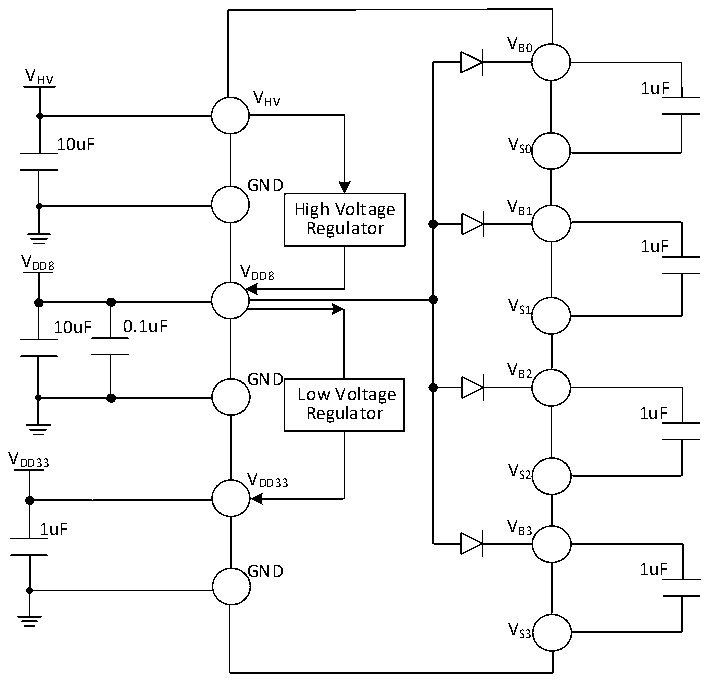

<!-- source-page: 29 -->

[← p.28](0028.md) · [index](../README.md) · [PDF p.29](https://ch32-riscv-ug.github.io/CH32M030/datasheet_en/CH32M030DS0.PDF#page=29) · [p.30 →](0030.md)

<!-- header: CH32M030 Datasheet https://wch-ic.com -->

Figure 3-1-3 Typical circuit with conventional power supply (External direct power supply for VDD33 and VDD8)  
 <!-- rendered from the PDF; verify at https://ch32-riscv-ug.github.io/CH32M030/datasheet_en/CH32M030DS0.PDF#page=29 -->

🖼 Text parsed from the figure above

VB0  
V  
HV 1uF  
VHV  
10uF VS0  
GND  
High Voltage V B1  
Regulator  
1uF  
V  
DD8 V  
DD8  
VS1  
10uF 0.1uF  
V  
GND B2  
Low Voltage  
Regulator 1uF  
V  
DD33 V  
V S2  
DD33  
1uF V B3  
GND 1uF  
VS3  

## 3.2 Absolute Maximum Ratings

Stresses at or above the absolute maximum ratings listed in the table below may cause permanent damage to the  
device.  

<!-- p29-table-001 (table-3-1@1) pages 29-30 -->
<table><caption>Table 3-1 Absolute maximum ratings</caption><tr><th>Symbol</th><th colspan="2">Description</th><th>Min.</th><th>Max.</th><th>Unit</th></tr><tr><td rowspan="2" style="text-align:left">TA</td><td rowspan="2" style="text-align:left">Ambient temperature at work</td><td style="text-align:left">CH32M030C8T7, CH32M030C8U7CH32M030G8R7, CH32M030K8U7</td><td>-40</td><td>105</td><td>℃</td></tr><tr><td>CH32M030C8U3</td><td>-40</td><td>125</td><td>℃</td></tr><tr><td style="text-align:left">TS</td><td colspan="2">Ambient temperature during storage</td><td>-40</td><td>150</td><td>℃</td></tr><tr><td style="text-align:left">V -GNDHV</td><td colspan="2" style="text-align:left">External main supply voltage (V ) HV</td><td>-0.3</td><td>30</td><td>V</td></tr><tr><td style="text-align:left">V -GNDDD8</td><td colspan="2" style="text-align:left">Supply voltage of internal low voltage regulator and MV I/0 pin (V ) DD8</td><td>-0.3</td><td>12</td><td>V</td></tr><tr><td style="text-align:left">V -GNDDD33</td><td colspan="2" style="text-align:left">Power supply voltage of common I/O pin and analog part (V ) DD33</td><td>-0.3</td><td>3.8</td><td>V</td></tr><tr><td rowspan="3" style="text-align:left">VIN</td><td colspan="2" style="text-align:left">Input voltage on HV high voltage I/O pin PC5</td><td>-0.3</td><td style="text-align:left">V +7HV</td><td>V</td></tr><tr><td colspan="2">Voltage on HV high voltage I/O pin PB7</td><td>-0.3</td><td>40</td><td>V</td></tr><tr><td colspan="2" style="text-align:left">Input voltage on high-voltage I/O pin CCx (there may be leakage)</td><td>-0.3</td><td>28</td><td>V</td></tr><tr><td></td><td colspan="2">Input voltage on common I/O pin</td><td>-0.3</td><td style="text-align:left">V +0.3DD33</td><td>V</td></tr><tr><td style="text-align:left">VB</td><td colspan="2">High-side bootstrap supply voltage</td><td>-0.3</td><td>40</td><td>V</td></tr><tr><td style="text-align:left">VBPEAK</td><td colspan="2" style="text-align:left">High-side bootstrap 1% duty cycle pulse voltage</td><td>-0.3</td><td>42</td><td>V</td></tr><tr><td style="text-align:left">VS</td><td colspan="2">High side floating ground voltage</td><td>-2</td><td>30</td><td>V</td></tr><tr><td style="text-align:left">VSPEAK</td><td colspan="2" style="text-align:left">High-side suspended 1% duty cycle pulse voltage</td><td>-5</td><td>32</td><td>V</td></tr><tr><td style="text-align:left">VB_S</td><td colspan="2" style="text-align:left">Voltage difference between high-side bootstrap power supply and floating ground</td><td>-0.3</td><td>12</td><td>V</td></tr><tr><td style="text-align:left">VHO</td><td colspan="2">Output voltage of high-side driver</td><td style="text-align:left">V -0.3S</td><td style="text-align:left">V +0.3B</td><td>V</td></tr><tr><td style="text-align:left">VLO</td><td colspan="2">Output voltage of low-side driver</td><td>-0.3</td><td style="text-align:left">V +0.3DD8</td><td>V</td></tr><tr><td rowspan="2" style="text-align:left">VESD(HBM)</td><td colspan="2" style="text-align:left">ESD electrostatic discharge voltage to external pins USB and PD (HBM)</td><td colspan="2">4K</td><td>V</td></tr><tr><td colspan="2" style="text-align:left">ESD electrostatic discharge voltage (HBM) to external pins USB and PD.</td><td colspan="2">2K</td><td>V</td></tr><tr><td style="text-align:left">IPEAKVB</td><td colspan="2" style="text-align:left">V built-in diode 1% duty cycle pulse output current B</td><td></td><td>70</td><td>mA</td></tr><tr><td style="text-align:left">IAVVB</td><td colspan="2" style="text-align:left">V built-in diode continuous output current B</td><td></td><td>7</td><td>mA</td></tr><tr><td style="text-align:left">IVHV</td><td colspan="2" style="text-align:left">Continuous input current (supply current) for all V pins. HV</td><td></td><td>60</td><td>mA</td></tr><tr><td style="text-align:left">IGND</td><td colspan="2" style="text-align:left">Total current (outflow current) of all GND common ground pins</td><td></td><td>200</td><td>mA</td></tr><tr><td rowspan="3" style="text-align:left">IIO</td><td colspan="2" style="text-align:left">Sink current or source current on HV high-voltage I/O pins</td><td></td><td>+/-5</td><td>mA</td></tr><tr><td colspan="2" style="text-align:left">Sink current or source current on MV pre-drive I/O pins</td><td></td><td>+/-80</td><td>mA</td></tr><tr><td colspan="2" style="text-align:left">Sink current or source current on other common I/O pins</td><td></td><td>+/-30</td><td>mA</td></tr><tr><td rowspan="2" style="text-align:left">IINJ(PIN)</td><td colspan="2">XI pin of HSE</td><td></td><td>+/-4</td><td>mA</td></tr><tr><td colspan="2">Sink current on other pins</td><td></td><td>+/-4</td><td>mA</td></tr><tr><td style="text-align:left">∑IINJ(PIN)</td><td colspan="2" style="text-align:left">Total injection current of all IO and control pins</td><td></td><td>+/-20</td><td>mA</td></tr></table>

<!-- image: p29-draw-image-00001 bbox=[518.88, 784.08, 538.32, 794.28] -->
<!-- footer: V1.2 26 -->
