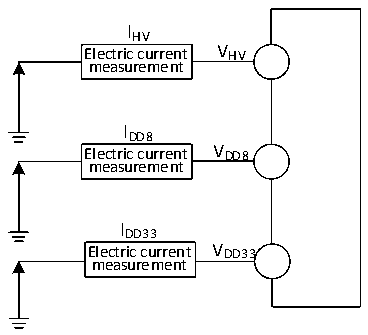

<!-- source-page: 32 -->

[← p.31](0031.md) · [index](../README.md) · [PDF p.32](https://ch32-riscv-ug.github.io/CH32M030/datasheet_en/CH32M030DS0.PDF#page=32) · [p.33 →](0033.md)

<!-- header: CH32M030 Datasheet https://wch-ic.com -->
factors include operating voltage, ambient temperature, I/O pin load, the software configuration of the product, the  
operating frequency, flip rate of the I/O pin, the location of the program in memory and the executed code, etc.  
The current consumption measurement method is as follows:  

Figure 3-2 Current consumption measurement  
 <!-- rendered from the PDF; verify at https://ch32-riscv-ug.github.io/CH32M030/datasheet_en/CH32M030DS0.PDF#page=32 -->

🖼 Text parsed from the figure above

IHV  
Electric current V HV  
measurement  
IDD8  
Electric current V DD8  
measurement  
IDD33  
Electric current V DD33  
measurement  

The microcontroller is in the following conditions:  
Under the condition of room temperature VHV=12V (VDD8=8V, VDD33=3.3V), during the test, I/O ports supporting  
pull-up input are configured in pull-up input mode, while others are configured in analog input mode. HSE=8M,  
HSI=8M (calibrated). Enable or turn off the power consumption of all peripheral clocks.  

<!-- p32-table-001 (table-3-5@1) -->
<table><caption>Table 3-5 Typical current consumption in Run mode, data processing code runs from the internal Flash</caption><tr><th rowspan="3">Symbol</th><th rowspan="3">Parameter</th><th rowspan="3" colspan="2">Condition</th><th colspan="2">Typ.</th><th rowspan="3">Unit</th></tr><tr><td rowspan="2" style="text-align:left">All peripherals enabled</td><td>All peripherals</td></tr><tr><td>disabled</td></tr><tr><td rowspan="10" style="text-align:left">IHV</td><td rowspan="10" style="text-align:left">Supply current in Run mode</td><td rowspan="5" style="text-align:left">Running in high-speed internal RC oscillator (HSI), HB prescaler is used to reduce the frequency.</td><td style="text-align:left">F = 72MHz HCLK</td><td>12.0</td><td>6.3</td><td rowspan="5">mA</td></tr><tr><td style="text-align:left">F = 48MHz HCLK</td><td>9.0</td><td>4.9</td></tr><tr><td style="text-align:left">F = 24MHz HCLK</td><td>5.9</td><td>3.5</td></tr><tr><td style="text-align:left">F = 8MHz HCLK</td><td>1.9</td><td>1.4</td></tr><tr><td style="text-align:left">F = 4MHz HCLK</td><td>1.4</td><td>1.1</td></tr><tr><td rowspan="5" style="text-align:left">Running on high-speed external clock (HSE), HB pre-frequency division is used to reduce the frequency.</td><td style="text-align:left">F = 72MHz HCLK</td><td>12.2</td><td>6.5</td><td rowspan="5">mA</td></tr><tr><td style="text-align:left">F = 48MHz HCLK</td><td>9.2</td><td>5.1</td></tr><tr><td style="text-align:left">F = 24MHz HCLK</td><td>6.1</td><td>3.7</td></tr><tr><td style="text-align:left">F = 8MHz HCLK</td><td>2.1</td><td>1.6</td></tr><tr><td style="text-align:left">F = 4MHz HCLK</td><td>1.6</td><td>1.3</td></tr></table>

<em>Note: The above are measured parameters.</em>  

<!-- p32-table-002 (table-3-6@1) pages 32-33 -->
<table><caption>Table 3-6 Typical current consumption in Sleep mode, data processing code runs from internal Flash or SRAM</caption><tr><th>Symbol</th><th>Parameter</th><th colspan="2">Condition</th><th colspan="2">Typ.</th><th>Unit</th></tr><tr><td rowspan="2"></td><td rowspan="2"></td><td rowspan="2" colspan="2"></td><td rowspan="2" style="text-align:left">All peripherals enabled</td><td>All peripherals</td><td rowspan="2"></td></tr><tr><td>disabled</td></tr><tr><td rowspan="10" style="text-align:left">IHV</td><td rowspan="10" style="text-align:left">Supply current in SLEEP mode (peripheral power supply and clock holding at this time)</td><td rowspan="5" style="text-align:left">Running in high-speed internal RC oscillator (HSI), HB prescaler is used to reduce the frequency.</td><td style="text-align:left">F = 72MHz HCLK</td><td>9.5</td><td>3.9</td><td rowspan="5">mA</td></tr><tr><td style="text-align:left">F = 48MHz HCLK</td><td>7.1</td><td>3.1</td></tr><tr><td style="text-align:left">F = 24MHz HCLK</td><td>4.7</td><td>2.3</td></tr><tr><td style="text-align:left">F = 8MHz HCLK</td><td>1.1</td><td>0.6</td></tr><tr><td style="text-align:left">F = 4MHz HCLK</td><td>0.7</td><td>0.5</td></tr><tr><td rowspan="5" style="text-align:left">Running on high-speed external clock (HSE), HB pre-frequency division is used to reduce the frequency.</td><td style="text-align:left">F = 72MHz HCLK</td><td>9.9</td><td>4.2</td><td rowspan="5">mA</td></tr><tr><td style="text-align:left">F = 48MHz HCLK</td><td>7.5</td><td>3.4</td></tr><tr><td style="text-align:left">F = 24MHz HCLK</td><td>5.0</td><td>2.6</td></tr><tr><td style="text-align:left">F = 8MHz HCLK</td><td>1.4</td><td>0.9</td></tr><tr><td style="text-align:left">F = 4MHz HCLK</td><td>1.0</td><td>0.8</td></tr></table>

<!-- image: p32-draw-image-00001 bbox=[518.88, 784.08, 538.32, 794.28] -->
<!-- footer: V1.2 29 -->
