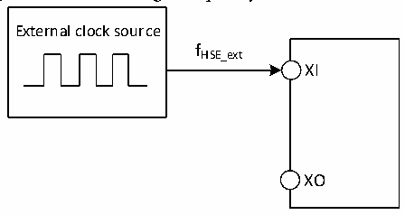
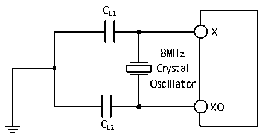

<!-- source-page: 34 -->

[← p.33](0033.md) · [index](../README.md) · [PDF p.34](https://ch32-riscv-ug.github.io/CH32M030/datasheet_en/CH32M030DS0.PDF#page=34) · [p.35 →](0035.md)

<!-- header: CH32M030 Datasheet https://wch-ic.com -->

> ⬆ **Table continued** — rendered in full at [page 33](0033.md). <!-- p34-table-001 -->

<em>Note: 1. Failure to meet this condition may cause level recognition error.</em>  

Figure 3-3 External high-frequency clock source circuit  
 <!-- rendered from the PDF; verify at https://ch32-riscv-ug.github.io/CH32M030/datasheet_en/CH32M030DS0.PDF#page=34 -->

🖼 Text parsed from the figure above

External clock source  
fHSE_ext  
XI  
XO  

<!-- p34-table-002 (table-3-9@1) -->
<table><caption>Table 3-9 High-speed external clock generated from a crystal/ceramic resonator</caption><tr><th>Symbol</th><th>Parameter</th><th>Condition</th><th>Min.</th><th>Typ.</th><th>Max.</th><th>Unit</th></tr><tr><td style="text-align:left">FXI</td><td>Resonator frequency</td><td></td><td>4</td><td>8</td><td>25</td><td>MHz</td></tr><tr><td style="text-align:left">RF</td><td>Feedback resistor (no external)</td><td></td><td></td><td>250</td><td></td><td>kΩ</td></tr><tr><td style="text-align:left">CLOAD</td><td style="text-align:left">Suggested load capacitance and corresponding crystal serial impedance RS</td><td style="text-align:left">R = 60Ω(1) S</td><td></td><td>20</td><td></td><td>pF</td></tr><tr><td style="text-align:left">I2</td><td>HSE drive current</td><td style="text-align:left">V = 3.3V, 20p load DD33</td><td></td><td>0.3</td><td></td><td>mA</td></tr><tr><td style="text-align:left">g m</td><td>Transconductance of oscillator</td><td>Startup</td><td></td><td>16</td><td></td><td>mA/V</td></tr><tr><td style="text-align:left">t SU(HSE)</td><td>Startup time</td><td style="text-align:left">V is stable DD</td><td></td><td>2(2)</td><td></td><td>ms</td></tr></table>

<em>Note: 1. 25M crystal ESR is recommended not more than 80Ω, less than 25m can be appropriately relaxed.</em>  
<em>2. Startup time refers to the time difference between when HSEON is turned on and when HSERDY is set.</em>  
Circuit reference design and requirements:  
The load capacitance of the crystal is subject to the recommendation of the crystal manufacturer, generally CL1=  
CL2.  

Figure 3-4 Typical circuit of external 8M crystal  
 <!-- rendered from the PDF; verify at https://ch32-riscv-ug.github.io/CH32M030/datasheet_en/CH32M030DS0.PDF#page=34 -->

🖼 Text parsed from the figure above

CL1  
XI  
8MHz  
Crystal  
Oscillator  
XO  
CL2  

<!-- image: p34-draw-image-00001 bbox=[518.88, 784.08, 538.32, 794.28] -->
<!-- footer: V1.2 31 -->
