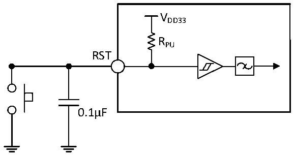

<!-- source-page: 41 -->

[← p.40](0040.md) · [index](../README.md) · [PDF p.41](https://ch32-riscv-ug.github.io/CH32M030/datasheet_en/CH32M030DS0.PDF#page=41) · [p.42 →](0042.md)

<!-- header: CH32M030 Datasheet https://wch-ic.com -->

> ⬆ **Table continued** — rendered in full at [page 40](0040.md). <!-- p41-table-001 -->

<!-- p41-table-002 (table-3-28-2@1) -->
<table><caption>Table 3-28-2 Type-C interface I/O pin characteristics</caption><tr><th>Symbol</th><th>Parameter</th><th>Condition</th><th>Min.</th><th>Typ.</th><th>Max.</th><th>Unit</th></tr><tr><td style="text-align:left">VCCIH</td><td style="text-align:left">CC pin input high-level voltage</td><td style="text-align:left">V = 3.3V, DD33 USBPDx_CC_HVT = 1 (x=0,1)</td><td>2.1</td><td></td><td style="text-align:left">VDD33</td><td>V</td></tr><tr><td style="text-align:left">VCCIL</td><td style="text-align:left">CC pin input low-level voltage</td><td style="text-align:left">V = 3.3V, DD33 USBPDx_CC_HVT = 1 (x=0,1)</td><td>0</td><td></td><td>1.9</td><td>V</td></tr><tr><td style="text-align:left">VCChys</td><td style="text-align:left">Schmitt trigger voltage hysteresis</td><td style="text-align:left">V = 3.3V, DD33 USBPDx_CC_HVT = 1 (x=0,1)</td><td></td><td>200</td><td></td><td>mV</td></tr><tr><td rowspan="3" style="text-align:left">IPUCC</td><td rowspan="3">CC pin pull-up current</td><td style="text-align:left">CCx_PU = 11 (x=1,2), PAD &lt; V -0.6VDD33</td><td>68</td><td>80</td><td>92</td><td>uA</td></tr><tr><td style="text-align:left">CCx_PU = 10 (x=1,2), PAD &lt; V -0.6VDD33</td><td>150</td><td>180</td><td>210</td><td>uA</td></tr><tr><td style="text-align:left">CCx_PU = 01 (x=1,2), PAD &lt; V -0.6VDD33</td><td>280</td><td>330</td><td>380</td><td>uA</td></tr><tr><td>Rd</td><td style="text-align:left">CC pin built-in Rd pull-down resistor (for CCxR with R suffix)</td><td style="text-align:left">CCx_PD = 1 (x=1,2), V ≥ 3.1V or external pull-up DD33330uA</td><td>4.08</td><td>5.1</td><td>6.12</td><td>kΩ</td></tr><tr><td style="text-align:left">R wpd</td><td style="text-align:left">CC pin built-in weak pull-down resistor</td><td>CCx_PD = 0 (x=1,2)</td><td>250</td><td>600</td><td></td><td>kΩ</td></tr><tr><td rowspan="2" style="text-align:left">VAINCC</td><td rowspan="2" style="text-align:left">CC pin ADC conversion voltage range</td><td style="text-align:left">V &gt; 5VHV</td><td>0</td><td></td><td style="text-align:left">VDD33</td><td>V</td></tr><tr><td style="text-align:left">V &lt; 5VHV</td><td>0</td><td></td><td style="text-align:left">V -1. DD337</td><td>V</td></tr></table>

### 3.3.13 RST Pin Characteristics

Circuit reference design and requirements:  

Figure 3-5 Typical circuit of external reset pin  
 <!-- rendered from the PDF; verify at https://ch32-riscv-ug.github.io/CH32M030/datasheet_en/CH32M030DS0.PDF#page=41 -->

🖼 Text parsed from the figure above

VDD33  
RPU  
RST  
0.1μF  

<em>Note: The capacitance in the figure is optional and can be used to filter out key jitter.</em>  
<!-- image: p41-draw-image-00001 bbox=[518.88, 784.08, 538.32, 794.28] -->
<!-- footer: V1.2 38 -->
