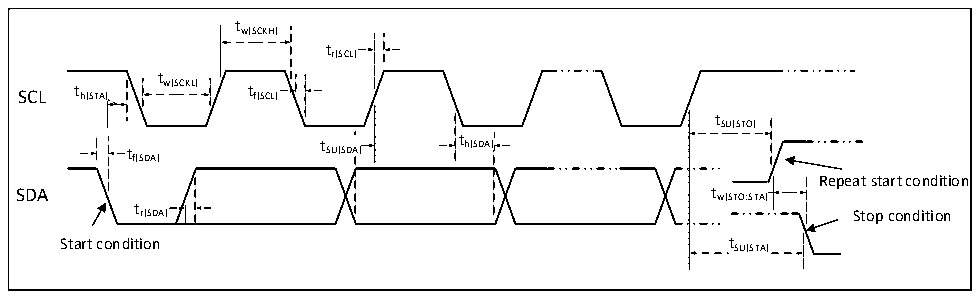

<!-- source-page: 42 -->

[← p.41](0041.md) · [index](../README.md) · [PDF p.42](https://ch32-riscv-ug.github.io/CH32M030/datasheet_en/CH32M030DS0.PDF#page=42) · [p.43 →](0043.md)

<!-- header: CH32M030 Datasheet https://wch-ic.com -->

<!-- p42-table-001 (table-3-29@1) -->
<table><caption>Table 3-29 External reset pin characteristics</caption><tr><th>Symbol</th><th>Parameter</th><th>Condition</th><th>Min.</th><th>Typ.</th><th>Max.</th><th>Unit</th></tr><tr><td style="text-align:left">VIL(RST)</td><td>RST input low-level voltage</td><td style="text-align:left">V = 3.3VDD33</td><td>0</td><td></td><td>0.8</td><td>V</td></tr><tr><td style="text-align:left">VIH(RST)</td><td>RST input high-level voltage</td><td style="text-align:left">V = 3.3VDD33</td><td>1.8</td><td></td><td style="text-align:left">VDD33</td><td>V</td></tr><tr><td style="text-align:left">V hys(RST)</td><td style="text-align:left">RST Schmitt trigger voltage hysteresis</td><td></td><td>200</td><td></td><td></td><td>mV</td></tr><tr><td style="text-align:left">RPU</td><td>Pull up equivalent resistance</td><td></td><td>30</td><td>45</td><td>60</td><td>kΩ</td></tr><tr><td style="text-align:left">VF(RST)</td><td style="text-align:left">RST input can be filtered pulse width.</td><td></td><td></td><td></td><td>60</td><td>ns</td></tr><tr><td style="text-align:left">VNF(RST)</td><td>RST input cannot filter pulse width.</td><td></td><td>230</td><td></td><td></td><td>ns</td></tr></table>

### 3.3.14 TIM Timer Characteristics

<!-- p42-table-002 (table-3-30@1) -->
<table><caption>Table 3-30 TIMx characteristics</caption><tr><th>Symbol</th><th>Parameter</th><th>Condition</th><th>Min.</th><th>Max.</th><th>Unit</th></tr><tr><td rowspan="2" style="text-align:left">t res(TIM)</td><td rowspan="2">Timer reference clock</td><td></td><td>1</td><td></td><td style="text-align:left">t TIMxCLK</td></tr><tr><td style="text-align:left">f = 48MHz TIMxCLK</td><td>20.8</td><td></td><td>ns</td></tr><tr><td rowspan="2" style="text-align:left">FEXT</td><td rowspan="2" style="text-align:left">Timer external clock frequency from CH1 to CH3</td><td></td><td>0</td><td style="text-align:left">f /2TIMxCLK</td><td>MHz</td></tr><tr><td style="text-align:left">f = 48MHz TIMxCLK</td><td>0</td><td>24</td><td>MHz</td></tr><tr><td style="text-align:left">R esTIM</td><td>Timer resolution</td><td></td><td></td><td>16</td><td>Bit</td></tr><tr><td rowspan="2" style="text-align:left">t COUNTER</td><td rowspan="2" style="text-align:left">When the internal clock is selected, the 16-bit counter clock cycle</td><td></td><td>1</td><td>65536</td><td style="text-align:left">t TIMxCLK</td></tr><tr><td style="text-align:left">f = 48MHz TIMxCLK</td><td>0.0208</td><td>1363</td><td>us</td></tr><tr><td rowspan="2" style="text-align:left">t MAX_COUNT</td><td rowspan="2">Maximum possible count</td><td></td><td></td><td>65535</td><td style="text-align:left">t TIMxCLK</td></tr><tr><td style="text-align:left">f = 48MHz TIMxCLK</td><td></td><td>1363</td><td>us</td></tr></table>

### 3.3.15 I2C Interface Characteristics

Figure 3-6 I2C bus timing diagram  
 <!-- rendered from the PDF; verify at https://ch32-riscv-ug.github.io/CH32M030/datasheet_en/CH32M030DS0.PDF#page=42 -->

🖼 Text parsed from the figure above

tw(SCKH)  
tr(SCL)  
t  
SCL t h(STA) w(SCKL) t f(SCL)  
tSU(STO)  
t t SU(SDA) t h(SDA)  
f(SDA)  
Repeat start condition  
SDA tw(STO:STA)  
t  
r(SDA) Stop condition  
Start condition tSU(STA)  

<!-- image: p42-draw-image-00001 bbox=[518.88, 784.08, 538.32, 794.28] -->
<!-- footer: V1.2 39 -->
