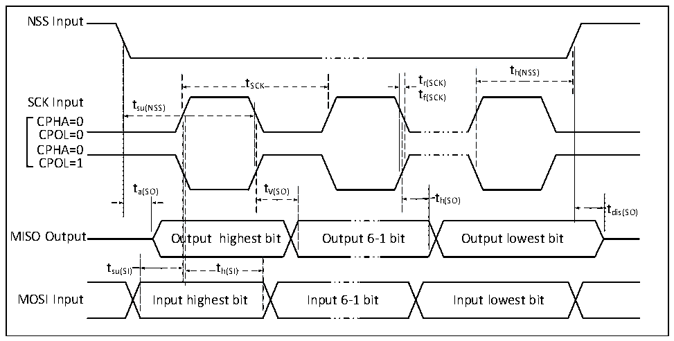
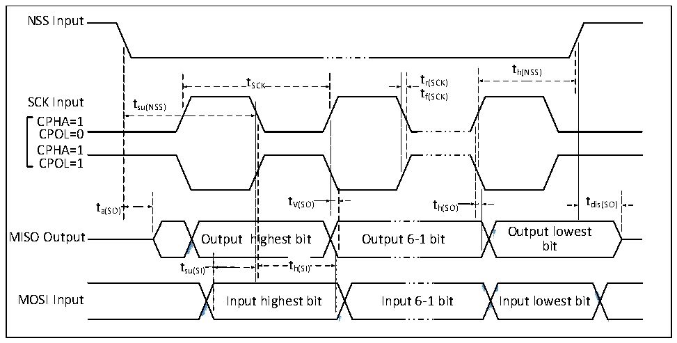

<!-- source-page: 44 -->

[← p.43](0043.md) · [index](../README.md) · [PDF p.44](https://ch32-riscv-ug.github.io/CH32M030/datasheet_en/CH32M030DS0.PDF#page=44) · [p.45 →](0045.md)

<!-- header: CH32M030 Datasheet https://wch-ic.com -->

Figure 3-8 SPI timing diagram in Slave mode (CPHA = 0)  
 <!-- rendered from the PDF; verify at https://ch32-riscv-ug.github.io/CH32M030/datasheet_en/CH32M030DS0.PDF#page=44 -->

🖼 Text parsed from the figure above

NSS Input  
t  
t SCK t r(SCK) h(NSS)  
t  
SCK Input tsu(NSS) f(SCK)  
CPHA=0  
CPOL=0  
CPHA=0  
CPOL=1  
t t  
a(SO) V(SO) t  
h(SO)  
tdis(SO)  
MISO Output Output highest bit Output 6-1 bit Output lowest bit  
t h(SI)  t h(SI)  )  th(SI)  
tsu(SI) th(SI)  
MOSI Input Input highest bit Input 6-1 bit Input lowest bit  

Figure 3-9 SPI timing diagram in Slave mode (CPHA = 1)  
 <!-- rendered from the PDF; verify at https://ch32-riscv-ug.github.io/CH32M030/datasheet_en/CH32M030DS0.PDF#page=44 -->

🖼 Text parsed from the figure above

NSS Input  
t  
t SCK t r(SCK) h(NSS)  
t  
SCK Input tsu(NSS) f(SCK)  
CPHA=1  
CPOL=0  
CPHA=1  
CPOL=1  
t a(SO) t V(SO) t h(SO) t dis(SO)  
<!-- image: p44-draw-image-00008 inside the figure -->
<!-- image: p44-draw-image-00002 inside the figure -->
<!-- image: p44-draw-image-00003 inside the figure -->
Output lowest  
MISO Output Output highest bit Output 6-1 bit  
bit  
t su(SI)  
h(SI)  h(SI)  
<!-- image: p44-draw-image-00004 inside the figure -->
<!-- image: p44-draw-image-00005 inside the figure -->
<!-- image: p44-draw-image-00006 inside the figure -->
<!-- image: p44-draw-image-00007 inside the figure -->
MOSI Input Input highest bit Input 6-1 bit Input lowest bit  

<!-- p44-table-004 (table-3-32@1) -->
<table><caption>Table 3-32 SPI interface characteristics</caption><tr><th>Symbol</th><th>Parameter</th><th>Condition</th><th>Min.</th><th>Max.</th><th>Unit</th></tr><tr><td rowspan="2" style="text-align:left">f /t SCK SCK</td><td rowspan="2">SPI clock frequency</td><td>Master mode</td><td></td><td>36</td><td>MHz</td></tr><tr><td>Slave mode</td><td></td><td>36</td><td>MHz</td></tr><tr><td style="text-align:left">t /t r(SCK) f(SCK)</td><td>SPI clock rise and fall time</td><td>Load capacitance: C = 30pF</td><td></td><td>8</td><td>ns</td></tr><tr><td style="text-align:left">t SU(NSS)</td><td>NSS setup time</td><td>Slave mode</td><td style="text-align:left">2*t HCLK</td><td></td><td>ns</td></tr><tr><td style="text-align:left">t h(NSS)</td><td>NSS hold time</td><td>Slave mode</td><td style="text-align:left">2*t HCLK</td><td></td><td>ns</td></tr><tr><td style="text-align:left">t /t w(SCKH) w(SCKL)</td><td>SCK high and low time</td><td style="text-align:left">Master mode, f = HCLK 24MHz，Prescaler factor = 4</td><td>70</td><td>97</td><td>ns</td></tr></table>

<!-- image: p44-draw-image-00001 bbox=[518.88, 784.08, 538.32, 794.28] -->
<!-- footer: V1.2 41 -->
