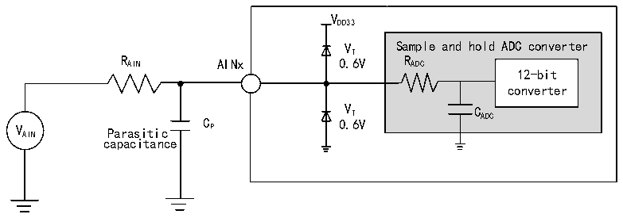
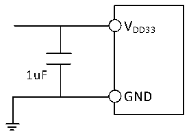

<!-- source-page: 46 -->

[← p.45](0045.md) · [index](../README.md) · [PDF p.46](https://ch32-riscv-ug.github.io/CH32M030/datasheet_en/CH32M030DS0.PDF#page=46) · [p.47 →](0047.md)

<!-- header: CH32M030 Datasheet https://wch-ic.com -->

<!-- p46-table-001 (table-3-34@1) -->
<table><caption>Table 3-34 Maximum RAIN when fADC= 18MHz</caption><tr><th style="text-align:left">T (Cycle) S</th><th style="text-align:left">t (us) S</th><th style="text-align:left">Max. R (kΩ) AIN</th></tr><tr><td>5.5</td><td>0.31</td><td>3.8</td></tr><tr><td>11.5</td><td>0.64</td><td>9.4</td></tr><tr><td>23.5</td><td>1.31</td><td>21</td></tr><tr><td>59.5</td><td>3.31</td><td>55</td></tr></table>

<!-- p46-table-002 (table-3-35@1) -->
<table><caption>Table 3-35 ADC error</caption><tr><th>Symbol</th><th>Parameter</th><th>Condition</th><th>Typ.</th><th>Max.</th><th>Unit</th></tr><tr><td>ET</td><td>Data total error</td><td rowspan="5" style="text-align:left">f = 18MHz, ADC R &lt; 4kΩ, AIN V = 3.3VDD33</td><td>±12</td><td></td><td rowspan="5">LSB</td></tr><tr><td>EO</td><td>Offset error</td><td>±3</td><td></td></tr><tr><td>EG</td><td>Gain error</td><td>±6</td><td></td></tr><tr><td>ED</td><td>Differential nonlinear error</td><td>±10</td><td></td></tr><tr><td>EL</td><td>Integral nonlinear error</td><td>±10</td><td></td></tr></table>

<em>Note: Above parameters are guaranteed by design.</em>  

Figure 3-10 ADC typical connection diagram  
 <!-- rendered from the PDF; verify at https://ch32-riscv-ug.github.io/CH32M030/datasheet_en/CH32M030DS0.PDF#page=46 -->

🖼 Text parsed from the figure above

VDD33  
VT Sample and hold ADC converter  
R AIN AINx 0.6V R ADC  
12-bit  
converter  
V AIN Parasitic C P 0 V . T 6V C ADC  
capacitance  

Cp represents the parasitic capacitance on the PCB and the pad (about 5pF), which may be related to the quality of  
the pad and PCB layout. A larger Cp value will reduce the conversion accuracy, the solution is to reduce the fADC  
value.  

Figure 3-11 Analog power supply and decoupling circuit reference  
 <!-- rendered from the PDF; verify at https://ch32-riscv-ug.github.io/CH32M030/datasheet_en/CH32M030DS0.PDF#page=46 -->

🖼 Text parsed from the figure above

VDD33  
1uF  
GND  

### 3.3.18 OPA Characteristics

<!-- p46-table-003 (table-3-36-1@1) pages 46-47 -->
<table><caption>Table 3-36-1 OPA1 characteristics</caption><tr><th>Symbol</th><th>Parameter</th><th>Condition</th><th>Min.</th><th>Typ.</th><th>Max.</th><th>Unit</th></tr><tr><td style="text-align:left">VDD33</td><td>Supply voltage</td><td></td><td>3.1</td><td>3.3</td><td>3.5</td><td>V</td></tr><tr><td style="text-align:left">IDDQII</td><td>Supply current</td><td></td><td></td><td>270</td><td></td><td>uA</td></tr><tr><td style="text-align:left">VCMIR</td><td>Common-mode input voltage</td><td></td><td></td><td></td><td style="text-align:left">V -1.5DD33</td><td>V</td></tr><tr><td style="text-align:left">VIOFFSET</td><td>Input offset voltage</td><td></td><td></td><td>2</td><td>6</td><td>mV</td></tr><tr><td>Av(1)</td><td>Open loop gain</td><td></td><td></td><td>90</td><td></td><td>dB</td></tr><tr><td rowspan="3">BW(1)</td><td rowspan="3" style="text-align:left">OPA1 operational amplifier bandwidth</td><td style="text-align:left">VO (0.3V, V -0.3V) DD33</td><td></td><td>600</td><td></td><td rowspan="3">kHz</td></tr><tr><td style="text-align:left">VO (0.2V, V -0.2V) DD33</td><td></td><td>500</td><td></td></tr><tr><td style="text-align:left">∈ VO (0.1V, V -0.1V) DD33</td><td></td><td>400</td><td></td></tr><tr><td rowspan="2" style="text-align:left">PGA (1) GAIN</td><td rowspan="2">PGA gain error</td><td>Gain = 20</td><td>-1</td><td></td><td>1</td><td rowspan="2">%</td></tr><tr><td>Gain = 40</td><td>-1</td><td></td><td>1</td></tr><tr><td style="text-align:left">RBIAS</td><td>Bias resistance in QII1 mode</td><td></td><td></td><td>90</td><td></td><td>kΩ</td></tr></table>

<!-- image: p46-draw-image-00001 bbox=[518.88, 784.08, 538.32, 794.28] -->
<!-- footer: V1.2 43 -->
