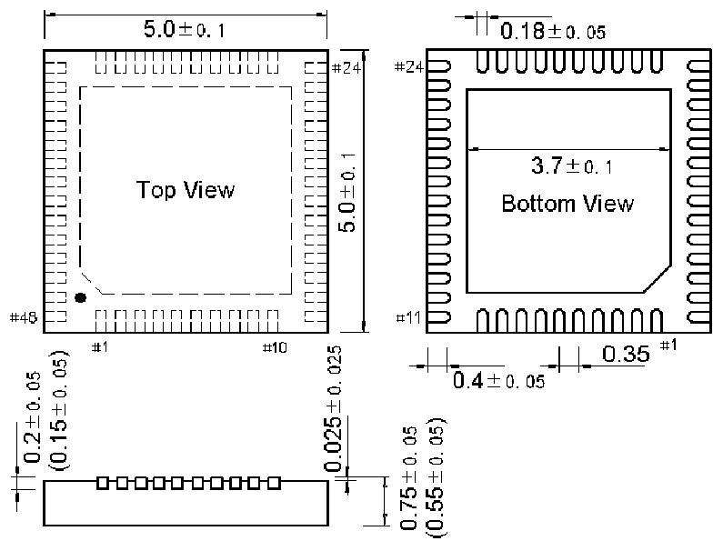
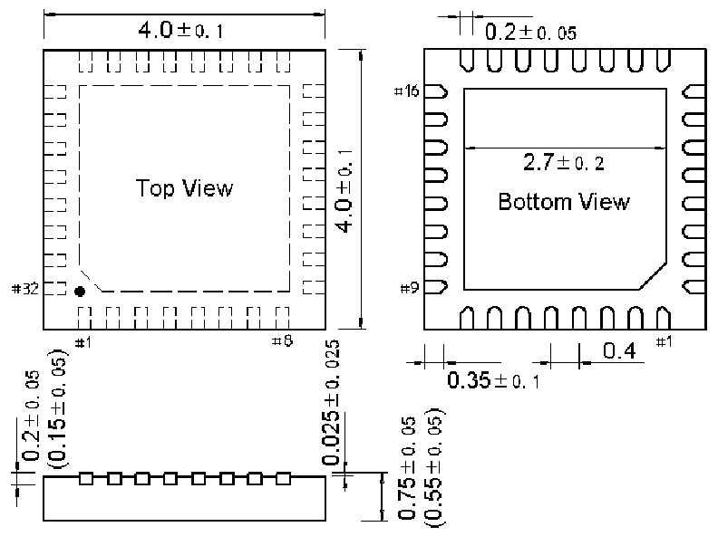

<!-- source-page: 54 -->

[← p.53](0053.md) · [index](../README.md) · [PDF p.54](https://ch32-riscv-ug.github.io/CH32M030/datasheet_en/CH32M030DS0.PDF#page=54) · [p.55 →](0055.md)

<!-- header: CH32M030 Datasheet https://wch-ic.com -->

Figure 4-3 QFN48 package  
 <!-- rendered from the PDF; verify at https://ch32-riscv-ug.github.io/CH32M030/datasheet_en/CH32M030DS0.PDF#page=54 -->

🖼 Text parsed from the figure above

<!-- image: p54-draw-image-00002 inside the figure -->

Figure 4-4 QFN32 package  
 <!-- rendered from the PDF; verify at https://ch32-riscv-ug.github.io/CH32M030/datasheet_en/CH32M030DS0.PDF#page=54 -->

🖼 Text parsed from the figure above

<!-- image: p54-draw-image-00003 inside the figure -->

<!-- image: p54-draw-image-00001 bbox=[518.88, 784.08, 538.32, 794.28] -->
<!-- footer: V1.2 51 -->
