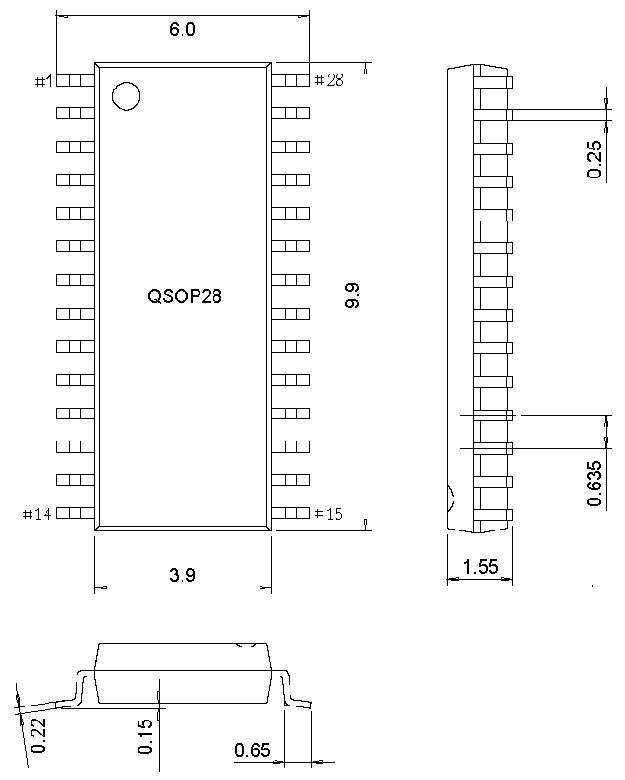

<!-- source-page: 55 -->

[← p.54](0054.md) · [index](../README.md) · [PDF p.55](https://ch32-riscv-ug.github.io/CH32M030/datasheet_en/CH32M030DS0.PDF#page=55) · [p.56 →](0056.md)

<!-- header: CH32M030 Datasheet https://wch-ic.com -->

Figure 4-5 QSOP28 package  
 <!-- rendered from the PDF; verify at https://ch32-riscv-ug.github.io/CH32M030/datasheet_en/CH32M030DS0.PDF#page=55 -->

🖼 Text parsed from the figure above

<!-- image: p55-draw-image-00002 inside the figure -->

<!-- image: p55-draw-image-00001 bbox=[518.88, 784.08, 538.32, 794.28] -->
<!-- footer: V1.2 52 -->
