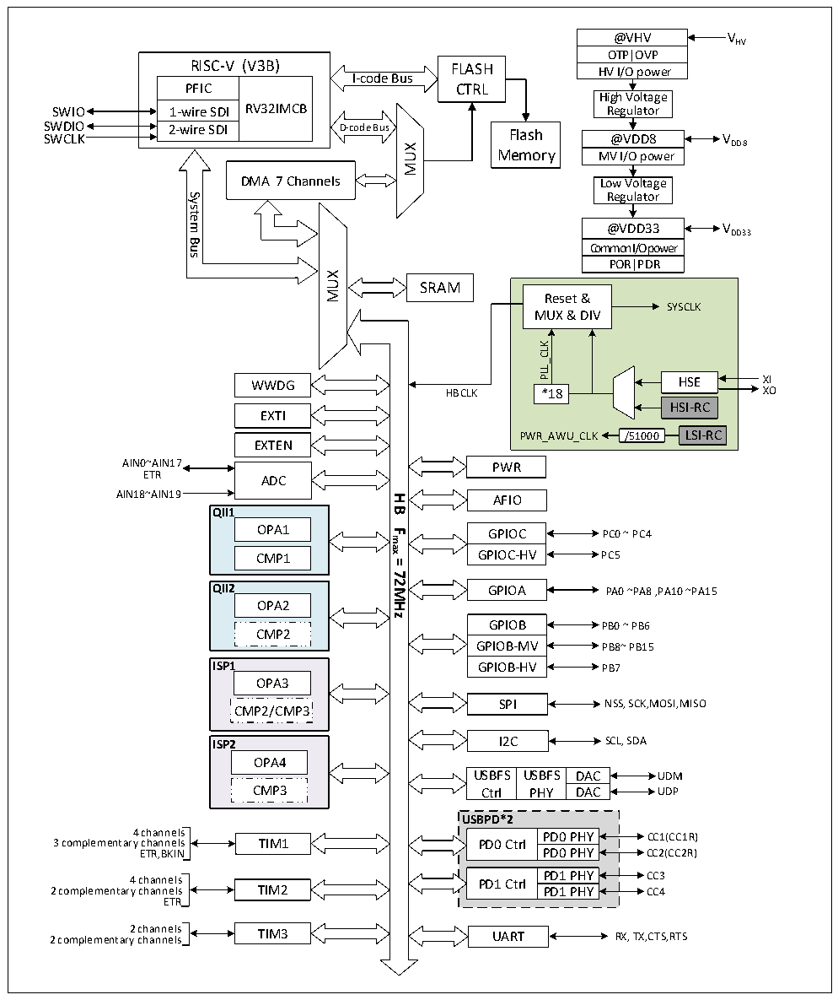

<!-- source-page: 3 -->

[← p.2](0002.md) · [index](../README.md) · [PDF p.3](https://ch32-riscv-ug.github.io/CH32M030/datasheet_zh/CH32M030DS0.PDF#page=3) · [p.4 →](0004.md)

<!-- header: CH32M030数据手册 https://wch.cn -->

# 第1章 规格信息

## 1.1 系统架构

微控制器基于RISC-V指令集的青稞V3B设计，其架构中将内核、仲裁单元、DMA模块、SRAM存储等  
部分通过多组总线实现交互。设计中集成通用DMA控制器以减轻CPU负担、提高访问效率，同时兼有数  
据保护机制，时钟自动切换保护等措施增加了系统稳定性。下图是CH32M030内部总体架构框图。  

图1-1 系统框图  
 <!-- rendered from the PDF; verify at https://ch32-riscv-ug.github.io/CH32M030/datasheet_zh/CH32M030DS0.PDF#page=3 -->

🖼 Text parsed from the figure above

@VHV  OTP|OVP  HV I/O power  
VHV  
RISC-V (V3B)  PFIC  RV32IMCB  1-wire SDI  21--wwiirree SSDDII  
RISC-V (V3B) FLASH  
I-code Bus  
CTRL  
High Voltage  
SWIO 1-wire SDI RV32IMCB Regulator  
SWDIO 2-wire SDI SWCLKD-codeBusFlash@VDD8 V  
DD8  
MUX  
Memory  
MV I/O power  
DMA 7 Channels  
Low Voltage  
Regulator  
System  
@VDD33  Common I/O power  
Bus  
POR|PDR  
MUX  
SRAM  
Reset &amp;  
SYSCLK  
MUX &amp; DIV  
PLL_CLK  
WWDG HSE XI  
HBCLK XO  
HSEHSI-RC  
*18  
EXTI  
/51000  L  LSI-RC  
PWR_AWU_CLK /51000  
EXTEN  
AIN0~AIN17  
PWR  
ETR ADC  
AIN18~AIN19 AFIO  
<strong>HB</strong>  
<strong>QII1</strong>  
OPA1  
<strong>Fmax</strong>  
GPIOC PC0 ~ PC4  
GPIOC-HV PC5  
CMP1  
<strong>=</strong>  
<strong>72MHz</strong>  
<strong>QII2</strong>  
GPIOA PA0 ~PA8 ,PA10 ~PA15  
OPA2  
GPIOB PB0 ~ PB6  
CMP2  
GPIOB-MV PB8~ PB15  
ISP1 GPIOB-HV PB7  
OPA3  
SPI NSS, SCK,MOSI,MISO  
CMP2/CMP3  
I2C  
SCL, SDA  
<strong>ISP2</strong>  
OPA4  
USBFSCtrl  USBFPHY  FS DAC Y DAC  
CMP3  
<strong>USBPD*2</strong>  
4 channels PD0 PHY CC1(CC1R)  
PD0 Ctrl  PD0 PHY PD0 PHY  
3 complementary channels TIM1 PD0 Ctrl  
ETR,BKIN PD0 PHY CC2(CC2R)  
PD1 Ctrl  PD1 PHY  PD1 PHY PD1 PHY  
4 channels PD1 Ctrl PD1 PHY CC3  
2 complementary channels TIM2 PD1 PHY CC4  
ETR  
2 channels 2 complementary channels RX, TX,CTS,RTS  
TIM3  
UART  

<!-- image: p3-draw-image-00001 bbox=[517.92, 779.28, 537.36, 789.6] -->
<!-- footer: V1.3 1 -->
