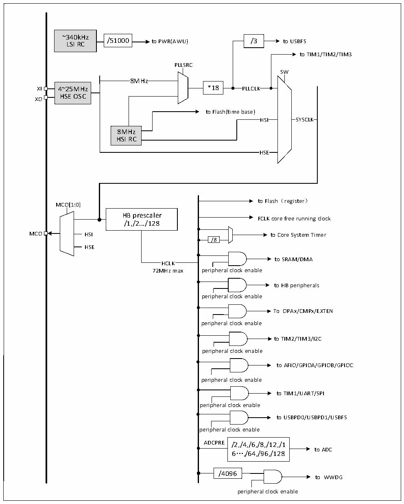

<!-- source-page: 5 -->

[← p.4](0004.md) · [index](../README.md) · [PDF p.5](https://ch32-riscv-ug.github.io/CH32M030/datasheet_zh/CH32M030DS0.PDF#page=5) · [p.6 →](0006.md)

<!-- header: CH32M030数据手册 https://wch.cn -->

## 1.3 时钟树

系统中引入3组时钟源：内部高频RC振荡器（HSI）、内部低频RC振荡器(LSI)和外部高频振荡器  
(HSE)。其中，低频时钟源为自动唤醒单元提供了时钟基准，高频时钟源直接或者间接通过18倍频后输  
出为系统总线时钟（SYSCLK），系统时钟再由各预分频器提供了HB域外设控制时钟及采样或接口输出时  
钟。  

图1-3 时钟树框图  
 <!-- rendered from the PDF; verify at https://ch32-riscv-ug.github.io/CH32M030/datasheet_zh/CH32M030DS0.PDF#page=5 -->

🖼 Text parsed from the figure above

~340kHz  
/51000  /51000  
LSI RC /51000 to PWR(AWU) /3 to USBFS  
to TIM1/TIM2/TIM3  
PLLSRC  
SW  
8MHz  
XI 4~25MHz *18 PLLCLK  
HSE OSC  
XO  
to Flash(time base)  
HS  HS  
SYSCLK  SYSCLK  
HSI SYSCLK  
8MHz  
HSI RC  
HSE  HSE  
to Flash（register）  
MCO[1:0]  
HB prescaler  
FCLK core free running clock  
/1,/2.../128  
MCO HSI to Core System Timer  
/8  
HSE  
to SRAM/DMA  
HCLK  
72MHz max peripheral clock enable  
to HB peripherals  
peripheral clock enable  
To OPAx/CMPx/EXTEN  
peripheral clock enable  
to TIM2/TIM3/I2C  
peripheral clock enable  
to AFIO/GPIOA/GPIOB/GPIOC  
peripheral clock enable  
to TIM1/UART/SPI  
peripheral clock enable  
to USBPD0/USBPD1/USBFS  
peripheral clock enable  
ADCPRE /2,/4,/6,/8,/12,/1  
to ADC  
6…,/64,/96,/128  
/4096  
to WWDG  
peripheral clock enable  

<!-- image: p5-draw-image-00001 bbox=[517.92, 779.28, 537.36, 789.6] -->
<!-- footer: V1.3 3 -->
