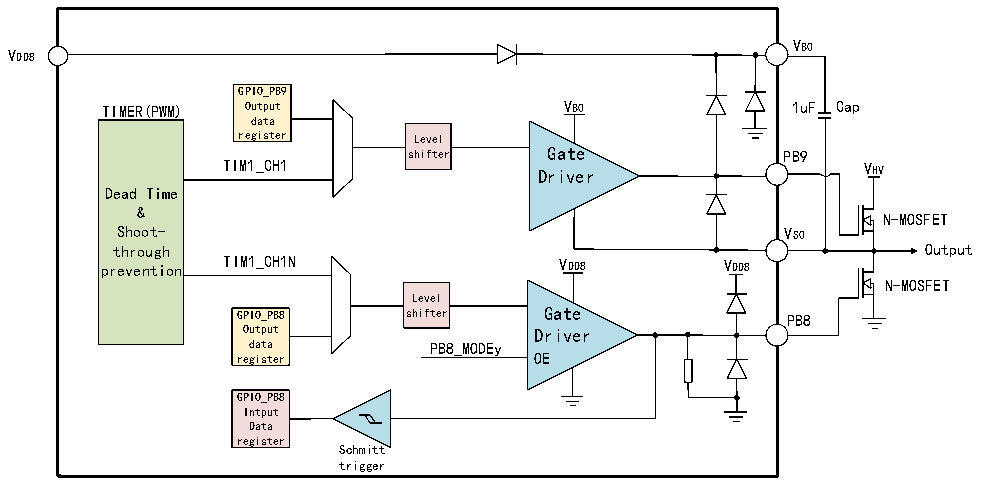

<!-- source-page: 11 -->

[← p.10](0010.md) · [index](../README.md) · [PDF p.11](https://ch32-riscv-ug.github.io/CH32M030/datasheet_zh/CH32M030DS0.PDF#page=11) · [p.12 →](0012.md)

<!-- header: CH32M030数据手册 https://wch.cn -->

图1-4 单个半桥驱动器结构框图  
 <!-- rendered from the PDF; verify at https://ch32-riscv-ug.github.io/CH32M030/datasheet_zh/CH32M030DS0.PDF#page=11 -->

🖼 Text parsed from the figure above

VB0  
VDD8  
GPIO_PB9  
TIMER(PWM) Output VB0 1uF Cap  
data  
register Level  
shifter Gate PB9  
TIM1_CH1  
VHV  
Driver  
Dead Time  
&amp;  
N-MOSFET  
Shoot- VS0  
through Output  
prevention TIM1_CH1N VDD8 VDD8  
N-MOSFET  
Level  
GPIO_PB8 shifter Gate PB8  
Output Driver  
data PB8_MODEy  
register OE  
GPIO_PB8  
Intput  
Data  
register  
Schmitt  
trigger  

注：Cap为片外电容；N-MOSFET为片外N型MOSFET功率管。  

### 1.4.21 通用输入输出接口（GPIO）

系统提供了3组GPIO端口，共37个GPIO引脚（PA0～PA8，PA10～PA15，PB0～PB15，PC0～PC5）。所  
有的GPIO引脚可以由软件配置成输出（推挽或开漏），除PB7、PB9、PB11、PB13、PB15以外的GPIO引脚  
可以由配置成输入或复用的外设功能端口。多数GPIO引脚都与数字或模拟的复用外设共用，提供锁定  
机制冻结IO配置，以避免意外的写入I/O寄存器。  
PB8～PB15为VDD8 供电的预驱动MV I/O引脚，PB7为高压开漏输出引脚，PC5为VHV 供电的高压HV I/O  
引脚，其余为VDD33 供电的普通I/O引脚。  
PB9、PB11、PB13、PB15为推挽输出，默认输出低电平，不支持输入。  
PB7仅支持高压开漏输出，不支持输入；PC5支持轻载下的推挽输出，在压差7V以下可防电流倒灌。  
除PB7～PB15以及PC5外，所有GPIO引脚都支持可控上拉，其中，CC1/CC2/CC3/CC4提供的是多级上  
拉电流。  
PB0和PB1内置默认开启、可以调节、可以关闭的下拉电阻，由EXTEN_CTLR1中的两组PDE和DAC进行  
调节和控制，并可提供下拉电流；CC1/CC2/CC3/CC4如果有后缀R则表示内置Type-C规范定义的可控Rd  
下拉电阻，默认开启；PA0/CC1R和PA1/CC2R引脚内置可控Rd下拉电阻，作为GPIO推挽输出时建议关闭  
下拉；PB8、PB10、PB12、PB14内置不可关闭的下拉电阻；除此之外的GPIO引脚均未内置下拉电阻。  
MV I/O引脚（PB8～PB15）由VDD8 提供电源，通过改变VDD8 供电将改变MV引脚输出电平高值来适配外  
部接口电平。其中，PB9、PB11、PB13、PB15供电为基于VDD8 供电的自举电源，输出高电平时为VB，输  
出低电平时为VS。HV I/O引脚PC5由VHV 提供电源，通过改变VHV 供电将改变HV I/O引脚输出电平高值来适  
配外部接口电平。普通I/O引脚由VDD33 提供电源，通过改变VDD33 供电将改变普通I/O引脚输出电平高值来  
适配外部接口电平。具体引脚请参考第二章引脚描述。  
CH32M030K9U和CH32M030C9U提供了更多的耐高压开漏输出引脚，可以由升压电荷泵供电，支持两  
级栅压输出，控制多个外部N型MOSFET功率管实现Type-C电源通路的开关，相比P型MOSFET内阻小、成  
本低，具体电路参考CH32M030手册2。  

### 1.4.22 调试接口（SDI Serial Debug Interface）

内核自带一个串行单线调试接口（1-wire SDI Serial Debug Interface）和一个串行2线调试接  
口（2-wire SDI Serial Debug Interface）。系统支持单双线两种调试模式；其中，单线调试为默认  
调试模式，对应SWIO引脚，而双线调试对应SWDIO和SWCLK引脚，可以提高下载速度。系统上电或复位  
<!-- image: p11-draw-image-00001 bbox=[512.28, 779.28, 531.72, 789.6] -->
<!-- footer: V1.3 9 -->
