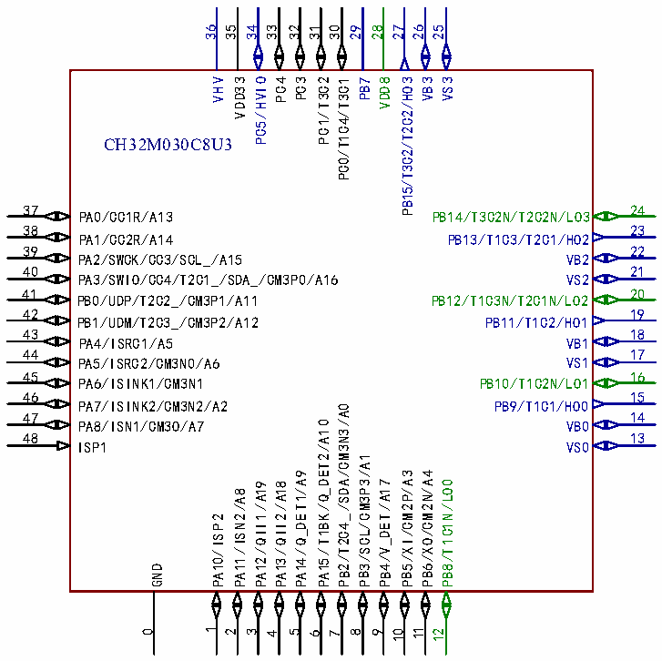
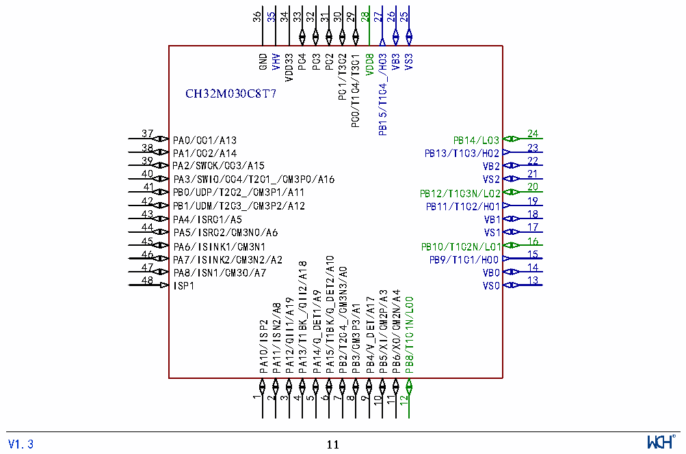

<!-- source-page: 13 -->

[← p.12](0012.md) · [index](../README.md) · [PDF p.13](https://ch32-riscv-ug.github.io/CH32M030/datasheet_zh/CH32M030DS0.PDF#page=13) · [p.14 →](0014.md)

<!-- header: CH32M030数据手册 https://wch.cn -->

# 第2章 引脚信息

## 2.1 引脚排列

 <!-- p13-cluster-01 uncaptioned graphics, rendered from the PDF; verify at https://ch32-riscv-ug.github.io/CH32M030/datasheet_zh/CH32M030DS0.PDF#page=13 -->

 <!-- p13-cluster-02 uncaptioned graphics, rendered from the PDF; verify at https://ch32-riscv-ug.github.io/CH32M030/datasheet_zh/CH32M030DS0.PDF#page=13 -->

🖼 Text parsed from the figure above

36  
35  
34  
33  
32 31 28 27  
30 29  
26  
25  
VHV VDD33 PC5/HVIO PC4 PC3  
PC1/T3C2 PC0/T1C4/T3C1  
VDD8 PB15/T3C2/T2C2/HO3 VB3 VS3  
PB7  
CH32M030C8U3  
37  
24  
PA0/CC1R/A13  
PB14/T3C2N/T2C2N/LO3  
38  
23  
PA1/CC2R/A14  
PB13/T1C3/T2C1/HO2  
39  
22  
PA2/SWCK/CC3/SCL_/A15  
VB2  
40 21  
PA3/SWIO/CC4/T2C1_/SDA_/CM3P0/A16  
VS2  
41 20  
PB0/UDP/T2C2_/CM3P1/A11 PB12/T1C3N/T2C1N/LO2  
42  
19  
PB1/UDM/T2C3_/CM3P2/A12  
PB11/T1C2/HO1  
43  
18  
PA4/ISRC1/A5  
VB1  
44 17  
VS1  
PA5/ISRC2/CM3N0/A6  
45 16  
PA6/ISINK1/CM3N1  
PB10/T1C2N/LO1  
46  
15  
PA7/ISINK2/CM3N2/A2  
PB9/T1C1/HO0  
PB2/T2C4_/SDA/CM3N3/A0  
47  
14  
PA15/T1BK/Q_DET2/A10  
PA8/ISN1/CM3O/A7  
VB0  
48  
13  
ISP1  
VS0  
PB3/SCL/CM3P3/A1  
PA14/Q_DET1/A9  
PB5/XI/CM2P/A3 PB6/XO/CM2N/A4  
PB4/V_DET/A17  
PB8/T1C1N/LO0  
PA12/QII1/A19 PA13/QII2/A18  
PA11/ISN2/A8  
PA10/ISP2  
GND  
0 1  
11 12  
2  
3  
4 5  
8 9  
10  
6 7  
36  
35  
34  
33  
32 30 28 27  
31  
29  
26  
25  
GND  
VHV  
VDD33  
PC4  
PC3  
PC2  
PC1/T3C2  
PC0/T1C4/T3C1  
VDD8  
PB15/T1C4_/HO3  
VB3  
VS3  
CH32M030C8T7  
37  
24  
PA0/CC1/A13  
PB14/LO3  
38  
23  
PA1/CC2/A14  
PB13/T1C3/HO2  
39  
22  
PA2/SWCK/CC3/A15  
VB2  
40 21  
PA3/SWIO/CC4/T2C1_/CM3P0/A16 VS2  
41 20  
PB0/UDP/T2C2_/CM3P1/A11 PB12/T1C3N/LO2  
42  
19  
PB1/UDM/T2C3_/CM3P2/A12  
PB11/T1C2/HO1  
43  
18  
PA4/ISRC1/A5  
VB1  
44 17  
PA5/ISRC2/CM3N0/A6 VS1  
45 16  
PA6/ISINK1/CM3N1 PB10/T1C2N/LO1  
46  
15  
PA7/ISINK2/CM3N2/A2  
PB9/T1C1/HO0  
A15/T1BK/Q_DET2/A10  
A13/T1BK_/QII2/A18  
47  
14  
B2/T2C4_/CM3N3/A0  
PA8/ISN1/CM3O/A7  
VB0  
48  
13  
ISP1  
VS0  
A14/Q_DET1/A9  
B5/XI/CM2P/A3  
B6/XO/CM2N/A4  
B4/V_DET/A17  
B8/T1C1N/LO0  
A12/QII1/A19  
A11/ISN2/A8  
B3/CM3P3/A1  
A10/ISP2  
P  
P  
P  
P  
P  
P  
P  
P  
P  
P  
P  
P  
1  
11  
2  
3  
4  
5  
6  
7  
8 9  
10  
12  
<!-- image: p13-draw-image-00001 inside the figure -->
<!-- footer: V1.3 11 -->

