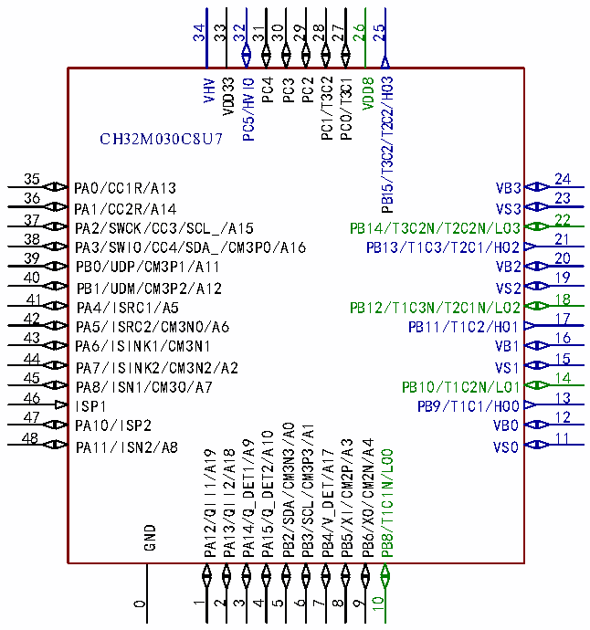
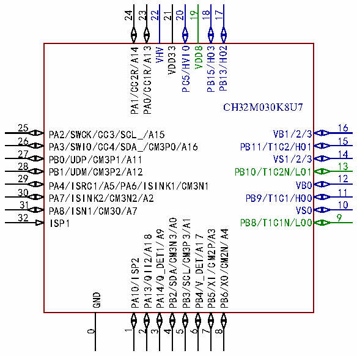

<!-- source-page: 14 -->

[← p.13](0013.md) · [index](../README.md) · [PDF p.14](https://ch32-riscv-ug.github.io/CH32M030/datasheet_zh/CH32M030DS0.PDF#page=14) · [p.15 →](0015.md)

<!-- header: CH32M030数据手册 https://wch.cn -->

 <!-- p14-cluster-01 uncaptioned graphics, rendered from the PDF; verify at https://ch32-riscv-ug.github.io/CH32M030/datasheet_zh/CH32M030DS0.PDF#page=14 -->

 <!-- p14-cluster-02 uncaptioned graphics, rendered from the PDF; verify at https://ch32-riscv-ug.github.io/CH32M030/datasheet_zh/CH32M030DS0.PDF#page=14 -->

🖼 Text parsed from the figure above

34  
33  
32  
31 29 27  
30  
28  
26  
25  
VHV VDD33 PC5/HVIO PC4 PC3 PC2 PC1/T3C2 PC0/T3C1 VDD8 PB15/T3C2/T2C2/HO3  
CH32M030C8U7  
35  
24  
PA0/CC1R/A13  
VB3  
36 23  
PA1/CC2R/A14 VS3  
37  
22  
PA2/SWCK/CC3/SCL_/A15  
PB14/T3C2N/T2C2N/LO3  
38  
21  
PA3/SWIO/CC4/SDA_/CM3P0/A16  
PB13/T1C3/T2C1/HO2  
39 20  
PB0/UDP/CM3P1/A11 VB2  
40 19  
PB1/UDM/CM3P2/A12 VS2  
41  
18  
PA4/ISRC1/A5  
PB12/T1C3N/T2C1N/LO2  
42 17  
PA5/ISRC2/CM3N0/A6 PB11/T1C2/HO1  
43  
16  
PA6/ISINK1/CM3N1  
VB1  
44 15  
PA7/ISINK2/CM3N2/A2 VS1  
45  
14  
PA8/ISN1/CM3O/A7  
PB10/T1C2N/LO1  
46  
13  
ISP1  
PB9/T1C1/HO0  
47  
12  
PA10/ISP2  
VB0  
PB2/SDA/CM3N3/A0 PB3/SCL/CM3P3/A1  
PA15/Q_DET2/A10  
48  
11  
PA14/Q_DET1/A9  
PB5/XI/CM2P/A3  
PB6/XO/CM2N/A4  
PA11/ISN2/A8  
VS0  
PA12/QII1/A19  
PA13/QII2/A18  
PB4/V_DET/A17  
PB8/T1C1N/LO0  
GND  
9 10  
0 1 2 3 4  
5 6  
7  
8  
24  
23  
22 21  
20  
19  
18 17  
PA1/CC2R/A14 PA0/CC1R/A13 VHV VDD33 PC5/HVIO VDD8 PB15/HO3 PB13/HO2  
CH32M030K8U7  
25  
16  
VB1/2/3  
PA2/SWCK/CC3/SCL_/A15  
26  
15  
PB11/T1C2/HO1  
PA3/SWIO/CC4/SDA_/CM3P0/A16  
27  
14  
VS1/2/3  
PB0/UDP/CM3P1/A11  
28  
13  
PB10/T1C2N/LO1  
PB1/UDM/CM3P2/A12  
29  
12  
VB0  
PA4/ISRC1/A5/PA6/ISINK1/CM3N1  
30  
11  
PB9/T1C1/HO0  
PA7/ISINK2/CM3N2/A2  
31  
10  
VS0  
PA8/ISN1/CM3O/A7  
32  
9  
PB8/T1C1N/LO0  
PB2/SDA/CM3N3/A0 PB3/SCL/CM3P3/A1  
ISP1  
PA14/Q_DET1/A9  
PB5/XI/CM2P/A3 PB6/XO/CM2N/A4  
PA13/QII2/A18  
PB4/V_DET/A17  
PA10/ISP2  
GND  
1 4 5 6 7 8  
0  
2 3  

<!-- image: p14-draw-image-00001 bbox=[516.84, 779.28, 536.28, 789.6] -->
<!-- footer: V1.3 12 -->
