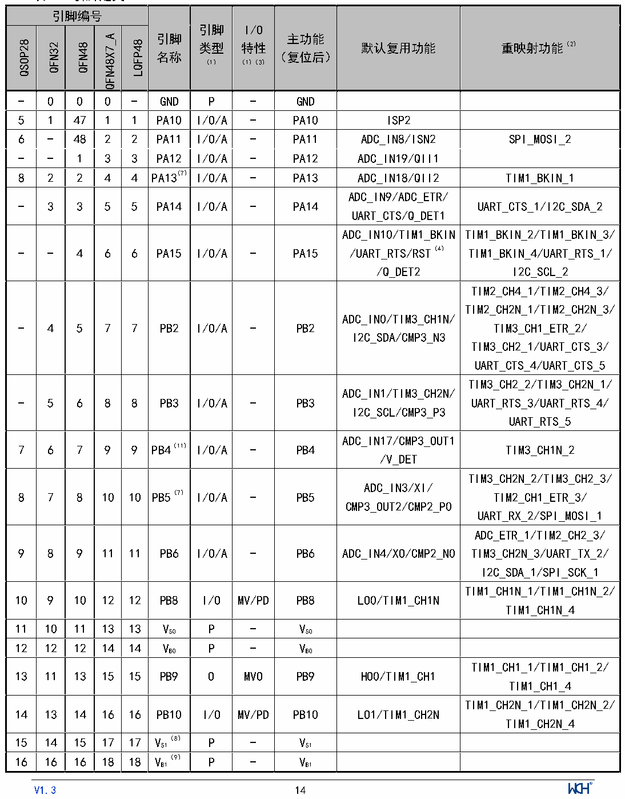

<!-- source-page: 16 -->

[← p.15](0015.md) · [index](../README.md) · [PDF p.16](https://ch32-riscv-ug.github.io/CH32M030/datasheet_zh/CH32M030DS0.PDF#page=16) · [p.17 →](0017.md)

<!-- header: CH32M030数据手册 https://wch.cn -->

## 2.2 引脚定义

注意，下表中的引脚功能描述针对的是所有功能，不涉及具体型号芯片。不同型号之间外设资源有差  
异，查看前请先根据芯片型号资源表确认是否有此功能。  

 <!-- p16-cluster-01 uncaptioned graphics, rendered from the PDF; verify at https://ch32-riscv-ug.github.io/CH32M030/datasheet_zh/CH32M030DS0.PDF#page=16 -->

🖼 Text parsed from the figure above

<!-- p16-table-001 (table-2-1@1) pages 16-18 -->
<table><caption>表2-1 引脚定义</caption><tr><th colspan="5">引脚编号</th><th rowspan="3">引脚</th><th rowspan="2">引脚</th><th rowspan="2">I/O</th><th rowspan="7" style="text-align:left">主功能 （复位后）</th><th rowspan="7">默认复用功能</th><th rowspan="7">重映射功能（2）</th></tr><tr><td rowspan="6">QSOP28</td><td rowspan="6">QFN32</td><td rowspan="6">QFN48</td><td rowspan="6">QFN48X7_A</td><td rowspan="6">LQFP48</td></tr><tr><td rowspan="2">类型</td><td rowspan="2">特性</td></tr><tr><td rowspan="2">名称</td></tr><tr><td rowspan="2">（1）</td><td rowspan="2">（1）（3）</td></tr><tr><td rowspan="2"></td></tr><tr><td></td><td></td></tr><tr><td>-</td><td>0</td><td>0</td><td>0</td><td>-</td><td>GND</td><td>P</td><td>-</td><td>GND</td><td></td><td></td></tr><tr><td>5</td><td>1</td><td>47</td><td>1</td><td>1</td><td>PA10</td><td>I/O/A</td><td>-</td><td>PA10</td><td>ISP2</td><td></td></tr><tr><td>6</td><td>-</td><td>48</td><td>2</td><td>2</td><td>PA11</td><td>I/O/A</td><td>-</td><td>PA11</td><td>ADC_IN8/ISN2</td><td>SPI_MOSI_2</td></tr><tr><td>-</td><td>-</td><td>1</td><td>3</td><td>3</td><td>PA12</td><td>I/O/A</td><td>-</td><td>PA12</td><td>ADC_IN19/QII1</td><td></td></tr><tr><td>8</td><td>2</td><td>2</td><td>4</td><td>4</td><td>PA13（7）</td><td>I/O/A</td><td>-</td><td>PA13</td><td>ADC_IN18/QII2</td><td>TIM1_BKIN_1</td></tr><tr><td>-</td><td>3</td><td>3</td><td>5</td><td>5</td><td>PA14</td><td>I/O/A</td><td>-</td><td>PA14</td><td style="text-align:left">ADC_IN9/ADC_ETR/ UART_CTS/Q_DET1</td><td>UART_CTS_1/I2C_SDA_2</td></tr><tr><td>-</td><td>-</td><td>4</td><td>6</td><td>6</td><td>PA15</td><td>I/O/A</td><td>-</td><td>PA15</td><td style="text-align:left">ADC_IN10/TIM1_BKIN /UART_RTS/RST（4） /Q_DET2</td><td style="text-align:left">TIM1_BKIN_2/TIM1_BKIN_3/ TIM1_BKIN_4/UART_RTS_1/ I2C_SCL_2</td></tr><tr><td>-</td><td>4</td><td>5</td><td>7</td><td>7</td><td>PB2</td><td>I/O/A</td><td>-</td><td>PB2</td><td style="text-align:left">ADC_IN0/TIM3_CH1N/ I2C_SDA/CMP3_N3</td><td style="text-align:left">TIM2_CH4_1/TIM2_CH4_3/ TIM2_CH2N_1/TIM2_CH2N_3/ TIM3_CH1_ETR_2/ TIM3_CH2_1/UART_CTS_3/ UART_CTS_4/UART_CTS_5</td></tr><tr><td>-</td><td>5</td><td>6</td><td>8</td><td>8</td><td>PB3</td><td>I/O/A</td><td>-</td><td>PB3</td><td style="text-align:left">ADC_IN1/TIM3_CH2N/ I2C_SCL/CMP3_P3</td><td style="text-align:left">TIM3_CH2_2/TIM3_CH2N_1/ UART_RTS_3/UART_RTS_4/ UART_RTS_5</td></tr><tr><td>7</td><td>6</td><td>7</td><td>9</td><td>9</td><td>PB4（11）</td><td>I/O/A</td><td>-</td><td>PB4</td><td style="text-align:left">ADC_IN17/CMP3_OUT1 /V_DET</td><td>TIM3_CH1N_2</td></tr><tr><td>8</td><td>7</td><td>8</td><td>10</td><td>10</td><td>PB5（7）</td><td>I/O/A</td><td>-</td><td>PB5</td><td style="text-align:left">ADC_IN3/XI/ CMP3_OUT2/CMP2_P0</td><td style="text-align:left">TIM3_CH2N_2/TIM3_CH2_3/ TIM2_CH1_ETR_3/ UART_RX_2/SPI_MOSI_1</td></tr><tr><td>9</td><td>8</td><td>9</td><td>11</td><td>11</td><td>PB6</td><td>I/O/A</td><td>-</td><td>PB6</td><td>ADC_IN4/XO/CMP2_N0</td><td style="text-align:left">ADC_ETR_1/TIM2_CH2_3/ TIM3_CH2N_3/UART_TX_2/ I2C_SDA_1/SPI_SCK_1</td></tr><tr><td>10</td><td>9</td><td>10</td><td>12</td><td>12</td><td>PB8</td><td>I/O</td><td>MV/PD</td><td>PB8</td><td>LO0/TIM1_CH1N</td><td style="text-align:left">TIM1_CH1N_1/TIM1_CH1N_2/ TIM1_CH1N_4</td></tr><tr><td>11</td><td>10</td><td>11</td><td>13</td><td>13</td><td style="text-align:left">VSO</td><td>P</td><td>-</td><td style="text-align:left">VSO</td><td></td><td></td></tr><tr><td>12</td><td>12</td><td>12</td><td>14</td><td>14</td><td style="text-align:left">VBO</td><td>P</td><td>-</td><td style="text-align:left">VBO</td><td></td><td></td></tr><tr><td>13</td><td>11</td><td>13</td><td>15</td><td>15</td><td>PB9</td><td>O</td><td>MVO</td><td>PB9</td><td>HO0/TIM1_CH1</td><td style="text-align:left">TIM1_CH1_1/TIM1_CH1_2/ TIM1_CH1_4</td></tr><tr><td>14</td><td>13</td><td>14</td><td>16</td><td>16</td><td>PB10</td><td>I/O</td><td>MV/PD</td><td>PB10</td><td>LO1/TIM1_CH2N</td><td style="text-align:left">TIM1_CH2N_1/TIM1_CH2N_2/ TIM1_CH2N_4</td></tr><tr><td>15</td><td>14</td><td>15</td><td>17</td><td>17</td><td style="text-align:left">V （8） S1</td><td>P</td><td>-</td><td style="text-align:left">VS1</td><td></td><td></td></tr><tr><td>16</td><td>16</td><td>16</td><td>18</td><td>18</td><td style="text-align:left">V （9） B1</td><td>P</td><td>-</td><td style="text-align:left">VB1</td><td></td><td></td></tr><tr><td>17</td><td>15</td><td>17</td><td>19</td><td>19</td><td>PB11</td><td>O</td><td>MVO</td><td>PB11</td><td>HO1/TIM1_CH2</td><td style="text-align:left">TIM1_CH2_1/TIM1_CH2_2/ TIM1_CH2_4</td></tr><tr><td>18</td><td>-</td><td>18</td><td>20</td><td>20</td><td>PB12</td><td>I/O</td><td>MV/PD</td><td>PB12</td><td>LO2/TIM1_CH3N</td><td style="text-align:left">TIM1_CH3N_1/TIM1_CH3N_4/ TIM2_CH3_2/TIM2_CH1N_2/ TIM3_CH1N_4</td></tr><tr><td>19</td><td>14</td><td>19</td><td>21</td><td>21</td><td style="text-align:left">V （8） S2</td><td>P</td><td>-</td><td style="text-align:left">VS2</td><td></td><td></td></tr><tr><td>20</td><td>16</td><td>20</td><td>22</td><td>22</td><td style="text-align:left">V （9） B2</td><td>P</td><td>-</td><td style="text-align:left">VB2</td><td></td><td></td></tr><tr><td>21</td><td>17</td><td>21</td><td>23</td><td>23</td><td>PB13</td><td>O</td><td>MVO</td><td>PB13</td><td>HO2/TIM1_CH3</td><td style="text-align:left">TIM1_CH3_1/TIM1_CH3_4/ TIM2_CH1_ETR_2/ TIM3_CH1_ETR_4</td></tr><tr><td>-</td><td>-</td><td>22</td><td>24</td><td>24</td><td>PB14</td><td>I/O</td><td>MV/PD</td><td>PB14</td><td>LO3</td><td style="text-align:left">TIM1_CH3N_2/TIM2_CH4_2/ TIM2_CH2N_2/TIM3_CH2N_4</td></tr><tr><td>-</td><td>14</td><td>23</td><td>25</td><td>25</td><td style="text-align:left">V （8） S3</td><td>P</td><td>-</td><td style="text-align:left">VS3</td><td></td><td></td></tr><tr><td>-</td><td>16</td><td>24</td><td>26</td><td>26</td><td style="text-align:left">V （9） B3</td><td>P</td><td>-</td><td style="text-align:left">VB3</td><td></td><td></td></tr><tr><td>-</td><td>18</td><td>25</td><td>27</td><td>27</td><td>PB15</td><td>O</td><td>MVO</td><td>PB15</td><td>HO3</td><td style="text-align:left">TIM1_CH3_2/TIM1_CH4_1/ TIM2_CH2_2（10）/TIM3_CH2_4</td></tr><tr><td>22</td><td>19</td><td>26</td><td>28</td><td>28</td><td style="text-align:left">VDD8</td><td>P</td><td>-</td><td style="text-align:left">VDD8</td><td></td><td></td></tr><tr><td>-</td><td>-</td><td>-</td><td>29</td><td>-</td><td>PB7</td><td>O</td><td>HVOD</td><td>PB7</td><td></td><td></td></tr><tr><td>-</td><td>-</td><td>27</td><td>30</td><td>29</td><td>PC0</td><td>I/O</td><td>-</td><td>PC0</td><td style="text-align:left">TIM1_CH4/RST（4） TIM3_CH1_ETR/ UART_RX</td><td style="text-align:left">TIM1_CH3N_3/TIM1_CH3N_4/ TIM3_CH1_ETR_1</td></tr><tr><td>-</td><td>-</td><td>28</td><td>31</td><td>30</td><td>PC1</td><td>I/O</td><td>-</td><td>PC1</td><td style="text-align:left">TIM1_ETR/TIM3_CH2/ UART_TX</td><td style="text-align:left">TIM1_ETR_1/TIM1_CH2N_3/ TIM1_CH2N_4/TIM3_CH1N_1/ UART_TX_1</td></tr><tr><td>-</td><td>-</td><td>29</td><td>-</td><td>31</td><td>PC2</td><td>I/O</td><td>-</td><td>PC2</td><td></td><td style="text-align:left">TIM1_CH4_2/TIM1_CH1N_3/ TIM1_CH1N_4/UART_RX_1</td></tr><tr><td>-</td><td>-</td><td>30</td><td>32</td><td>32</td><td>PC3</td><td>I/O</td><td>-</td><td>PC3</td><td>SPI_MOSI</td><td>TIM1_CH1_3/TIM1_CH1_4</td></tr><tr><td>-</td><td>-</td><td>31</td><td>33</td><td>33</td><td>PC4</td><td>I/O</td><td>-</td><td>PC4</td><td>SPI_MISO</td><td style="text-align:left">TIM1_CH2_3/TIM1_CH2_4/ SPI_MISO_2</td></tr><tr><td>-</td><td>20</td><td>32</td><td>34</td><td>-</td><td>PC5</td><td>I/O</td><td>HV</td><td>PC5</td><td></td><td style="text-align:left">TIM1_CH4_3/ TIM2_CH2_2（10）</td></tr><tr><td>23</td><td>21</td><td>33</td><td>35</td><td>34</td><td style="text-align:left">VDD33</td><td>P</td><td>-</td><td style="text-align:left">VDD33</td><td></td><td></td></tr><tr><td>24</td><td>22</td><td>34</td><td>36</td><td>35</td><td style="text-align:left">VHV</td><td>P</td><td>-</td><td style="text-align:left">VHV</td><td></td><td></td></tr><tr><td>25</td><td>-</td><td>-</td><td>-</td><td>36</td><td>GND</td><td>P</td><td>-</td><td>GND</td><td></td><td></td></tr><tr><td>-</td><td>23</td><td>35</td><td>37</td><td>37</td><td>PA0（5）</td><td>I/O/A</td><td>-</td><td>PA0</td><td style="text-align:left">ADC_IN13/CC1(CC1R) /SPI_NSS</td><td style="text-align:left">TIM1_CH3_3/TIM1_CH3_4/ SPI_NSS_2</td></tr><tr><td>-</td><td>24</td><td>36</td><td>38</td><td>38</td><td>PA1（5）</td><td>I/O/A</td><td>-</td><td>PA1</td><td style="text-align:left">ADC_IN14/CC2(CC2R) /SPI_SCK</td><td style="text-align:left">TIM1_CH4_4/SPI_SCK_2/ SPI_SCK_3</td></tr><tr><td>26</td><td>25</td><td>37</td><td>39</td><td>39</td><td>PA2（5）</td><td>I/O/A</td><td>-</td><td>PA2</td><td>ADC_IN15/SWCLK/CC3</td><td style="text-align:left">TIM3_CH1_ETR_3/ UART_RX_4/UART_TX_5/ UART_CTS_2/I2C_SCL_1/ I2C_SCL_3/SPI_NSS_1/ SPI_NSS_3</td></tr><tr><td>27</td><td>26</td><td>38</td><td>40</td><td>40</td><td>PA3（5）</td><td>I/O/A</td><td>-</td><td>PA3</td><td style="text-align:left">ADC_IN16/SWDIO/ SWIM/CC4/CMP3_P0</td><td style="text-align:left">TIM2_CH1_ETR_1/ UART_RX_5/UART_TX_4/ I2C_SDA_3</td></tr><tr><td>28</td><td>27</td><td>39</td><td>41</td><td>41</td><td>PB0</td><td>I/O/A</td><td>-</td><td>PB0</td><td style="text-align:left">ADC_IN11/UDP/ CMP3_P1</td><td>TIM2_CH2_1/UART_RX_3</td></tr><tr><td>1</td><td>28</td><td>40</td><td>42</td><td>42</td><td>PB1</td><td>I/O/A</td><td>-</td><td>PB1</td><td style="text-align:left">ADC_IN12/UDM/ CMP3_P2</td><td style="text-align:left">TIM2_CH3_1/TIM2_CH3_3/ TIM2_CH1N_1/TIM2_CH1N_3/ UART_TX_3</td></tr><tr><td>-</td><td>29</td><td>41</td><td>43</td><td>43</td><td>PA4（6）</td><td>I/O/A</td><td>-</td><td>PA4</td><td style="text-align:left">ADC_IN5/TIM2_CH4/ TIM2_CH2N/ISOURCE1</td><td style="text-align:left">TIM1_ETR_2/TIM1_ETR_3/ TIM1_ETR_4/TIM3_CH1N_3/ UART_RTS_2/SPI_MISO_1/ SPI_MISO_3</td></tr><tr><td>-</td><td>-</td><td>42</td><td>44</td><td>44</td><td>PA5</td><td>I/O/A</td><td>-</td><td>PA5</td><td style="text-align:left">ADC_IN6/ TIM2_CH1_ETR/ CMP3_N0/ISOURCE2</td><td></td></tr><tr><td>-</td><td>29</td><td>43</td><td>45</td><td>45</td><td>PA6（6）</td><td>I/O/A</td><td>-</td><td>PA6</td><td style="text-align:left">TIM2_CH2/CMP3_N1/ ISINK1</td><td></td></tr><tr><td>2</td><td>30</td><td>44</td><td>46</td><td>46</td><td>PA7</td><td>I/O/A</td><td>-</td><td>PA7</td><td style="text-align:left">ADC_IN2/TIM2_CH3/ TIM2_CH1N/CMP3_N2/ ISINK2</td><td></td></tr><tr><td>3</td><td>31</td><td>45</td><td>47</td><td>47</td><td>PA8</td><td>I/O/A</td><td>-</td><td>PA8</td><td style="text-align:left">ADC_IN7/MCO/ CMP3_OUT0/ISN1</td><td>SPI_MOSI_3</td></tr><tr><td>4</td><td>32</td><td>46</td><td>48</td><td>48</td><td>ISP1</td><td>A</td><td>-</td><td>ISP1</td><td></td><td></td></tr></table>

<!-- image: p16-draw-image-00001 inside the figure -->
<!-- footer: V1.3 14 -->

