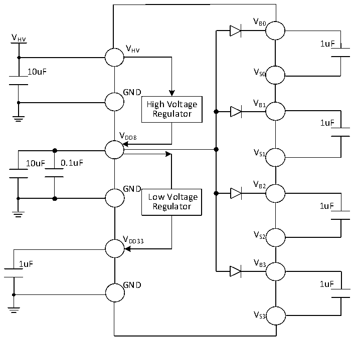

<!-- source-page: 22 -->

[← p.21](0021.md) · [index](../README.md) · [PDF p.22](https://ch32-riscv-ug.github.io/CH32M030/datasheet_zh/CH32M030DS0.PDF#page=22) · [p.23 →](0023.md)

<!-- header: CH32M030数据手册 https://wch.cn -->

# 第3章 电气特性

## 3.1 测试条件

除非特殊说明和标注，所有电压都以GND为基准。  
所有最小值和最大值将在最坏的环境温度、供电电压和时钟频率条件下得到保证。典型数值可基  
于以下三种环境之一用于设计指导：  
1、单VHV 供电，常温25℃、VHV= 12V；  
2、外部直接为VDD8 供电，常温25℃、VHV= 12V、VDD8= 8V，此时要求VDD8≤ VHV；  
3、外部直接为VDD33 和VDD8 供电，常温25℃、VHV= 12V、VDD8= 8V、VDD33= 3.3V，此时要求VDD33≤ VDD8  
≤ VHV。  
对于通过综合评估、设计模拟或工艺特性得到的数据，不会在生产线进行测试。在综合评估的基  
础上，最小和最大值是通过样本测试后统计得到。除非特殊说明为实测值，否则特性参数以综合评估  
或设计保证。  
供电方案：  

图3-1-1 常规供电典型电路（单VHV 供电）  
 <!-- rendered from the PDF; verify at https://ch32-riscv-ug.github.io/CH32M030/datasheet_zh/CH32M030DS0.PDF#page=22 -->

🖼 Text parsed from the figure above

VB0  
V  
HV 1uF  
VHV  
10uF VS0  
GND  
High Voltage V B1  
Regulator  
1uF  
VDD8  
VS1  
10uF 0.1uF  
V  
GND B2  
Low Voltage  
Regulator 1uF  
V  
V S2  
DD33  
1uF V B3  
GND 1uF  
VS3  

<!-- image: p22-draw-image-00001 bbox=[513.72, 780.72, 533.16, 791.04] -->
<!-- footer: V1.3 20 -->
