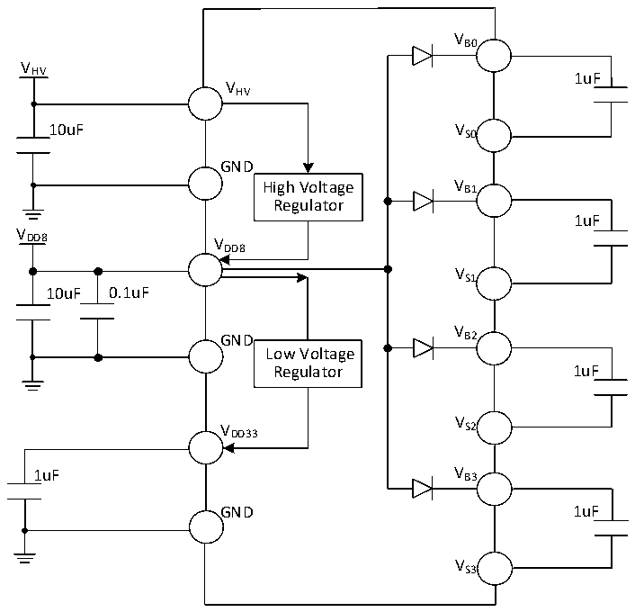
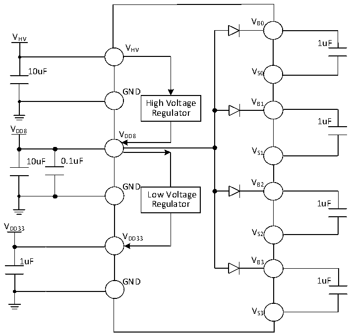

<!-- source-page: 23 -->

[← p.22](0022.md) · [index](../README.md) · [PDF p.23](https://ch32-riscv-ug.github.io/CH32M030/datasheet_zh/CH32M030DS0.PDF#page=23) · [p.24 →](0024.md)

<!-- header: CH32M030数据手册 https://wch.cn -->

图3-1-2 常规供电典型电路（外部直接为VDD8 供电)  
 <!-- rendered from the PDF; verify at https://ch32-riscv-ug.github.io/CH32M030/datasheet_zh/CH32M030DS0.PDF#page=23 -->

🖼 Text parsed from the figure above

VB0  
V  
HV 1uF  
VHV  
10uF VS0  
GND  
High Voltage V B1  
Regulator  
1uF  
V  
DD8 V  
DD8  
VS1  
10uF 0.1uF  
V  
GND B2  
Low Voltage  
Regulator 1uF  
V  
V S2  
DD33  
1uF V B3  
GND 1uF  
VS3  

图3-1-3 常规供电典型电路（外部直接为VDD33 和VDD8 供电）  
 <!-- rendered from the PDF; verify at https://ch32-riscv-ug.github.io/CH32M030/datasheet_zh/CH32M030DS0.PDF#page=23 -->

🖼 Text parsed from the figure above

VB0  
V  
HV 1uF  
VHV  
10uF VS0  
GND  
High Voltage V B1  
Regulator  
1uF  
V  
DD8 V  
DD8  
VS1  
10uF 0.1uF  
V  
GND B2  
Low Voltage  
Regulator 1uF  
V  
DD33 V  
V S2  
DD33  
1uF V B3  
GND 1uF  
VS3  

<!-- image: p23-draw-image-00001 bbox=[513.72, 780.72, 533.16, 791.04] -->
<!-- footer: V1.3 21 -->
