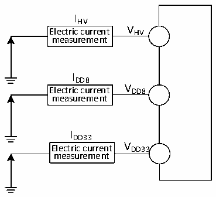

<!-- source-page: 26 -->

[← p.25](0025.md) · [index](../README.md) · [PDF p.26](https://ch32-riscv-ug.github.io/CH32M030/datasheet_zh/CH32M030DS0.PDF#page=26) · [p.27 →](0027.md)

<!-- header: CH32M030数据手册 https://wch.cn -->

图3-2 电流消耗测量  
 <!-- rendered from the PDF; verify at https://ch32-riscv-ug.github.io/CH32M030/datasheet_zh/CH32M030DS0.PDF#page=26 -->

🖼 Text parsed from the figure above

IHV  
Electric current V HV  
measurement  
IDD8  
Electric current V DD8  
measurement  
IDD33  
Electric current V DD33  
measurement  

微控制器处于下列条件：  
常温VHV= 12V（VDD8= 8V、VDD33= 3.3V）情况下，测试时：支持上拉输入的I/O口配置成上拉输入  
模式，其他配置为模拟输入模式。HSE = 8M、HSI = 8M（已校准）。使能或关闭所有外设时钟的功耗。  

<!-- p26-table-001 (table-3-5@1) -->
<table><caption>表3-5 运行模式下典型的电流消耗，数据处理代码从内部闪存中运行</caption><tr><th rowspan="2">符号</th><th rowspan="2">参数</th><th rowspan="2" colspan="2">条件</th><th colspan="2">典型值</th><th rowspan="2">单位</th></tr><tr><td>使能所有外设</td><td>关闭所有外设</td></tr><tr><td rowspan="10" style="text-align:left">IHV</td><td rowspan="10" style="text-align:left">运行模式下的供应电流</td><td rowspan="5" style="text-align:left">运行于高速内部RC振荡器（HSI）， 使用HB预分频以减低频率</td><td style="text-align:left">F = 72MHz HCLK</td><td>12.0</td><td>6.3</td><td rowspan="5">mA</td></tr><tr><td style="text-align:left">F = 48MHz HCLK</td><td>9.0</td><td>4.9</td></tr><tr><td style="text-align:left">F = 24MHz HCLK</td><td>5.9</td><td>3.5</td></tr><tr><td style="text-align:left">F = 8MHz HCLK</td><td>1.9</td><td>1.4</td></tr><tr><td style="text-align:left">F = 4MHz HCLK</td><td>1.4</td><td>1.1</td></tr><tr><td rowspan="5" style="text-align:left">运行于高速外部时钟（HSE），使用 HB 预分频以减低频率</td><td style="text-align:left">F = 72MHz HCLK</td><td>12.2</td><td>6.5</td><td rowspan="5">mA</td></tr><tr><td style="text-align:left">F = 48MHz HCLK</td><td>9.2</td><td>5.1</td></tr><tr><td style="text-align:left">F = 24MHz HCLK</td><td>6.1</td><td>3.7</td></tr><tr><td style="text-align:left">F = 8MHz HCLK</td><td>2.1</td><td>1.6</td></tr><tr><td style="text-align:left">F = 4MHz HCLK</td><td>1.6</td><td>1.3</td></tr></table>

注：以上为实测参数。  

<!-- p26-table-002 (table-3-6@1) pages 26-27 -->
<table><caption>表3-6 睡眠模式下典型的电流消耗，数据处理代码从内部闪存中运行</caption><tr><th rowspan="2">符号</th><th rowspan="2">参数</th><th rowspan="2" colspan="2">条件</th><th colspan="2">典型值</th><th rowspan="2">单位</th></tr><tr><td>使能所有外设</td><td>关闭所有外设</td></tr><tr><td rowspan="9" style="text-align:left">IHV</td><td rowspan="9" style="text-align:left">SLEEP睡眠模式下的供应电流 （此时外设供电和时钟保持）</td><td rowspan="5" style="text-align:left">运行于高速内部RC振荡器（HSI）， 使用HB预分频以减低频率</td><td style="text-align:left">F = 72MHz HCLK</td><td>9.5</td><td>3.9</td><td rowspan="5">mA</td></tr><tr><td style="text-align:left">F = 48MHz HCLK</td><td>7.1</td><td>3.1</td></tr><tr><td style="text-align:left">F = 24MHz HCLK</td><td>4.7</td><td>2.3</td></tr><tr><td style="text-align:left">F = 8MHz HCLK</td><td>1.1</td><td>0.6</td></tr><tr><td style="text-align:left">F = 4MHz HCLK</td><td>0.7</td><td>0.5</td></tr><tr><td rowspan="4" style="text-align:left">运行于高速外部时钟（HSE），使用 HB 预分频以减低频率</td><td style="text-align:left">F = 72MHz HCLK</td><td>9.9</td><td>4.2</td><td rowspan="4">mA</td></tr><tr><td style="text-align:left">F = 48MHz HCLK</td><td>7.5</td><td>3.4</td></tr><tr><td style="text-align:left">F = 24MHz HCLK</td><td>5.0</td><td>2.6</td></tr><tr><td style="text-align:left">F = 8MHz HCLK</td><td>1.4</td><td>0.9</td></tr><tr><td></td><td></td><td></td><td style="text-align:left">F = 4MHz HCLK</td><td>1.0</td><td>0.8</td><td></td></tr></table>

<!-- image: p26-draw-image-00001 bbox=[513.72, 780.72, 533.16, 791.04] -->
<!-- footer: V1.3 24 -->
