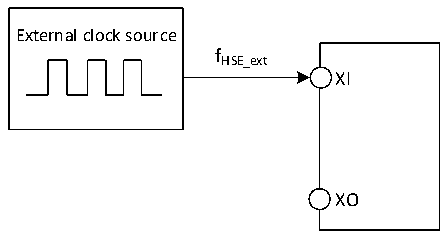

<!-- source-page: 27 -->

[← p.26](0026.md) · [index](../README.md) · [PDF p.27](https://ch32-riscv-ug.github.io/CH32M030/datasheet_zh/CH32M030DS0.PDF#page=27) · [p.28 →](0028.md)

<!-- header: CH32M030数据手册 https://wch.cn -->

> ⬆ **Table continued** — rendered in full at [page 26](0026.md). <!-- p27-table-001 -->

注：以上为实测参数。  

<!-- p27-table-002 (table-3-7@1) -->
<table><caption>表3-7 待机模式下典型的电流消耗</caption><tr><th>符号</th><th>参数</th><th colspan="2">条件</th><th>典型值</th><th>单位</th></tr><tr><td rowspan="12" style="text-align:left">IHV</td><td rowspan="4">STOP停止模式下的供应电流</td><td colspan="2" style="text-align:left">V = 12V、V = 5V HV DD8</td><td>104</td><td rowspan="4">uA</td></tr><tr><td colspan="2" style="text-align:left">V = 12V、V = 8V HV DD8</td><td>114</td></tr><tr><td colspan="2" style="text-align:left">V = 12V、V = 9V HV DD8</td><td>123</td></tr><tr><td colspan="2" style="text-align:left">V = 12V、V = 10V HV DD8</td><td>133</td></tr><tr><td rowspan="8">STANDBY待机模式下的供应电流</td><td rowspan="2" style="text-align:left">V = 12V、V = 5V HV DD8</td><td>LSI打开</td><td>76</td><td rowspan="8">uA</td></tr><tr><td>LSI关闭</td><td>74</td></tr><tr><td rowspan="2" style="text-align:left">V = 12V、V = 8V HV DD8</td><td>LSI打开</td><td>94</td></tr><tr><td>LSI关闭</td><td>92</td></tr><tr><td rowspan="2" style="text-align:left">V = 12V、V = 9V HV DD8</td><td>LSI打开</td><td>102</td></tr><tr><td>LSI关闭</td><td>102</td></tr><tr><td rowspan="2" style="text-align:left">V = 12V、V = 10V HV DD8</td><td>LSI打开</td><td>114</td></tr><tr><td>LSI关闭</td><td>114</td></tr></table>

注：以上为实测参数。  

### 3.3.4 外部时钟源特性

<!-- p27-table-003 (table-3-8@1) -->
<table><caption>表3-8 来自外部高速时钟</caption><tr><th>符号</th><th>参数</th><th>条件</th><th>最小值</th><th>典型值</th><th>最大值</th><th>单位</th></tr><tr><td style="text-align:left">FHSE_ext</td><td>外部时钟频率</td><td></td><td>4</td><td>8</td><td>25</td><td>MHz</td></tr><tr><td style="text-align:left">V (1) HSEH</td><td>XI输入引脚高电平电压</td><td></td><td style="text-align:left">0.8*VDD33</td><td></td><td style="text-align:left">VDD33</td><td>V</td></tr><tr><td style="text-align:left">V (1) HSEL</td><td>XI输入引脚低电平电压</td><td></td><td>0</td><td></td><td style="text-align:left">0.2*VDD33</td><td>V</td></tr><tr><td style="text-align:left">C in(HSE)</td><td>XI输入电容</td><td></td><td></td><td>5</td><td></td><td>pF</td></tr><tr><td style="text-align:left">DuCy (HSE)</td><td>占空比(Duty cycle)</td><td></td><td>40</td><td>50</td><td>60</td><td>%</td></tr><tr><td style="text-align:left">IL</td><td>XI输入漏电流</td><td></td><td></td><td></td><td>±1</td><td>uA</td></tr></table>

注：1.不满足此条件可能会引起电平识别错误。  

图3-3 外部提供高频时钟源电路  
 <!-- rendered from the PDF; verify at https://ch32-riscv-ug.github.io/CH32M030/datasheet_zh/CH32M030DS0.PDF#page=27 -->

🖼 Text parsed from the figure above

External clock source  
fHSE_ext  
XI  
XO  

<!-- p27-table-004 (table-3-9@1) pages 27-28 -->
<table><caption>表3-9 使用一个晶体/陶瓷谐振器产生的高速外部时钟</caption><tr><th>符号</th><th>参数</th><th>条件</th><th>最小值</th><th>典型值</th><th>最大值</th><th>单位</th></tr><tr><td style="text-align:left">FXI</td><td>谐振器频率</td><td></td><td>4</td><td>8</td><td>25</td><td>MHz</td></tr><tr><td style="text-align:left">RF</td><td>反馈电阻（无需外置）</td><td></td><td></td><td>250</td><td></td><td>kΩ</td></tr><tr><td style="text-align:left">CLOAD</td><td style="text-align:left">建议的负载电容与对应晶体串行阻抗RS</td><td style="text-align:left">R = 60Ω(1) S</td><td></td><td>20</td><td></td><td>pF</td></tr><tr><td style="text-align:left">I2</td><td>HSE驱动电流</td><td></td><td></td><td>0.3</td><td></td><td>mA</td></tr><tr><td style="text-align:left">g m</td><td>振荡器的跨导</td><td>启动</td><td></td><td>16</td><td></td><td>mA/V</td></tr><tr><td style="text-align:left">t SU(HSE)</td><td>启动时间</td><td style="text-align:left">V 稳定DD</td><td></td><td>2（2）</td><td></td><td>ms</td></tr></table>

<!-- image: p27-draw-image-00001 bbox=[513.72, 780.72, 533.16, 791.04] -->
<!-- footer: V1.3 25 -->
