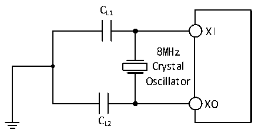

<!-- source-page: 28 -->

[← p.27](0027.md) · [index](../README.md) · [PDF p.28](https://ch32-riscv-ug.github.io/CH32M030/datasheet_zh/CH32M030DS0.PDF#page=28) · [p.29 →](0029.md)

<!-- header: CH32M030数据手册 https://wch.cn -->

> ⬆ **Table continued** — rendered in full at [page 27](0027.md). <!-- p28-table-001 -->

注：1.建议晶体ESR不超过80欧姆，优先选择ESR较小的晶体，负载电容参考晶体手册要求。  
2.启动时间指从HSEON开启到HSERDY被置位的时间差。  
电路参考设计及要求：  
晶体的负载电容以晶体厂商建议为准，通常情况CL1= CL2。  

图3-4 外接8M晶体典型电路  
 <!-- rendered from the PDF; verify at https://ch32-riscv-ug.github.io/CH32M030/datasheet_zh/CH32M030DS0.PDF#page=28 -->

🖼 Text parsed from the figure above

CL1  
XI  
8MHz  
Crystal  
Oscillator  
XO  
CL2  

### 3.3.5 内部时钟源特性

<!-- p28-table-002 (table-3-10@1) -->
<table><caption>表3-10 内部高速(HSI)RC振荡器特性</caption><tr><th>符号</th><th>参数</th><th>条件</th><th>最小值</th><th>典型值</th><th>最大值</th><th>单位</th></tr><tr><td style="text-align:left">FHSI</td><td>频率(校准后)</td><td></td><td></td><td>8</td><td></td><td>MHz</td></tr><tr><td style="text-align:left">DuCy HSI</td><td>占空比</td><td></td><td>45</td><td>50</td><td>55</td><td>%</td></tr><tr><td rowspan="3" style="text-align:left">ACCHSI</td><td rowspan="3">HSI振荡器的精度（校准后）</td><td style="text-align:left">T = 0℃～70℃ A</td><td>-1.5</td><td></td><td>1.5</td><td>%</td></tr><tr><td style="text-align:left">T = -40℃～85℃ A</td><td>-2.0</td><td></td><td>2.0</td><td>%</td></tr><tr><td style="text-align:left">T = -40℃～125℃ A</td><td>-2.2</td><td></td><td>2.2</td><td>%</td></tr><tr><td style="text-align:left">t SU(HSI)</td><td>HSI振荡器启动稳定时间</td><td></td><td></td><td>10</td><td></td><td>us</td></tr><tr><td style="text-align:left">IDD(HSI)</td><td>HSI振荡器功耗</td><td></td><td>120</td><td>180</td><td>270</td><td>uA</td></tr></table>

<!-- p28-table-003 (table-3-11@1) -->
<table><caption>表3-11 内部低速(LSI)RC振荡器特性</caption><tr><th>符号</th><th>参数</th><th>条件</th><th>最小值</th><th>典型值</th><th>最大值</th><th>单位</th></tr><tr><td style="text-align:left">FLSI</td><td>频率</td><td></td><td>240</td><td>340</td><td>450</td><td>kHz</td></tr><tr><td style="text-align:left">DuTy LSI</td><td>占空比</td><td></td><td>45</td><td>50</td><td>55</td><td>%</td></tr><tr><td style="text-align:left">t SU(LSI)</td><td>LSI振荡器启动稳定时间</td><td></td><td></td><td>80</td><td></td><td>us</td></tr><tr><td style="text-align:left">IDD(LSI)</td><td>LSI振荡器功耗</td><td></td><td></td><td>2</td><td></td><td>uA</td></tr></table>

### 3.3.6 从低功耗模式唤醒的时间

<!-- p28-table-004 (table-3-12@1) pages 28-29 -->
<table><caption>表3-12 低功耗模式唤醒的时间(1)</caption><tr><th>符号</th><th>参数</th><th>条件</th><th>典型值</th><th>单位</th></tr><tr><td style="text-align:left">t WUSLEEP</td><td>从睡眠模式唤醒</td><td>使用HSI RC时钟唤醒</td><td>24</td><td>us</td></tr><tr><td style="text-align:left">t WUSTOP</td><td>从停止模式唤醒</td><td>使用HSI RC时钟唤醒</td><td>255</td><td>us</td></tr><tr><td style="text-align:left">t WUSTDBY</td><td>从待机模式唤醒</td><td>LDO稳定时间 + HSI RC时钟唤醒</td><td>260</td><td>us</td></tr></table>

<!-- image: p28-draw-image-00001 bbox=[513.72, 780.72, 533.16, 791.04] -->
<!-- footer: V1.3 26 -->
