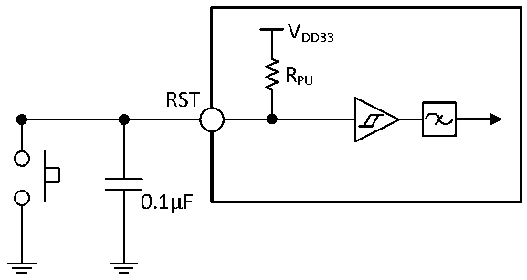

<!-- source-page: 33 -->

[← p.32](0032.md) · [index](../README.md) · [PDF p.33](https://ch32-riscv-ug.github.io/CH32M030/datasheet_zh/CH32M030DS0.PDF#page=33) · [p.34 →](0034.md)

<!-- header: CH32M030数据手册 https://wch.cn -->

> ⬆ **Table continued** — rendered in full at [page 32](0032.md). <!-- p33-table-001 -->

### 3.3.13 RST引脚特性

电路参考设计及要求：  

图3-5 外部复位引脚典型电路  
 <!-- rendered from the PDF; verify at https://ch32-riscv-ug.github.io/CH32M030/datasheet_zh/CH32M030DS0.PDF#page=33 -->

🖼 Text parsed from the figure above

VDD33  
RPU  
RST  
0.1μF  

注：图中的电容是可选的，可以用于滤除按键抖动。  

<!-- p33-table-003 (table-3-29@1) -->
<table><caption>表3-29 外部复位引脚特性</caption><tr><th>符号</th><th>参数</th><th>条件</th><th>最小值</th><th>典型值</th><th>最大值</th><th>单位</th></tr><tr><td style="text-align:left">VIL(RST)</td><td>RST输入低电平电压</td><td style="text-align:left">V = 3.3VDD33</td><td>0</td><td></td><td>0.8</td><td>V</td></tr><tr><td style="text-align:left">VIH(RST)</td><td>RST输入高电平电压</td><td style="text-align:left">V = 3.3VDD33</td><td>1.8</td><td></td><td style="text-align:left">VDD33</td><td>V</td></tr><tr><td style="text-align:left">V hys(RST)</td><td>RST施密特触发器迟滞电压</td><td></td><td>200</td><td></td><td></td><td>mV</td></tr><tr><td style="text-align:left">RPU</td><td>上拉等效电阻</td><td></td><td>30</td><td>45</td><td>60</td><td>kΩ</td></tr><tr><td style="text-align:left">VF(RST)</td><td>RST输入可被滤波脉宽</td><td></td><td></td><td></td><td>60</td><td>ns</td></tr><tr><td style="text-align:left">VNF(RST)</td><td>RST输入无法滤波脉宽</td><td></td><td>230</td><td></td><td></td><td>ns</td></tr></table>

### 3.3.14 TIM定时器特性

<!-- p33-table-004 (table-3-30@1) pages 33-34 -->
<table><caption>表3-30 TIMx特性</caption><tr><th>符号</th><th>参数</th><th>条件</th><th>最小值</th><th>最大值</th><th>单位</th></tr><tr><td rowspan="2" style="text-align:left">t res(TIM)</td><td rowspan="2">定时器基准时钟</td><td></td><td>1</td><td></td><td style="text-align:left">t TIMxCLK</td></tr><tr><td style="text-align:left">f = 48MHz TIMxCLK</td><td>20.8</td><td></td><td>ns</td></tr><tr><td rowspan="2" style="text-align:left">FEXT</td><td rowspan="2">CH1至CH3的定时器外部时钟频率</td><td></td><td>0</td><td style="text-align:left">f /2TIMxCLK</td><td>MHz</td></tr><tr><td style="text-align:left">f = 48MHz TIMxCLK</td><td>0</td><td>24</td><td>MHz</td></tr><tr><td style="text-align:left">R esTIM</td><td>定时器分辨率</td><td></td><td></td><td>16</td><td>位</td></tr><tr><td style="text-align:left">t COUNTER</td><td>当选择了内部时钟时，16位计数器时</td><td></td><td>1</td><td>65536</td><td style="text-align:left">t TIMxCLK</td></tr><tr><td></td><td>钟周期</td><td style="text-align:left">f = 48MHz TIMxCLK</td><td>0.0208</td><td>1363</td><td>us</td></tr><tr><td rowspan="2" style="text-align:left">t MAX_COUNT</td><td rowspan="2">最大可能的计数</td><td></td><td></td><td>65536</td><td style="text-align:left">t TIMxCLK</td></tr><tr><td style="text-align:left">f = 48MHz TIMxCLK</td><td></td><td>89.4</td><td>s</td></tr></table>

<!-- image: p33-draw-image-00001 bbox=[513.72, 780.72, 533.16, 791.04] -->
<!-- footer: V1.3 31 -->
