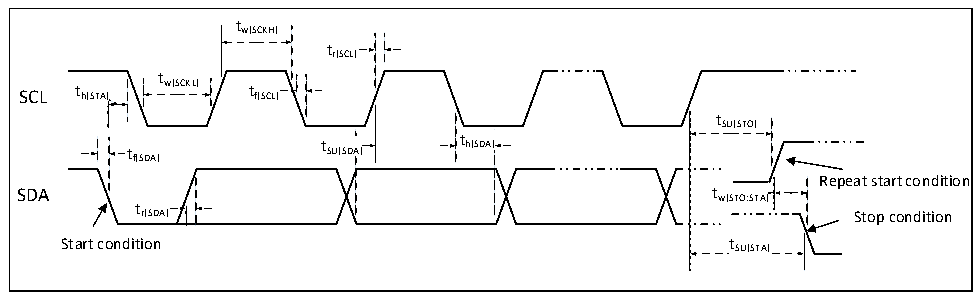

<!-- source-page: 34 -->

[← p.33](0033.md) · [index](../README.md) · [PDF p.34](https://ch32-riscv-ug.github.io/CH32M030/datasheet_zh/CH32M030DS0.PDF#page=34) · [p.35 →](0035.md)

<!-- header: CH32M030数据手册 https://wch.cn -->

> ⬆ **Table continued** — rendered in full at [page 33](0033.md). <!-- p34-table-001 -->

### 3.3.15 I2C接口特性

图3-6 I2C总线时序图  
 <!-- rendered from the PDF; verify at https://ch32-riscv-ug.github.io/CH32M030/datasheet_zh/CH32M030DS0.PDF#page=34 -->

🖼 Text parsed from the figure above

tw(SCKH)  
tr(SCL)  
t  
SCL t h(STA) w(SCKL) t f(SCL)  
tSU(STO)  
t t SU(SDA) t h(SDA)  
th(SDA)  
f(SDA)  
Repeat start condition  
t  
r(SDA) Stop condition  
Start condition tSU(STA)  

<!-- p34-table-003 (table-3-31@1) -->
<table><caption>表3-31 I2C接口特性</caption><tr><th rowspan="2">符号</th><th rowspan="2">参数</th><th colspan="2">标准I2C</th><th colspan="2">快速I2C</th><th rowspan="2">单位</th></tr><tr><td>最小值</td><td>最大值</td><td>最小值</td><td>最大值</td></tr><tr><td style="text-align:left">t w(SCKL)</td><td>SCL时钟低电平时间</td><td>4.7</td><td></td><td>1.2</td><td></td><td>us</td></tr><tr><td style="text-align:left">t w(SCKH)</td><td>SCL时钟高电平时间</td><td>4.0</td><td></td><td>0.6</td><td></td><td>us</td></tr><tr><td style="text-align:left">t SU(SDA)</td><td>SDA数据建立时间</td><td>250</td><td></td><td>100</td><td></td><td>ns</td></tr><tr><td style="text-align:left">t h(SDA)</td><td>SDA数据保持时间</td><td>0</td><td></td><td>0</td><td>900</td><td>ns</td></tr><tr><td style="text-align:left">t /t r(SDA) r(SCL)</td><td>SDA和SCL上升时间</td><td></td><td>1000</td><td>20</td><td></td><td>ns</td></tr><tr><td style="text-align:left">t /t f(SDA) f(SCL)</td><td>SDA和SCL下降时间</td><td></td><td>300</td><td></td><td></td><td>ns</td></tr><tr><td style="text-align:left">t h(STA)</td><td>开始条件保持时间</td><td>4.0</td><td></td><td>0.6</td><td></td><td>us</td></tr><tr><td style="text-align:left">t SU(STA)</td><td>重复的开始条件建立时间</td><td>4.7</td><td></td><td>0.6</td><td></td><td>us</td></tr><tr><td style="text-align:left">t SU(STO)</td><td>停止条件建立时间</td><td>4.0</td><td></td><td>0.6</td><td></td><td>us</td></tr><tr><td style="text-align:left">t w(STO:STA)</td><td>停止条件至开始条件的时间（总线空闲）</td><td>4.7</td><td></td><td>1.2</td><td></td><td>us</td></tr><tr><td style="text-align:left">C b</td><td>每条总线的容性负载</td><td></td><td>400</td><td></td><td>400</td><td>pF</td></tr></table>

<!-- image: p34-draw-image-00001 bbox=[513.72, 780.72, 533.16, 791.04] -->
<!-- footer: V1.3 32 -->
