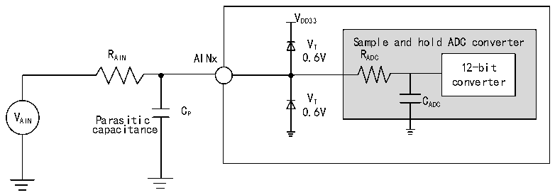
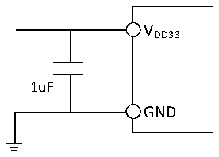

<!-- source-page: 38 -->

[← p.37](0037.md) · [index](../README.md) · [PDF p.38](https://ch32-riscv-ug.github.io/CH32M030/datasheet_zh/CH32M030DS0.PDF#page=38) · [p.39 →](0039.md)

<!-- header: CH32M030数据手册 https://wch.cn -->

图3-10 ADC典型连接图  
 <!-- rendered from the PDF; verify at https://ch32-riscv-ug.github.io/CH32M030/datasheet_zh/CH32M030DS0.PDF#page=38 -->

🖼 Text parsed from the figure above

VDD33  
VT Sample and hold ADC converter  
R AIN AINx 0.6V R ADC  
12-bit  
converter  
V AIN Parasitic C P 0 V . T 6V C ADC  
capacitance  

Cp表示PCB与焊盘上的寄生电容（大约5pF），可能与焊盘和PCB布局质量有关。较大的Cp数值将降  
低转换精度，解决办法是降低fADC 值。  

图3-11 模拟电源及退耦电路参考  
 <!-- rendered from the PDF; verify at https://ch32-riscv-ug.github.io/CH32M030/datasheet_zh/CH32M030DS0.PDF#page=38 -->

🖼 Text parsed from the figure above

VDD33  
1uF  
GND  

### 3.3.18 运算放大器OPA特性

<!-- p38-table-001 (table-3-36-1@1) -->
<table><caption>表3-36-1 OPA1特性</caption><tr><th>符号</th><th>参数</th><th>条件</th><th>最小值</th><th>典型值</th><th>最大值</th><th>单位</th></tr><tr><td style="text-align:left">VDD33</td><td>供电电压</td><td></td><td>3.1</td><td>3.3</td><td>3.5</td><td>V</td></tr><tr><td style="text-align:left">IDDQII</td><td>供电电流</td><td></td><td></td><td>270</td><td></td><td>uA</td></tr><tr><td style="text-align:left">VCMIR</td><td>共模输入电压</td><td></td><td></td><td></td><td style="text-align:left">V -1.5DD33</td><td>V</td></tr><tr><td style="text-align:left">VIOFFSET</td><td>输入失调电压</td><td></td><td></td><td>2</td><td>6</td><td>mV</td></tr><tr><td>Av(1)</td><td>开环增益</td><td></td><td></td><td>90</td><td></td><td>dB</td></tr><tr><td rowspan="3">BW(1)</td><td rowspan="3">OPA1运算放大器带宽</td><td style="text-align:left">VO∈(0.3V,V -0.3V) DD33</td><td></td><td>600</td><td></td><td rowspan="3">kHz</td></tr><tr><td style="text-align:left">VO∈(0.2V,V -0.2V) DD33</td><td></td><td>500</td><td></td></tr><tr><td style="text-align:left">VO∈(0.1V,V -0.1V) DD33</td><td></td><td>400</td><td></td></tr><tr><td rowspan="2" style="text-align:left">PGA (1) GAIN</td><td rowspan="2">PGA增益误差</td><td>Gain = 20</td><td>-1</td><td></td><td>1</td><td rowspan="2">%</td></tr><tr><td>Gain = 40</td><td>-1</td><td></td><td>1</td></tr><tr><td style="text-align:left">RBIAS</td><td>在QII1模式下的偏置电阻</td><td></td><td></td><td>90</td><td></td><td>kΩ</td></tr></table>

注：1.设计参数保证。  

<!-- p38-table-002 (table-3-36-2@1) pages 38-39 -->
<table><caption>表3-36-2 OPA2特性</caption><tr><th>符号</th><th>参数</th><th>条件</th><th>最小值</th><th>典型值</th><th>最大值</th><th>单位</th></tr><tr><td style="text-align:left">VDD33</td><td>供电电压</td><td></td><td>3.1</td><td>3.3</td><td>3.5</td><td>V</td></tr><tr><td style="text-align:left">IDDQII</td><td>供电电流</td><td></td><td></td><td>270</td><td></td><td>uA</td></tr><tr><td style="text-align:left">VCMIR</td><td>共模输入电压</td><td></td><td></td><td></td><td style="text-align:left">V -1.5DD33</td><td>V</td></tr><tr><td style="text-align:left">VIOFFSET</td><td>输入失调电压</td><td></td><td></td><td>2</td><td>6</td><td>mV</td></tr><tr><td>Av(1)</td><td>开环增益</td><td></td><td></td><td>90</td><td></td><td>dB</td></tr><tr><td rowspan="3">BW(1)</td><td rowspan="3">OPA2运算放大器带宽</td><td style="text-align:left">VO∈(0.3V,V -0.3V) DD33</td><td></td><td>600</td><td></td><td rowspan="3">kHz</td></tr><tr><td style="text-align:left">VO∈(0.2V,V -0.2V) DD33</td><td></td><td>500</td><td></td></tr><tr><td style="text-align:left">VO∈(0.1V,V -0.1V) DD33</td><td></td><td>400</td><td></td></tr><tr><td rowspan="4" style="text-align:left">PGA (1) GAIN</td><td rowspan="4">PGA增益误差</td><td>Gain = 5</td><td>-1</td><td></td><td>1</td><td rowspan="4">%</td></tr><tr><td>Gain = 10</td><td>-1</td><td></td><td>1</td></tr><tr><td>Gain = 20</td><td>-1</td><td></td><td>1</td></tr><tr><td>Gain = 40</td><td>-1</td><td></td><td>1</td></tr><tr><td style="text-align:left">RBIAS</td><td>在QII2模式下的偏置电阻</td><td></td><td></td><td>90</td><td></td><td>kΩ</td></tr></table>

<!-- image: p38-draw-image-00001 bbox=[513.72, 780.72, 533.16, 791.04] -->
<!-- footer: V1.3 36 -->
