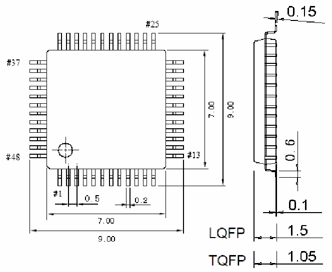
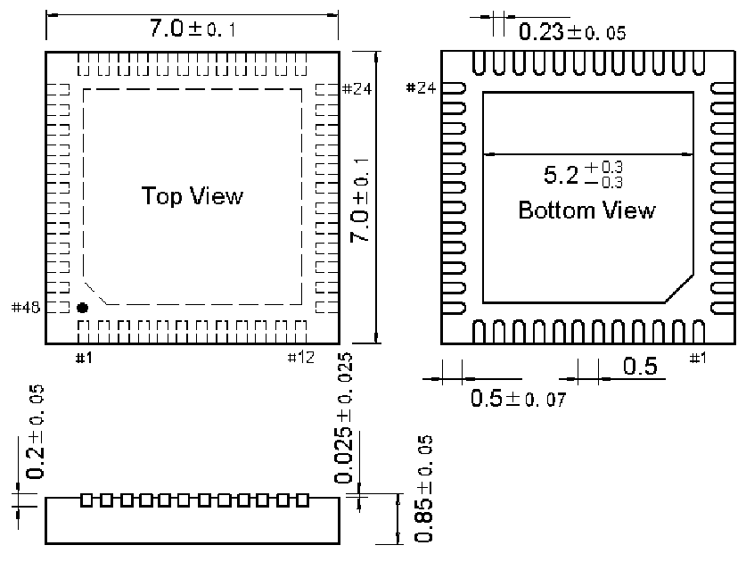

<!-- source-page: 44 -->

[← p.43](0043.md) · [index](../README.md) · [PDF p.44](https://ch32-riscv-ug.github.io/CH32M030/datasheet_zh/CH32M030DS0.PDF#page=44) · [p.45 →](0045.md)

<!-- header: CH32M030数据手册 https://wch.cn -->
说明：尺寸标注的单位是mm（毫米），引脚中心间距总是标称值，没有误差，除此之外的尺寸误差  
不大于±0.2mm或者±10%两者中的较大值。  

图4-1 LQFP48封装  
 <!-- rendered from the PDF; verify at https://ch32-riscv-ug.github.io/CH32M030/datasheet_zh/CH32M030DS0.PDF#page=44 -->

🖼 Text parsed from the figure above

<!-- image: p44-draw-image-00002 inside the figure -->

图4-2 QFN48X7_A封装  
 <!-- rendered from the PDF; verify at https://ch32-riscv-ug.github.io/CH32M030/datasheet_zh/CH32M030DS0.PDF#page=44 -->

🖼 Text parsed from the figure above

<!-- image: p44-draw-image-00003 inside the figure -->

<!-- image: p44-draw-image-00001 bbox=[502.32, 779.28, 521.76, 789.6] -->
<!-- footer: V1.3 42 -->
