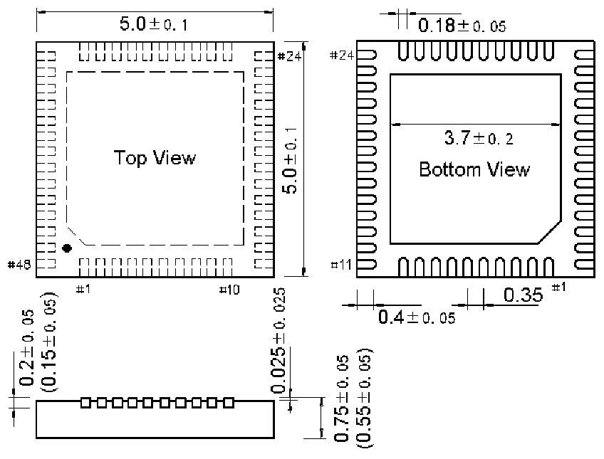
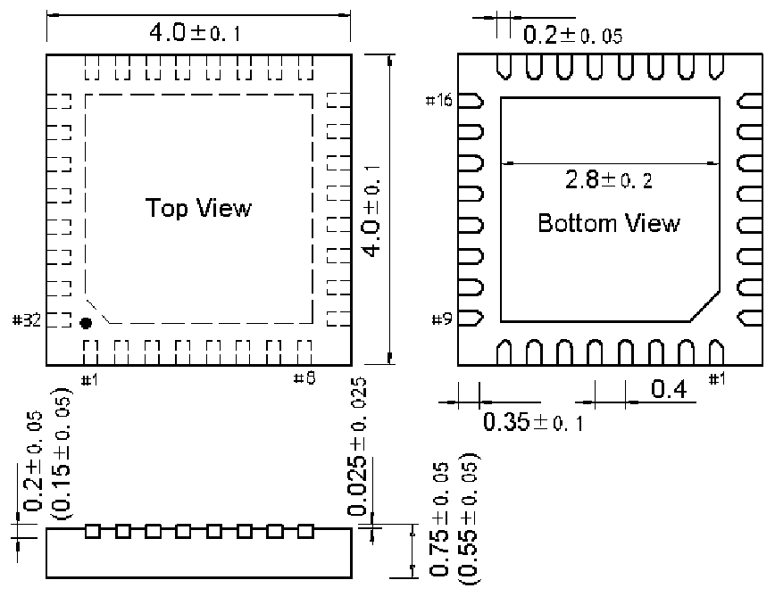

<!-- source-page: 45 -->

[← p.44](0044.md) · [index](../README.md) · [PDF p.45](https://ch32-riscv-ug.github.io/CH32M030/datasheet_zh/CH32M030DS0.PDF#page=45) · [p.46 →](0046.md)

<!-- header: CH32M030数据手册 https://wch.cn -->

图4-3 QFN48封装  
 <!-- rendered from the PDF; verify at https://ch32-riscv-ug.github.io/CH32M030/datasheet_zh/CH32M030DS0.PDF#page=45 -->

🖼 Text parsed from the figure above

<!-- image: p45-draw-image-00002 inside the figure -->

图4-4 QFN32封装  
 <!-- rendered from the PDF; verify at https://ch32-riscv-ug.github.io/CH32M030/datasheet_zh/CH32M030DS0.PDF#page=45 -->

🖼 Text parsed from the figure above

<!-- image: p45-draw-image-00003 inside the figure -->

<!-- image: p45-draw-image-00001 bbox=[502.32, 779.28, 521.76, 789.6] -->
<!-- footer: V1.3 43 -->
