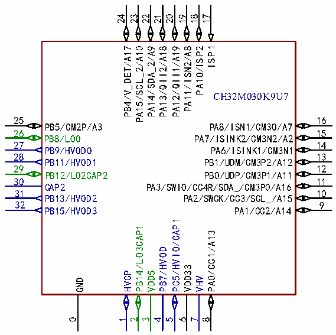
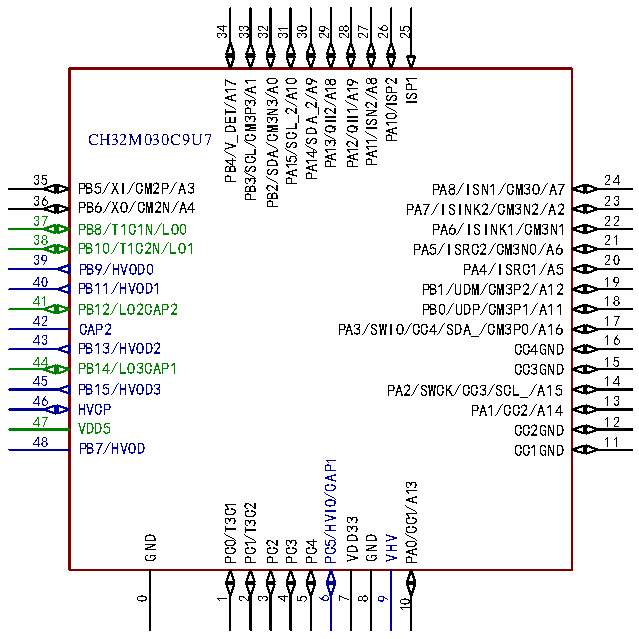

<!-- source-page: 1 -->

[index](../README.md) · [PDF p.1](https://ch32-riscv-ug.github.io/CH32M030/datasheet_zh/CH32M030DS2.PDF#page=1) · [p.2 →](0002.md)

<!-- header: CH32M030数据手册 https://wch.cn -->
<!-- image: p1-draw-image-00002 bbox=[68.04, 60.96, 135.6, 66.96] -->

# CH32M030数据手册2

<!-- image: p1-draw-image-00003 bbox=[68.04, 66.96, 135.6, 72.96] -->
<!-- image: p1-draw-image-00004 bbox=[68.04, 72.96, 135.6, 78.96] -->
<!-- image: p1-draw-image-00005 bbox=[68.04, 78.96, 135.6, 84.96] -->
<!-- image: p1-draw-image-00006 bbox=[68.04, 84.96, 135.6, 90.96] -->
<!-- image: p1-draw-image-00007 bbox=[68.04, 90.96, 135.6, 96.72] -->

# V1.2

# 1、引脚信息

## 1.1 引脚排列

 <!-- p1-cluster-01 uncaptioned graphics, rendered from the PDF; verify at https://ch32-riscv-ug.github.io/CH32M030/datasheet_zh/CH32M030DS2.PDF#page=1 -->

 <!-- p1-cluster-02 uncaptioned graphics, rendered from the PDF; verify at https://ch32-riscv-ug.github.io/CH32M030/datasheet_zh/CH32M030DS2.PDF#page=1 -->

🖼 Text parsed from the figure above

24  
23  
22  
21  
20  
19  
18  
17  
ISP1  
PA14/SDA_2/A9  
PA13/QII2/A18  
PA12/QII1/A19  
PA11/ISN2/A8  
PA10/ISP2  
PB4/V_DET/A17  
PA15/SCL_2/A10  
CH32M030K9U7  
25  
16  
PB5/CM2P/A3  
PA8/ISN1/CM3O/A7  
26  
15  
PB8/LO0  
PA7/ISINK2/CM3N2/A2  
27  
14  
PB9/HVOD0  
PA6/ISINK1/CM3N1  
28  
13  
PB11/HVOD1  
PB1/UDM/CM3P2/A12  
29  
12  
PB12/LO2CAP2  
PB0/UDP/CM3P1/A11  
30  
11  
CAP2  
PA3/SWIO/CC4R/SDA_/CM3P0/A16  
31  
10  
PB13/HVOD2  
PA2/SWCK/CC3/SCL_/A15  
32  
9  
PB15/HVOD3  
PA1/CC2/A14  
PC5/HVIO/CAP1  
PB14/LO3CAP1  
PA0/CC1/A13  
PB7/HVOD  
VDD33  
HVCP  
VDD5  
VHV  
GND  
0  
1  
2  
3  
4  
5  
6  
7  
8  
34  
33  
32  
31  
30  
29  
28  
27  
26  
25  
ISP1  
PA15/SCL_2/A10  
PA14/SDA_2/A9  
PB3/SCL/CM3P3/A1  
PB2/SDA/CM3N3/A0  
PA11/ISN2/A8  
PA10/ISP2  
PA12/QII1/A19  
PA13/QII2/A18  
PB4/V_DET/A17  
CH32M030C9U7  
35  
24  
PB5/XI/CM2P/A3  
PA8/ISN1/CM3O/A7  
36 PB6/XO/CM2N/A4  
23 PA7/ISINK2/CM3N2/A2  
37  
22  
PB8/T1C1N/LO0  
PA6/ISINK1/CM3N1  
38  
21  
PB10/T1C2N/LO1  
PA5/ISRC2/CM3N0/A6  
39  
20  
PB9/HVOD0  
PA4/ISRC1/A5  
40 PB11/HVOD1  
19 PB1/UDM/CM3P2/A12  
41  
18  
PB12/LO2CAP2  
PB0/UDP/CM3P1/A11  
42  
17  
CAP2  
PA3/SWIO/CC4/SDA_/CM3P0/A16  
43  
16  
PB13/HVOD2  
CC4GND  
44 PB14/LO3CAP1  
15 CC3GND  
45  
14  
PB15/HVOD3  
PA2/SWCK/CC3/SCL_/A15  
46  
13  
HVCP  
PA1/CC2/A14  
47 VDD5  
12 CC2GND  
48 PB7/HVOD  
11 CC1GND  
PC5/HVIO/CAP1  
PA0/CC1/A13  
PC0/T3C1  
PC1/T3C2  
VDD33  
GND  
GND  
VHV  
PC2  
PC3  
PC4  
0  
1  
2  
3  
4  
5  
6  
7  
8  
9  
10  

<!-- image: p1-draw-image-00001 bbox=[512.28, 779.28, 531.72, 789.6] -->
<!-- footer: V1.2 1 -->
