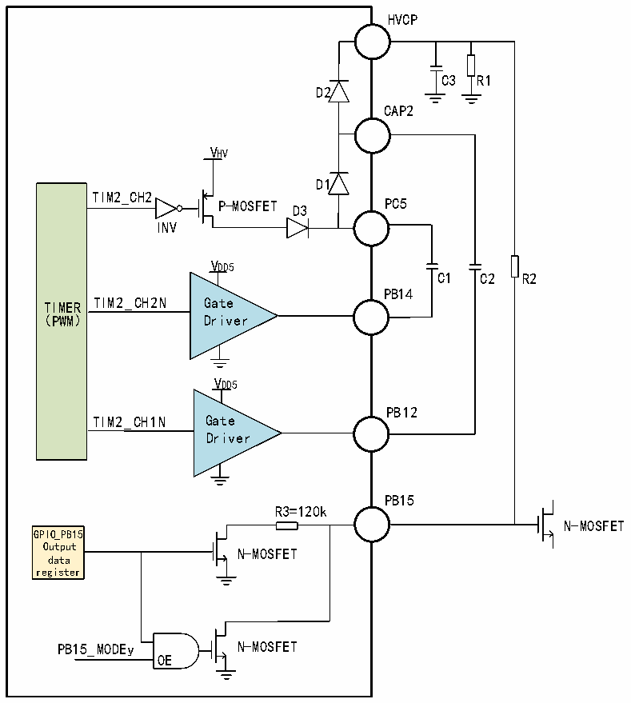

<!-- source-page: 6 -->

[← p.5](0005.md) · [index](../README.md) · [PDF p.6](https://ch32-riscv-ug.github.io/CH32M030/datasheet_zh/CH32M030DS2.PDF#page=6) · [p.7 →](0007.md)

<!-- header: CH32M030数据手册 https://wch.cn -->

# 2、功能概述

## 2.1 升压模块

CH32M030K9U的升压模块包含2级电荷泵，第一级电  
电荷泵由PB14推挽输出驱动，需要外接电容C1；  
第二级电荷泵由PB12推挽输出驱动，需要外接电容C2。  
。提升后的电压VHVCP 相当于VHV 加两倍VDD5，从HVCP  
引脚输出，需要外接储能电容C3，电阻R1为可选的关机  
机放电电阻。  
CH32M030K9U提供了5个高压开漏输出引脚PB7、PB9  
9、PB11、PB13、PB15，支持VHVCP 电压范围。其  
中PB9、PB11、PB13、PB15各自具有两级开漏输出驱动能  
能力，一级是常规驱动，另一级是内部串联电阻  
后的限流驱动，可以用于与外部上拉电阻R2分压产生非  
非满幅电压输出。  
下图为升压模块和高压开漏输出引脚PB15内部结构  
构图。  

图2-1 内部升压模  
 <!-- rendered from the PDF; verify at https://ch32-riscv-ug.github.io/CH32M030/datasheet_zh/CH32M030DS2.PDF#page=6 -->

模块结构图  

🖼 Text parsed from the figure above

HVCP  
C3 R1  
D2  
CAP2  
VHV  
D1  
TIM2_CH2  
PC5  
P-MOSFET D3  
INV  
VDD5  
C1 C2 R2  
PB14  
TIMER TIM2_CH2N Gate  
(PWM) Driver  
VDD5  
PB12  
TIM2_CH1N Gate  
Driver  
PB15  
R3=120k  
N-MOSFET  
GPIO_PB15  
Output  
N-MOSFET  
data  
register  
PB15_MODEy N-MOSFET  
OE  

注1：C1、C2、C3、R1、R2为芯片外部器件。  
注2：PB9、PB11、PB13内部结构参考PB15。  
注3：N-MOSFET为片外N型MOSFET功率管。  
<!-- image: p6-draw-image-00001 bbox=[509.28, 780.72, 528.72, 791.04] -->
<!-- footer: V1.2 6 -->
