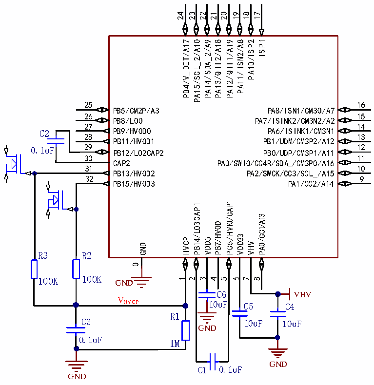

<!-- source-page: 9 -->

[← p.8](0008.md) · [index](../README.md) · [PDF p.9](https://ch32-riscv-ug.github.io/CH32M030/datasheet_zh/CH32M030DS2.PDF#page=9) · [p.10 →](0010.md)

<!-- header: CH32M030数据手册 https://wch.cn -->

# 4、升压和高压开漏驱动应用

 <!-- p9-cluster-01 uncaptioned graphics, rendered from the PDF; verify at https://ch32-riscv-ug.github.io/CH32M030/datasheet_zh/CH32M030DS2.PDF#page=9 -->

🖼 Text parsed from the figure above

24  
23  
22  
21  
20  
19  
18  
17  
ISP1  
PA14/SDA_2/A9  
PA13/QII2/A18  
PA12/QII1/A19  
PA11/ISN2/A8  
PA10/ISP2  
PB4/V_DET/A17  
PA15/SCL_2/A10  
25  
16  
PA8/ISN1/CM3O/A7  
PB5/CM2P/A3  
26  
15  
PB8/LO0  
PA7/ISINK2/CM3N2/A2  
27  
14  
PB9/HVOD0  
PA6/ISINK1/CM3N1  
C2  
28  
13  
PB11/HVOD1  
PB1/UDM/CM3P2/A12  
29 PB12/LO2CAP2  
12 PB0/UDP/CM3P1/A11  
0.1uF  
30  
11  
CAP2  
PA3/SWIO/CC4R/SDA_/CM3P0/A16  
31  
10  
PB13/HVOD2  
PA2/SWCK/CC3/SCL_/A15  
32  
9  
PB15/HVOD3  
PA1/CC2/A14  
PC5/HVIO/CAP1  
PB14/LO3CAP1  
PA0/CC1/A13  
PB7/HVOD  
VDD33  
HVCP  
VDD5  
VHV  
GND  
R3 R2  
0  
100K 100K GND  
1  
2  
3  
4  
5  
6  
7  
8  
C6 VHV  
V  
HVCP 10uF C5 C4  
R1  
C3 10uF 10uF  
GND  
0.1uF  
1M  
GND  
C1 0.1uF  
GND  

(一) 、建议C1=C2=C3=0.01uF～0.1uF，R1=1MΩ，R2、R3可根据实际应用所需分压选择阻值。  
(二) 、配置FLASH_CTLR2寄存器的VDD8_SEL=00（默认值），VDD5=5V。  
(三) 、开启HVCP升压。  
1)配置TIM2_CTLR1寄存器CH2_PWMOUT_EN=1，将定时器通道2的PWM从PC5输出；  
2)配置TIM2为PWM输出模式，PWM周期可设为1uS到5uS；  
3)配置TIM2_CH1CVR和TIM2_CH2CVR寄存器位相同值，配置TIM2_DTCR寄存器DT2_P位为1；  
4)配置TIM2_DTCR寄存器中DT2，使下降沿死区时间约为100ns，并使能OC2N_EN=1，开启互补功  
能，实现PC5、PB14输出带死区的互补信号；使能OC1N_EN=1、DT1N_P=1，实现PB12、PB14输出  
不带死区互补信号；  
5)配置GPIOx_CFGLR寄存器，PC5、PB14、PB12为复用推挽输出模式；  
6)如果设置PC5为输入模式（三态高阻），则关闭升压，电阻R1用于放电。  
(四) 、如果需要控制开漏输出，那么 PB7 直接驱动，PB9、PB11、PB13、PB15 可选两个驱动级别，系  
统复位后默认均为高阻输出，以下设置以PB15为例。  
1)直接驱动，配置GPIOx_CFGLR寄存器，PB15为通用推挽输出模式。  
a.配置GPIOx_OUTDR寄存器，bit15=0（默认值），此时，PB15输出高阻；  
b.配置GPIOx_OUTDR寄存器，bit15=1，此时，PB15直接输出低电平。  
2)分压驱动，配置GPIOx_CFGLR寄存器，PB15为输入模式。  
a.配置GPIOx_OUTDR寄存器，bit15=0（默认值），此时，PB15输出高阻；  
<!-- image: p9-draw-image-00001 bbox=[509.28, 780.72, 528.72, 791.04] -->
<!-- footer: V1.2 9 -->
