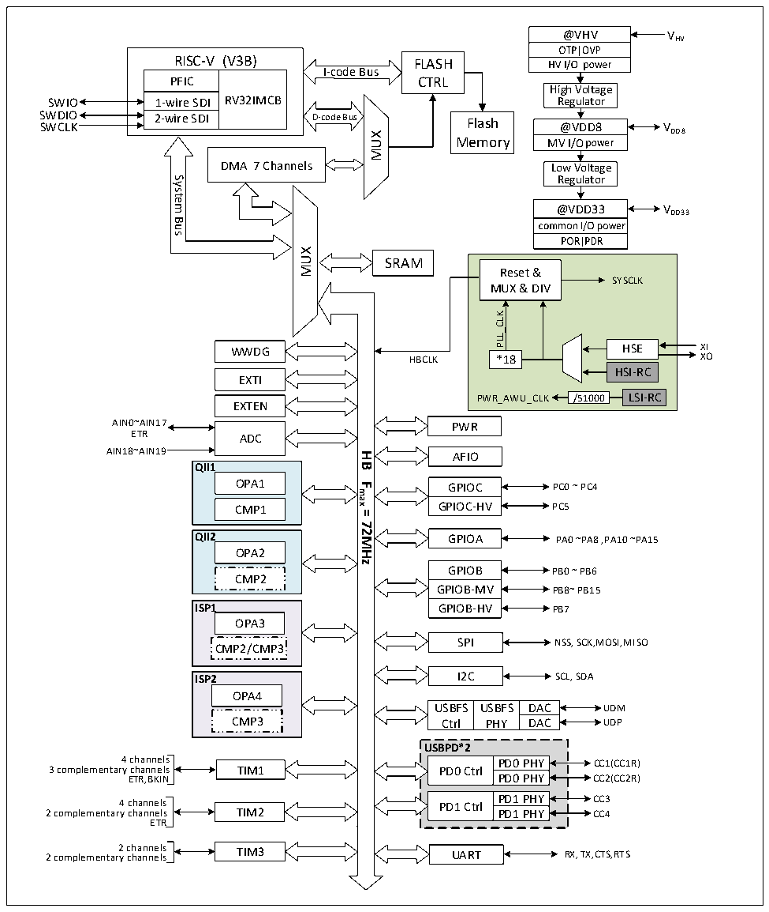

<!-- source-page: 4 -->

[← p.3](0003.md) · [index](../README.md) · [PDF p.4](https://ch32-riscv-ug.github.io/CH32M030/datasheet_en/CH32M030RM.PDF#page=4) · [p.5 →](0005.md)

<!-- header: CH32M030 Reference Manual https://wch-ic.com -->

Figure 1-1 CH32M030 system block diagram  
 <!-- rendered from the PDF; verify at https://ch32-riscv-ug.github.io/CH32M030/datasheet_en/CH32M030RM.PDF#page=4 -->

🖼 Text parsed from the figure above

@VHV  
VHV  
RISC-V (V3B)  RISC-VPFIC  V (V3B) RV32IMCB  1-wire SDI 2-wire SDI  
RISC-V (V3B) FLASH  
I-code Bus  
CTRL  
High Voltage  
SWIO 1-wire SDI RV32IMCB Regulator  
SWDIO 2-wire SDI SWCLKD-codeBusFlash@VDD8 V  
@VDD8  MV@ I/VODD8  
DD8  
MUX  
Memory  
DMA 7 Channels  
Low Voltage  
Regulator  
System  
@VDD33  
Bus  
MUX  
SRAM  
Reset &amp;  
SYSCLK  
MUX &amp; DIV  
PLL_CLK  
HSE  HSEHSI-RC  
WWDG HSE XI  
HBCLK XO  
*18  
EXTI  
/51000  LSI-RC  
PWR_AWU_CLK /51000  
EXTEN  
AIN0~AIN17  
PWR  
ETR ADC  
AIN18~AIN19 AFIO  
<strong>HB</strong>  
<strong>QII1</strong>  
OPA1  
<strong>Fmax</strong>  
GPIOC PC0 ~ PC4  
GPIOC-HV PC5  
CMP1  
<strong>=</strong>  
<strong>72MHz</strong>  
<strong>QII2</strong>  
GPIOA PA0 ~PA8 ,PA10 ~PA15  
OPA2  
GPIOB PB0 ~ PB6  
CMP2  
GPIOB-MV PB8~ PB15  
ISP1 GPIOB-HV PB7  
OPA3  
SPI NSS, SCK,MOSI,MISO  
CMP2/CMP3  
I2C  
SCL, SDA  
<strong>ISP2</strong>  
OPA4  
USBFSCtrl  USBFPHY  
USBFS USBFS DAC UDM  
CMP3  
Ctrl PHY DAC UDP  
<strong>USBPD*2</strong>  
4 channels PD0 PHY CC1(CC1R)  
3 complementary channels TIM1 PD0 Ctrl  
ETR,BKIN PD0 PHY CC2(CC2R)  
4 channels PD1 Ctrl PD1 PHY CC3  
2 complementary channels TIM2 PD1 PHY CC4  
ETR  
2 channels 2 complementary channels RX, TX,CTS,RTS  
TIM3  
UART  

The system is equipped with: Flash access prefetching mechanism to speed up code execution; General-purpose  
DMA controller to reduce the CPU burden and improve efficiency; clock tree hierarchy management to reduce the  
total power consumption of peripherals, as well as data protection mechanisms, clock security system protection  
mechanisms and other measures to increase system stability.  
● The instruction bus (I-Code) connects the core to the FLASH instruction interface and prefetching is done on  
this bus.  
● The data bus (D-Code) connects the core to the FLASH data interface for constant loading and debugging.  
<!-- image: p4-draw-image-00001 bbox=[506.4, 783.36, 526.32, 793.92] -->
<!-- footer: V1.2 2 -->
