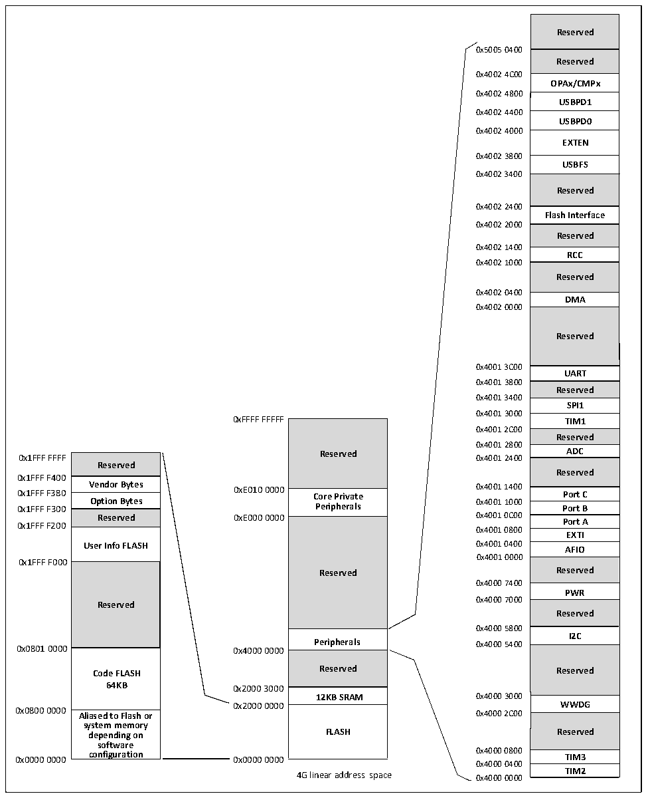

<!-- source-page: 6 -->

[← p.5](0005.md) · [index](../README.md) · [PDF p.6](https://ch32-riscv-ug.github.io/CH32M030/datasheet_en/CH32M030RM.PDF#page=6) · [p.7 →](0007.md)

<!-- header: CH32M030 Reference Manual https://wch-ic.com -->

## 1.2 Memory Map

The CH32M030 family contains program memory, data memory, core registers, peripheral registers, and more, all  
addressed in a 4GB linear space.  
System storage stores data in small-end format, i.e., low bytes are stored at the low address and high bytes are  
stored at the high address.  

Figure 1-2 CH32M030 storage image  
 <!-- rendered from the PDF; verify at https://ch32-riscv-ug.github.io/CH32M030/datasheet_en/CH32M030RM.PDF#page=6 -->

🖼 Text parsed from the figure above

Reserved  Reserved  
0x5005 0400  
0x4002 4C00  
<strong>OPAx/CMPx</strong>  
0x4002 4800  
<strong>USBPD1</strong>  
0x4002 4400  
<strong>USBPD0</strong>  
0x4002 4000  
<strong>EXTEN</strong>  
0x4002 3800  
<strong>USBFS</strong>  
0x4002 3400  
<strong>Reserved</strong>  
0x4002 2400  
<strong>Flash Interface</strong>  
0x4002 2000  
<strong>Reserved</strong>  
0x4002 1400  
<strong>RCC</strong>  
0x4002 1000  
<strong>Reserved</strong>  
0x4002 0400  
<strong>DMA</strong>  
0x4002 0000  
Reserved  UART  Reserved  SPI1  TIM1  Reserved  ADC  Reserved  Port C  Port B  Port A  EXTI  AFIO  Reserved  PWR  Reserved  
0x4001 3C00  
0x4001 3800  
0x4001 3400  
0x4001 3000  
0xFFFF FFFFF TIM1  
Reserved  Core Private Peripherals  Reserved  
0x4001 2C00  
0x4001 2800  
Reserved  Vendor Bytes  Vendor Bytes Option Bytes  Reserved  User Info FLASH  Reserved  Code FLASH64KB Aliased to Flash or  Aliased to Flash or system memory depending on software configuration  
0x1FFF F400  
0x4001 0800  
0x4001 0000  
0x1FFF F000  
<strong>Reserved Reserved</strong>  
0x4000 7400  
0x4000 7000  
0x4000 5800  
<strong>I2C</strong>  
0x0801 0000 0x4000 0000 Peripherals 0x4000 5400  
Reserved  12KB SRAM  FLASH  
64KB 0x2000 3000  
12KB SRAM 0x4000 3000  
0x2000 0000 WWDG  
0x0800 0000 Aliased to Flash or 0x4000 2C00  
0x4000 0400  
4G linear address space 0x4000 0000 TIM2  

<!-- image: p6-draw-image-00001 bbox=[506.4, 783.36, 526.32, 793.92] -->
<!-- footer: V1.2 4 -->
