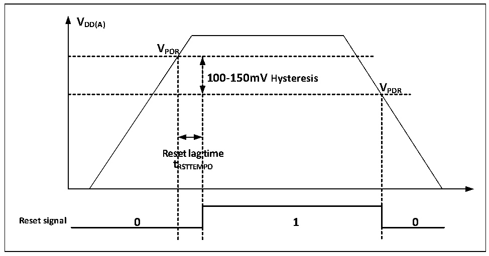

<!-- source-page: 8 -->

[← p.7](0007.md) · [index](../README.md) · [PDF p.8](https://ch32-riscv-ug.github.io/CH32M030/datasheet_en/CH32M030RM.PDF#page=8) · [p.9 →](0009.md)

<!-- header: CH32M030 Reference Manual https://wch-ic.com -->

# Chapter 2 Power Control (PWR)

## 2.1 Overview

The system operating voltage VHV ranges 4.0~29.0V.  

## 2.2 Power Management

### 2.2.1 Power-on Reset and Power-down Reset

The system integrated a power-on reset POR and a power-down reset PDR circuit. When the chip supply voltage  
VDD and VDDA falls below the corresponding threshold voltage, the system is reset by the relevant circuit, and no  
additional external reset circuit is required. Please refer to the corresponding datasheet for the parameters of the  
power-on threshold voltage VPOR and the power-down threshold voltage VPDR.  

Figure 2-2 Schematic diagram of the operation of POR and PDR  
 <!-- rendered from the PDF; verify at https://ch32-riscv-ug.github.io/CH32M030/datasheet_en/CH32M030RM.PDF#page=8 -->

🖼 Text parsed from the figure above

<strong>VDD(A)</strong>  
<strong>VPOR</strong>  
100-150mV Hysteresis  Rese t R  et lag RSTTEM  time MPO  V  
<strong>VPDR</strong>  
<strong>tRSTTEMPO</strong>  

### 2.2.2 Overvoltage Reset

By configuring the SEL_IO_VHV[1:0] bit, enable the PB4 port overvoltage protection detection. This function  
can automatically configure OVP overvoltage protection outside the chip through the PB4 pin. According to the  
threshold voltage of the internal judgment circuit and the proportion of the off-chip resistance voltage division, the  
overvoltage protection point of VHV can be set independently. When the VHV voltage is too high, the MCU can be  
forced to reset.  

### 2.2.3 Divider Voltage Monitoring

Enable the PB4 port VHV divider voltage monitoring by configuring the SEL_IO_VHV[1:0] bits. This function  
can input VHV divider voltage through PB4 pin, and the voltage value will be sampled and monitored by ADC,  
and the real-time VHV value can be deduced according to the divider ratio of the off-chip resistor. For example, the  
external partial voltage resistor is 10K and 1K, at this time the ratio of sampling voltage and VHV is 1:11, if the  
<!-- image: p8-draw-image-00001 bbox=[506.4, 783.36, 526.32, 793.92] -->
<!-- footer: V1.2 6 -->
