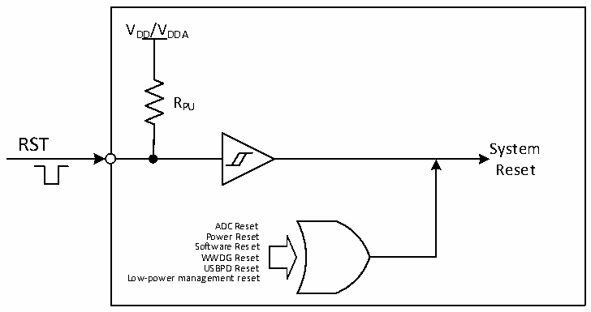

<!-- source-page: 14 -->

[← p.13](0013.md) · [index](../README.md) · [PDF p.14](https://ch32-riscv-ug.github.io/CH32M030/datasheet_en/CH32M030RM.PDF#page=14) · [p.15 →](0015.md)

<!-- header: CH32M030 Reference Manual https://wch-ic.com -->
Reset; If IE_RX_RESET is also 1, it also supports the reset generated by the signal frame Cable Reset. USB PD  
has no reset flag, but it produces the same reset effect as software reset.  
Low Power Management Reset: Standby mode reset is enabled by setting the STANDYRST bit in the user option  
byte. At this time, after entering the Standby mode, the system reset will be performed instead of entering the  
standby mode. Stop mode reset is enabled by setting the STOP_RST bit in the user option byte. At this time, after  
the process of entering the Stop mode is performed, the system reset will be performed instead of entering the  
Stop mode.  
ADC Reset: If the ADC watchdog reset enable is on, an ADC reset is generated when the ADC data is greater than  
the watchdog high threshold or less than the watchdog low threshold.  
OVP overvoltage reset: Triggered when the VHV voltage is higher than the set threshold voltage.  

Figure 3-1 System reset structure  
 <!-- rendered from the PDF; verify at https://ch32-riscv-ug.github.io/CH32M030/datasheet_en/CH32M030RM.PDF#page=14 -->

🖼 Text parsed from the figure above

VDD/VDDA  
RPU  
RST  
System  
Reset  
ADC Reset  
Power Reset  
Software Reset  
WWDG Reset  
USBPD Reset  
Low-power management reset  

### 3.2.3 Overtemperature Reset

CH32M030 has built-in OTP over-temperature protection module. By setting PMUPROEN bit to 1, PMU over-  
temperature protection is enabled, which will forcibly reset MCU when the chip temperature is too high.  
<!-- image: p14-draw-image-00001 bbox=[510.96, 783.36, 530.88, 793.92] -->
<!-- footer: V1.2 12 -->
