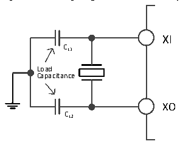
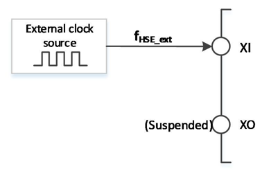

<!-- source-page: 16 -->

[← p.15](0015.md) · [index](../README.md) · [PDF p.16](https://ch32-riscv-ug.github.io/CH32M030/datasheet_en/CH32M030RM.PDF#page=16) · [p.17 →](0017.md)

<!-- header: CH32M030 Reference Manual https://wch-ic.com -->

### 3.3.2 High-speed Clock (HSI)

HSI is a high-speed clock signal generated by the system internal 8MHz RC oscillator. HSI RC oscillator can  
provide system clock without any external devices. It has a short start-up time. HSI is enabled and disabled by  
setting the HSION bit in the RCC_CTLR register, and the HSIRDY bit indicates whether the HSI RC oscillator is  
stable or not. The system defaults HSION and HSIRDY to 1 (It is recommended not to turn them off). If the  
HSIRDYIE bit in the RCC_INTR register is set, a corresponding interrupt will be generated.  
● Factory calibration: The difference of manufacturing process will cause different RC oscillation frequency  
for each chip, so HSI calibration is performed for each chip before it is shipped. After system reset, the  
factory calibration value is loaded into HSICAL[7:0] of the RCC_CTLR register.  
● User tuning: Based on different voltages or ambient temperatures, the application can adjust the HSI  
frequency by using the HSITRIM[4:0] bits in the RCC_CTLR register.  
HSE is an external high-speed clock signal, including external crystal/ceramic resonator generation or external  
high-speed clock input.  
● External crystal/ceramic resonator (HSE crystal): An external oscillator provides a more accurate clock  
source for the system. Further information can be found in the electrical characteristics section of the data  
sheet. The HSE crystal can be turned on and off by setting the HSEON bit in the RCC_CTLR register, and  
the HSERDY bit indicates whether the oscillation of the HSE crystal is stable, and the hardware sends the  
clock to the system only after the HSERDY bit is set. If the HSERDYIE bit in the RCC_INTR register is set,  
an interrupt will be generated.  

Figure 3-3 High speed external crystal circuit  
 <!-- rendered from the PDF; verify at https://ch32-riscv-ug.github.io/CH32M030/datasheet_en/CH32M030RM.PDF#page=16 -->

🖼 Text parsed from the figure above

XI  
CL1  
Load  
Capacitance  
XO  
CL2  

<em>Note: The load capacitance should be as close as possible to the oscillator pin, and the capacitance value should</em>  
<em>be selected according to the crystal manufacturer&#x27;s parameters.</em>  
● External high-speed clock source (HSE bypass): In this mode, the clock source is directly sent to the XI pin  
from the outside, and the XO pin is suspended. The application program needs to set the HSEBYP bit and  
turn on the HSE bypass function when the HSEON bit is 0, and then set the HSEON bit.  
● Figure 3-4 High speed clock source circuit  

 <!-- p16-draw-image-00002 rendered from the PDF -->

<!-- image: p16-draw-image-00001 bbox=[510.96, 783.36, 530.88, 793.92] -->
<!-- footer: V1.2 14 -->
