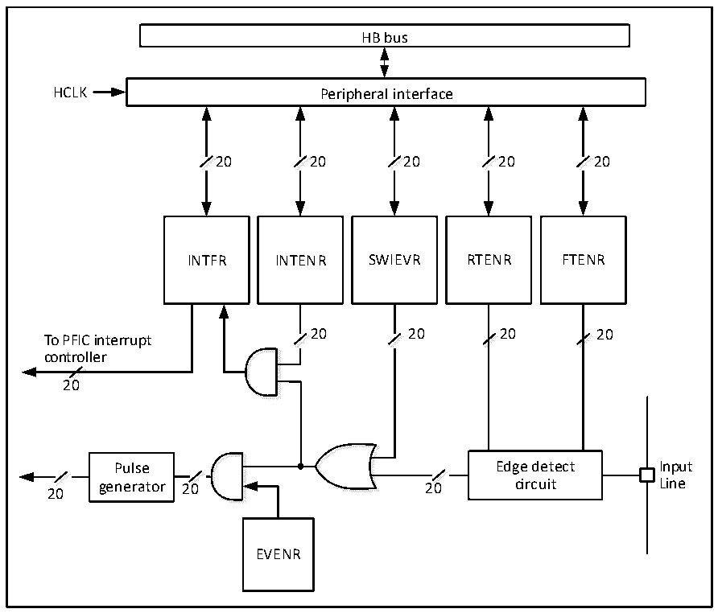

<!-- source-page: 34 -->

[← p.33](0033.md) · [index](../README.md) · [PDF p.34](https://ch32-riscv-ug.github.io/CH32M030/datasheet_en/CH32M030RM.PDF#page=34) · [p.35 →](0035.md)

<!-- header: CH32M030 Reference Manual https://wch-ic.com -->

## 5.4 External Interrupt and Event Controller (EXTI)

### 5.4.1 Overview

Figure 5-1 External interrupt (EXTI) interface block diagram  
 <!-- rendered from the PDF; verify at https://ch32-riscv-ug.github.io/CH32M030/datasheet_en/CH32M030RM.PDF#page=34 -->

🖼 Text parsed from the figure above

HB bus  
HCLK Peripheral interface  
20 20 20 20 20  
<!-- image: p34-draw-image-00002 inside the figure -->
<!-- image: p34-draw-image-00003 inside the figure -->
<!-- image: p34-draw-image-00004 inside the figure -->
<!-- image: p34-draw-image-00005 inside the figure -->
<!-- image: p34-draw-image-00006 inside the figure -->
<!-- image: p34-draw-image-00007 inside the figure -->
<!-- image: p34-draw-image-00008 inside the figure -->
<!-- image: p34-draw-image-00009 inside the figure -->
<!-- image: p34-draw-image-00010 inside the figure -->
<!-- image: p34-draw-image-00011 inside the figure -->
INTFR INTENR SWIEVR RTENR FTENR  
20 20 20 20  
To PFIC interrupt  
<!-- image: p34-draw-image-00022 inside the figure -->
<!-- image: p34-draw-image-00023 inside the figure -->
<!-- image: p34-draw-image-00024 inside the figure -->
<!-- image: p34-draw-image-00025 inside the figure -->
<!-- image: p34-draw-image-00026 inside the figure -->
<!-- image: p34-draw-image-00027 inside the figure -->
<!-- image: p34-draw-image-00028 inside the figure -->
<!-- image: p34-draw-image-00029 inside the figure -->
<!-- image: p34-draw-image-00016 inside the figure -->
<!-- image: p34-draw-image-00017 inside the figure -->
controller  
<!-- image: p34-draw-image-00012 inside the figure -->
<!-- image: p34-draw-image-00013 inside the figure -->
20  
<!-- image: p34-draw-image-00020 inside the figure -->
<!-- image: p34-draw-image-00021 inside the figure -->
<!-- image: p34-draw-image-00014 inside the figure -->
<!-- image: p34-draw-image-00015 inside the figure -->
Pulse Edge detect Input  
<!-- image: p34-draw-image-00030 inside the figure -->
<!-- image: p34-draw-image-00031 inside the figure -->
<!-- image: p34-draw-image-00032 inside the figure -->
<!-- image: p34-draw-image-00033 inside the figure -->
<!-- image: p34-draw-image-00018 inside the figure -->
<!-- image: p34-draw-image-00019 inside the figure -->
20 generator 20 20 circuit Line  
EVENR  

As can be seen from Figure 5-1, the trigger source of the external interrupt can be either a software interrupt  
(SWIEVR) or an actual external interrupt channel. The signal of the external interrupt channel will be screened by  
the edge detect circuit first. Whenever one of the software interrupt or external interrupt signals is generated, it  
will be output to 2 AND gate circuits, event enable and interrupt enable, through the OR gate circuit in the figure,  
as long as an interrupt is enabled or an event is enabled, an interrupt or an event will be generated. 6 registers of  
EXTI are accessed by the processor through the HB interface.  

### 5.4.2 Wake-up Event

The system can wake up the Sleep mode caused by the WFE command through a wake-up event. The wake-up  
event is generated by either of the following two configurations.  
● Enable an interrupt in a peripheral register, but not enabling this interrupt in the PFIC of the core, and  
enabling the SEVONPEND bit in the core at the same time. Embodied in EXTI, it is to enable an EXTI  
interrupt, but not to enable the EXTI interrupt in PFIC, and to enable the SEVONPEND bit at the same time.  
When the CPU wakes up from WFE, it needs to clear the EXTI interrupt flag bit and the PFIC pending bit.  
● Enable an EXTI channel as an event channel eliminates the need for the CPU to clear the interrupt flag bit  
and the PFIC pending bit after waking up from the WFE.  
<!-- image: p34-draw-image-00001 bbox=[510.96, 783.36, 530.88, 793.92] -->
<!-- footer: V1.2 32 -->
