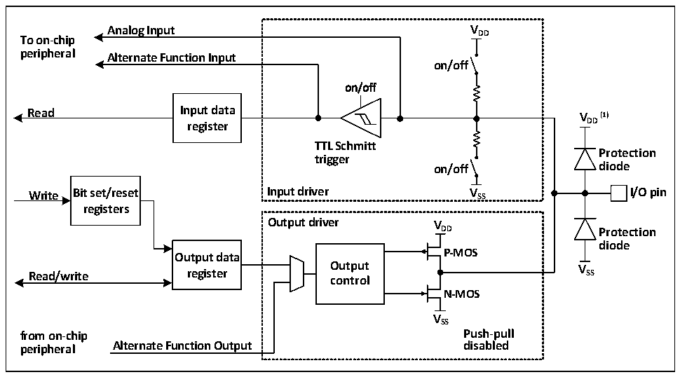

<!-- source-page: 55 -->

[← p.54](0054.md) · [index](../README.md) · [PDF p.55](https://ch32-riscv-ug.github.io/CH32M030/datasheet_en/CH32M030RM.PDF#page=55) · [p.56 →](0056.md)

<!-- header: CH32M030 Reference Manual https://wch-ic.com -->

## 6.2 Function Description

### 6.2.1 Overview

Figure 6-1 GPIO module basic structure block diagram  
 <!-- rendered from the PDF; verify at https://ch32-riscv-ug.github.io/CH32M030/datasheet_en/CH32M030RM.PDF#page=55 -->

🖼 Text parsed from the figure above

<strong>Analog Input V DD</strong>  
<strong>To on-chip</strong>  
<strong>peripheral Alternate Function Input</strong>  
<strong>on/off</strong>  
<strong>on/off</strong>  
<strong>Read Input data V (1)</strong>  
<strong>register DD</strong>  
<strong>TTL Schmitt</strong>  
<strong>Protection</strong>  
<strong>trigger</strong>  
<strong>on/off diode</strong>  
<strong>Write Bit set/reset Input driver V SS I/O pin</strong>  
<strong>registers</strong>  
<strong>Output driver V</strong>  
<strong>DD Protection</strong>  
<strong>diode</strong>  
<strong>Output data P-MOS</strong>  
<strong>Read/write register O co u n t t p r u o t l V SS</strong>  
<strong>N-MOS</strong>  
<strong>VSS</strong>  
<strong>from on-chip Push-pull</strong>  
<strong>peripheral Alternate Function Output disabled</strong>  

As shown in Figure 8-1 IO port structure, each pin has two protection diodes inside the chip, and the IO port can  
be internally divided into input and output driver modules. The input driver has a pull-up resistor and a pull-down  
resistor (Only for some of the IOs) to choose from, and can be connected to peripherals with analogue inputs such  
as AD; if the input is to a digital peripheral, it needs to go through a TTL Schmitt trigger and then be connected to  
a GPIO input register or other multiplexed peripherals. The output driver, on the other hand, has a pair of MOS  
tubes that can configure the IO port as a push-pull output; the output driver can also be configured internally as to  
whether the output is controlled by the GPIO or by another peripheral that is multiplexed.  

### 6.2.2 GPIO Initialization Function

Just after a reset, the GPIO ports are running in their initial state, when most IO ports are running in the floating  
input state, but there are also peripheral related pins that are running on the peripheral multiplexing function.  
Please refer to the relevant section of the pin description for the specific initialization function.  

### 6.2.3 External Interrupts

All GPIO ports can be configured with external interrupt input channels, but an external interrupt input channel  
can only be mapped to at most one GPIO pin, and the serial number of the external interrupt channel must be the  
same as the bit number of the GPIO port, for example, PA1 (Or PB1, PC1) can only be mapped to EXTI1, and  
EXTI1 can only accept one of PA1, PB1 or PC1, etc. The mapping of both parties is one-to-one.  

### 6.2.4 Alternate Functions

It is important to note that using the alternate function.  
● To use the alternate function in the input direction, the port must be configured in alternate input mode, and  
<!-- image: p55-draw-image-00001 bbox=[510.96, 783.36, 530.88, 793.92] -->
<!-- footer: V1.2 60 -->
