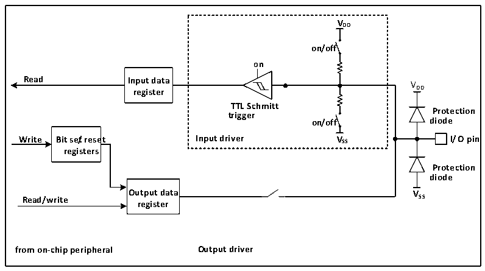

<!-- source-page: 56 -->

[← p.55](0055.md) · [index](../README.md) · [PDF p.56](https://ch32-riscv-ug.github.io/CH32M030/datasheet_en/CH32M030RM.PDF#page=56) · [p.57 →](0057.md)

<!-- header: CH32M030 Reference Manual https://wch-ic.com -->
the pull-down settings can be set according to actual needs.  
● To use the alternate function in the output direction, the port must be configured in alternate output mode.  
● For bidirectional alternate function, the port must be configured in alternate output mode, when the driver is  
configured in floating input mode  
The same I/O port may have multiple peripherals alternate to this pin, so in order to maximize the space for each  
peripheral, the alternate pins of peripherals can be remapped to other pins in addition to the default alternate pins,  
avoiding the occupied pins.  

### 6.2.5 Locking Mechanism

The locking mechanism locks the configuration of the I/O port. After a specific write sequence, the selected I/O  
pin configuration will be locked and cannot be changed until the next reset.  

### 6.2.6 Input Configuration

Figure 6-2 GPIO module input configuration structure block diagram  
 <!-- rendered from the PDF; verify at https://ch32-riscv-ug.github.io/CH32M030/datasheet_en/CH32M030RM.PDF#page=56 -->

🖼 Text parsed from the figure above

<strong>VDD</strong>  
<strong>on/off</strong>  
<strong>on</strong>  
<strong>Read Input data</strong>  
VDD  
<strong>register</strong>  
<strong>TTL Schmitt</strong>  
<strong>Protection</strong>  
<strong>trigger</strong>  
<strong>on/off diode</strong>  
<strong>Write Bit se/treset Input driver VSS I/O pin</strong>  
<strong>registers</strong>  
<strong>Protection</strong>  
<strong>diode</strong>  
<strong>Output data VSS</strong>  
<strong>Read/write</strong>  
<strong>register</strong>  
<strong>from on-chip peripheral Output driver</strong>  

When the IO port is configured in input mode, the output driver is disconnected, and the input pull-up and pull-  
down are optional (only some IO supports controllable pull-down), and the multiplexing function and analog input  
are not connected. The data on each IO port will be sampled into the input data register at each HB clock, and the  
level state of the corresponding pin will be obtained by reading the corresponding bit of the input data register.  
<!-- image: p56-draw-image-00001 bbox=[510.96, 783.36, 530.88, 793.92] -->
<!-- footer: V1.2 61 -->
