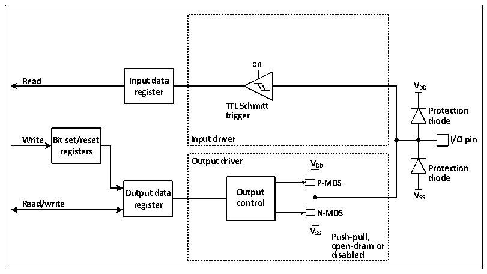
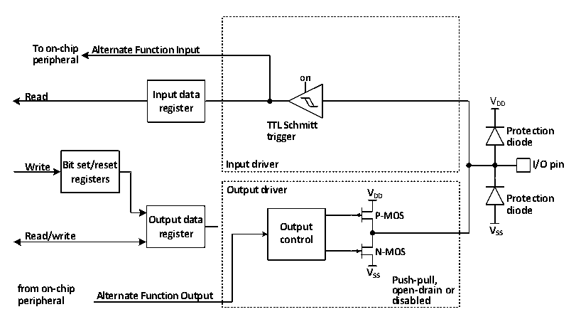

<!-- source-page: 57 -->

[← p.56](0056.md) · [index](../README.md) · [PDF p.57](https://ch32-riscv-ug.github.io/CH32M030/datasheet_en/CH32M030RM.PDF#page=57) · [p.58 →](0058.md)

<!-- header: CH32M030 Reference Manual https://wch-ic.com -->

### 6.2.7 Output Configuration

Figure 6-3 GPIO module output configuration structure block diagram  
 <!-- rendered from the PDF; verify at https://ch32-riscv-ug.github.io/CH32M030/datasheet_en/CH32M030RM.PDF#page=57 -->

🖼 Text parsed from the figure above

<strong>on</strong>  
<strong>Read Input data</strong>  
<strong>V</strong>  
<strong>register DD</strong>  
<strong>TTL Schmitt</strong>  
<strong>Protection</strong>  
<strong>trigger</strong>  
<strong>diode</strong>  
<strong>Write Bit set/reset Input driver I/O pin</strong>  
<strong>registers</strong>  
<strong>Output driver V</strong>  
<strong>DD Protection</strong>  
<strong>diode</strong>  
<strong>P-MOS</strong>  
<strong>Output data Output VSS</strong>  
<strong>Read/write register control</strong>  
<strong>N-MOS</strong>  
<strong>V</strong>  
<strong>SS Push-pull,</strong>  
<strong>open-drain or</strong>  
<strong>disabled</strong>  

When the IO port is configured in the output mode, a pair of MOS in the output driver can be configured in the  
push-pull or open-drain mode as required without using the alternate function. Input-driven pull-up and pull-down  
resistors are disabled, TTL Schmitt trigger is activated, and the level appearing on the IO pin will be sampled into  
the input data register at every HB clock, so reading the input data register will get the IO state, and in the push-  
pull output mode, accessing the output data register will get the last written value.  

### 6.2.8 Alternate Function Configuration

Figure 6-4 The structure of GPIO module when it is alternate by other peripherals  
 <!-- rendered from the PDF; verify at https://ch32-riscv-ug.github.io/CH32M030/datasheet_en/CH32M030RM.PDF#page=57 -->

🖼 Text parsed from the figure above

<strong>To on-chip Alternate Function Input</strong>  
<strong>peripheral</strong>  
<strong>on</strong>  
<strong>Read Input data V</strong>  
<strong>register DD</strong>  
<strong>TTL Schmitt</strong>  
<strong>Protection</strong>  
<strong>trigger</strong>  
<strong>diode</strong>  
<strong>Write Bit set/reset Input driver I/O pin</strong>  
<strong>registers</strong>  
<strong>Output driver V</strong>  
<strong>DD Protection</strong>  
<strong>diode</strong>  
<strong>Output data P-MOS</strong>  
<strong>Read/write register O co u n t t p r u o t l V SS</strong>  
<strong>N-MOS</strong>  
<strong>V</strong>  
<strong>SS Push-pull,</strong>  
<strong>from on-chip open-drain or</strong>  
<strong>Alternate Function Output</strong>  
<strong>peripheral disabled</strong>  

When the alternate function is enabled, the output driver is enabled and can be configured in open-drain or push-  
pull mode as required, the Schmidt trigger is also turned on, the input and output lines of the multiplexing  
function are connected, but the output data register is disconnected, and the level appearing on the IO pin will be  
sampled into the input data register every HB clock. In the open-drain mode, reading the input data register will  
get the current state of the IO port. In push-pull mode, reading the output data register will get the last written  
<!-- image: p57-draw-image-00001 bbox=[510.96, 783.36, 530.88, 793.92] -->
<!-- footer: V1.2 62 -->
