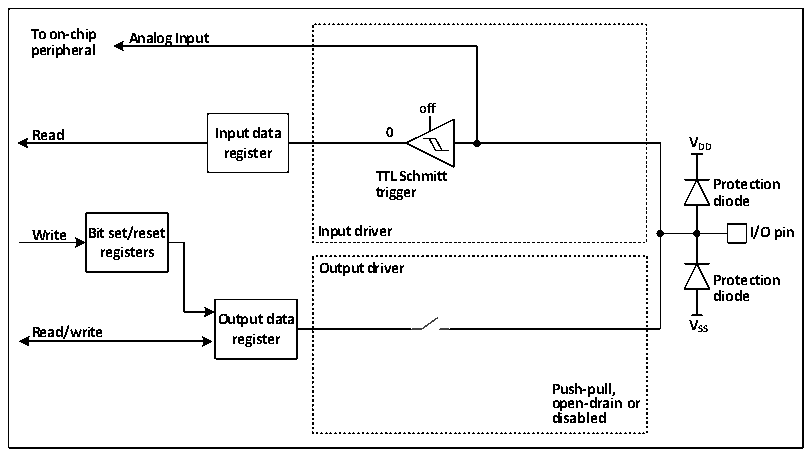
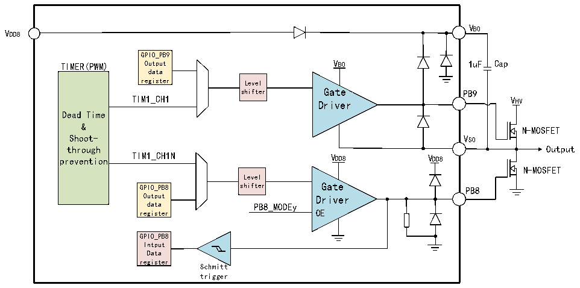

<!-- source-page: 58 -->

[← p.57](0057.md) · [index](../README.md) · [PDF p.58](https://ch32-riscv-ug.github.io/CH32M030/datasheet_en/CH32M030RM.PDF#page=58) · [p.59 →](0059.md)

<!-- header: CH32M030 Reference Manual https://wch-ic.com -->
value.  

### 6.2.9 Analog Input Configuration

Figure 6-5 The configuration structure when the GPIO module is used as an analog input  
 <!-- rendered from the PDF; verify at https://ch32-riscv-ug.github.io/CH32M030/datasheet_en/CH32M030RM.PDF#page=58 -->

🖼 Text parsed from the figure above

<strong>To on-chip Analog Input</strong>  
<strong>peripheral</strong>  
<strong>off</strong>  
<strong>Read Input data 0</strong>  
<strong>V</strong>  
<strong>register DD</strong>  
<strong>TTL Schmitt</strong>  
<strong>Protection</strong>  
<strong>trigger</strong>  
<strong>diode</strong>  
<strong>Write Bit set/reset Input driver I/O pin</strong>  
<strong>registers</strong>  
<strong>Output driver</strong>  
<strong>Protection</strong>  
<strong>diode</strong>  
<strong>Output data V</strong>  
<strong>Read/write SS</strong>  
<strong>register</strong>  
<strong>Push-pull,</strong>  
<strong>open-drain or</strong>  
<strong>disabled</strong>  

When the analog input is enabled, the output buffer is disconnected, the input of the Schmitt trigger in the input  
driver is disabled to prevent the generation of consumption on the I/O port, the pull-up and pull-down resistors are  
disabled, and the read input data register will always be 0.  

### 6.2.10 GPIO structure of MV

Figure 6-6 MV GPIO structure block diagram  
 <!-- rendered from the PDF; verify at https://ch32-riscv-ug.github.io/CH32M030/datasheet_en/CH32M030RM.PDF#page=58 -->

🖼 Text parsed from the figure above

VB0  
VDD8  
GPIO_PB9  
TIMER(PWM) Output VB0 1uF Cap  
data  
register Level  
shifter Gate PB9  
TIM1_CH1  
VHV  
Driver  
Dead Time  
&amp;  
N-MOSFET  
Shoot- VS0  
through Output  
prevention TIM1_CH1N VDD8 VDD8  
N-MOSFET  
Level  
GPIO_PB8 shifter Gate PB8  
Output Driver  
data PB8_MODEy  
register OE  
GPIO_PB8  
Intput  
Data  
register  
Schmitt  
trigger  

<em>Note: Cap is an off-chip capacitor of 1uF; N-MOSFET is an off-chip N-MOSFET power transistor.</em>  
CH32M030 integrates 4 independent half-bridge drivers, each half-bridge includes a low-voltage bootstrap diode,  
high-side and low-side level shift circuits, high-side and low-side output drive circuits, and supports four pairs of  
<!-- image: p58-draw-image-00001 bbox=[510.96, 783.36, 530.88, 793.92] -->
<!-- footer: V1.2 63 -->
