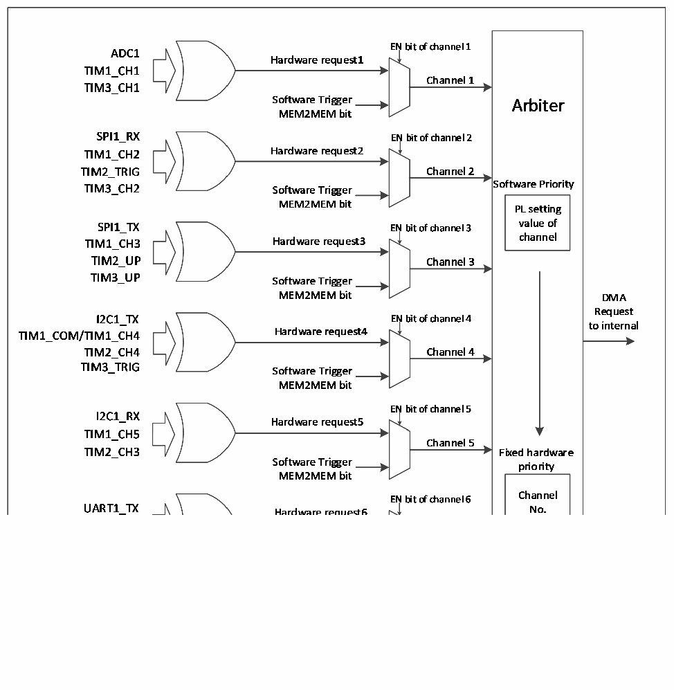

<!-- source-page: 74 -->

[← p.73](0073.md) · [index](../README.md) · [PDF p.74](https://ch32-riscv-ug.github.io/CH32M030/datasheet_en/CH32M030RM.PDF#page=74) · [p.75 →](0075.md)

<!-- header: CH32M030 Reference Manual https://wch-ic.com -->

### 7.2.3 DMA Request Mapping

The DMA controller provides 7 channels, each of which corresponds to multiple peripheral requests. By setting  
the corresponding DMA control bits in the corresponding peripheral registers, the DMA function of each  
peripheral can be independently turned on or off.  

Figure 7-1 DMA request image  
 <!-- rendered from the PDF; verify at https://ch32-riscv-ug.github.io/CH32M030/datasheet_en/CH32M030RM.PDF#page=74 -->

🖼 Text parsed from the figure above

<!-- image: p74-draw-image-00002 inside the figure -->
<!-- image: p74-draw-image-00003 inside the figure -->
<!-- image: p74-draw-image-00004 inside the figure -->
<!-- image: p74-draw-image-00005 inside the figure -->

<!-- p74-table-001 (table-7-1@1) pages 74-75 -->
<table><tr><th>Peripheral</th><th>Channel1</th><th>Channel 2</th><th>Channel 3</th><th>Channel 4</th><th>Channel 5</th><th>Channel 6</th><th>Channel 7</th></tr><tr><td>ADC</td><td>ADC</td><td></td><td></td><td></td><td></td><td></td><td></td></tr><tr><td>SPI1</td><td></td><td>SPI1_RX</td><td>SPI1_TX</td><td></td><td></td><td></td><td></td></tr><tr><td>UART1</td><td></td><td></td><td></td><td></td><td></td><td style="text-align:left">UART1_TX</td><td style="text-align:left">UART1_RX</td></tr><tr><td>I2C1</td><td></td><td></td><td></td><td>I2C1_TX</td><td>I2C1_RX</td><td></td><td></td></tr><tr><td>TIM1</td><td style="text-align:left">TIM1_CH1</td><td style="text-align:left">TIM1_CH2</td><td style="text-align:left">TIM1_CH3</td><td style="text-align:left">TIM1_CH4TIM1_COM</td><td style="text-align:left">TIM1_CH5</td><td>TIM1_UP</td><td style="text-align:left">TIM1_TRIG</td></tr><tr><td>TIM2</td><td></td><td style="text-align:left">TIM2_TRIG</td><td>TIM2_UP</td><td style="text-align:left">TIM2_CH4</td><td style="text-align:left">TIM2_CH3</td><td style="text-align:left">TIM2_CH2</td><td style="text-align:left">TIM2_CH1</td></tr><tr><td>TIM3</td><td style="text-align:left">TIM3_CH1</td><td style="text-align:left">TIM3_CH2</td><td>TIM3_UP</td><td style="text-align:left">TIM3_TRIG</td><td></td><td></td><td></td></tr></table>

<!-- image: p74-draw-image-00001 bbox=[510.96, 783.36, 530.88, 793.92] -->
<!-- footer: V1.2 79 -->
