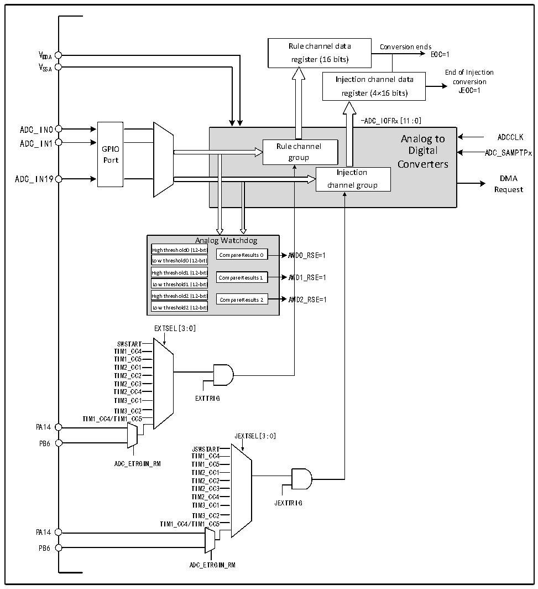

<!-- source-page: 80 -->

[← p.79](0079.md) · [index](../README.md) · [PDF p.80](https://ch32-riscv-ug.github.io/CH32M030/datasheet_en/CH32M030RM.PDF#page=80) · [p.81 →](0081.md)

<!-- header: CH32M030 Reference Manual https://wch-ic.com -->

## 8.2 Functional Description

### 8.2.1 Module Structure

Figure 8-1 ADC module block diagram  
 <!-- rendered from the PDF; verify at https://ch32-riscv-ug.github.io/CH32M030/datasheet_en/CH32M030RM.PDF#page=80 -->

🖼 Text parsed from the figure above

Rule channel data Conversion ends  
V EOC=1  
DDA register (16 bits)  
V  
SSA End of Injection  
Injection channel data conversion  
register (4×16 bits) JEOC=1  
-ADC_IOFRx[11:0]  
GPIOPort  
Analog to Rule channel Digital group Converters Injection channel group  
ADC_IN0  
Analog to ADCCLK  
ADC_IN1  
ADC_IN19 DMA  
Request  
Analog Watchdog  
High threshold0 (12-bit)  
Compare Results 0 AWD0_RSE=1  
Low threshold0 (12-bit)  
High threshold1 (12-bit) Compare Results 1 AWD1_RSE=1  
Low threshold1 (12-bit)  
High threshold2 (12-bit) Compare Results 2 AWD2_RSE=1  
Low threshold2 (12-bit)  
EXTSEL[3:0]  
SWSTART  
TIM1_CC4  
TIM1_CC5  
TIM2_CC1  
TIM2_CC2  
TIM2_CC3  
TIM2_CC4  
TIM3_CC1 EXTTRIG  
TIM3_CC2  
TIM1_CC4/TIM1_CC5  
PA14  
JEXTSEL[3:0]  
PB6  
JSWSTART  
TIM1_CC4  
ADC_ETRGIN_RM TIM1_CC5  
TIM2_CC1  
TIM2_CC2  
TIM2_CC3  
TIM2_CC4  
TIM3_CC1 JEXTTRIG  
TIM3_CC2  
TIM1_CC4/TIM1_CC5  
PA14  
PB6  
ADC_ETRGIN_RM  

### 8.2.2 ADC Configuration

1) Module power-up  
An ADON bit of 1 in the ADC_CTLR2 register indicates that the ADC module is powered up. When the ADC  
module enters the power-up state (ADON=1) from the power-down mode (ADON=0), a delay period t is  
STAB  
required for the module stabilization time. After that, the ADON bit is written to 1 again and is used as the start  
signal for software to start the ADC conversion. By clearing the ADON bit to 0, the current conversion can be  
<!-- image: p80-draw-image-00001 bbox=[510.96, 783.36, 530.88, 793.92] -->
<!-- footer: V1.2 85 -->
