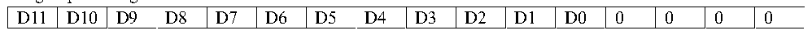
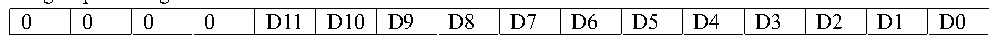

<!-- source-page: 82 -->

[← p.81](0081.md) · [index](../README.md) · [PDF p.82](https://ch32-riscv-ug.github.io/CH32M030/datasheet_en/CH32M030RM.PDF#page=82) · [p.83 →](0083.md)

<!-- header: CH32M030 Reference Manual https://wch-ic.com -->
can be sampled separately using a different time.  
The total conversion time is calculated as follows.  
TCONV= sampling time + 12.5TADCCLK  
The ADC&#x27;s rule channel conversion supports the DMA function. The value of the rule channel conversion is stored  
in a data-only register, ADC_RDATAR. To prevent the data in ADC_RDATAR register from being fetched in time  
when multiple rule channels are converted in succession, the DMA function of ADC can be enabled. The  
hardware will generate a DMA request at the end of the conversion of a rule channel (EOC set) and transfer the  
converted data from the ADC_RDATAR register to the user-specified destination address.  
After the channel configuration of the DMA controller module is completed, write DMA position 1 of the  
ADC_CTLR2 register to enable the DMA function of the ADC.  
<em>Note: Injection group conversion does not support DMA function.</em>  
<strong>6) Data alignment</strong>  
The ALIGN bit in the ADC_CTLR2 register selects the alignment of the ADC converted data storage. 12-bit data  
supports left-aligned and right-aligned modes.  
The data register ADC_RDATAR of the rule group channel holds the actual converted 12-bit digital value; while  
the data register ADC_IDATARx of the injection group channel is the actual converted data minus the value  
written after the offset defined in the ADC_IOFRx register, there will be positive and negative cases, so there are  
sign bits (SIGNB).  

Figure 8-2 Data left alignment  
 <!-- rendered from the PDF; verify at https://ch32-riscv-ug.github.io/CH32M030/datasheet_en/CH32M030RM.PDF#page=82 -->

Rule group data register  

🖼 Text parsed from the figure above

D11  D10  D9  D8  D7  D6  D5  D4  D3  D2  D1  D0  0  0  0  0  

Inject group data register  

<!-- p82-table-002 (table-7-2@1) -->
<table><tr><th>SIGNB</th><th>D11</th><th>D10</th><th>D9</th><th>D8</th><th>D7</th><th>D6</th><th>D5</th><th>D4</th><th>D3</th><th>D2</th><th>D1</th><th>D0</th><th>0</th><th>0</th><th>0</th></tr></table>

Figure 8-3 Data right alignment  
 <!-- rendered from the PDF; verify at https://ch32-riscv-ug.github.io/CH32M030/datasheet_en/CH32M030RM.PDF#page=82 -->

Rule group data register  

🖼 Text parsed from the figure above

0  0  0  0  D11  D10  D9  D8  D7  D6  D5  D4  D3  D2  D1  D0  

Inject group data register  

<!-- p82-table-004 (table-7-2@1) -->
<table><tr><th>SIGNB</th><th>SIGNB</th><th>SIGNB</th><th>SIGNB</th><th>D11</th><th>D10</th><th>D9</th><th>D8</th><th>D7</th><th>D6</th><th>D5</th><th>D4</th><th>D3</th><th>D2</th><th>D1</th><th>D0</th></tr></table>

### 8.2.3 External Trigger Source

The ADC conversion start event can be triggered by an external event. If the EXTTRIG or JEXTTRIG bits of the  
ADC_CTLR2 register are set, the conversion of a rule group or injection group channel can be triggered by an  
external event, respectively. In this case, the configuration of EXTSEL[3:0] and JEXTSEL[3:0] bits determines  
the external event source for the rule group and injection group.  
<em>Note: When the external trigger signal is selected as ADC rule or injection conversion, only its rising edge can</em>  
<em>start the conversion.</em>  

<!-- p82-table-005 (table-8-1@1) pages 82-83 -->
<table><caption>Table 8-1 External trigger sources for rule group channels</caption><tr><th>EXTSEL[3:0]</th><th>Trigger source</th><th>Type</th></tr><tr><td>0000</td><td>SWSTART bit 1 software trigger</td><td>Software control bit</td></tr><tr><td>0001</td><td>CC4 event of timer 1</td><td rowspan="8" style="text-align:left">Internal signal from on-chip timer</td></tr><tr><td>0010</td><td>CC5 event of timer 1</td></tr><tr><td>0011</td><td>CC1 event of timer 2</td></tr><tr><td>0100</td><td>CC2 event of timer 2</td></tr><tr><td>0101</td><td>CC3 event of timer 2</td></tr><tr><td>0110</td><td>CC4 event of timer 2</td></tr><tr><td>0111</td><td>CC1 event of timer 3</td></tr><tr><td>1000</td><td>CC2 event of timer 3</td></tr><tr><td>1001</td><td>PA14/PB6 event</td><td>From external pin</td></tr><tr><td>1010</td><td>CC4 event /CC5 event of timer 1</td><td style="text-align:left">Internal signal from on-chip timer</td></tr></table>

<!-- image: p82-draw-image-00001 bbox=[510.96, 783.36, 530.88, 793.92] -->
<!-- footer: V1.2 87 -->
