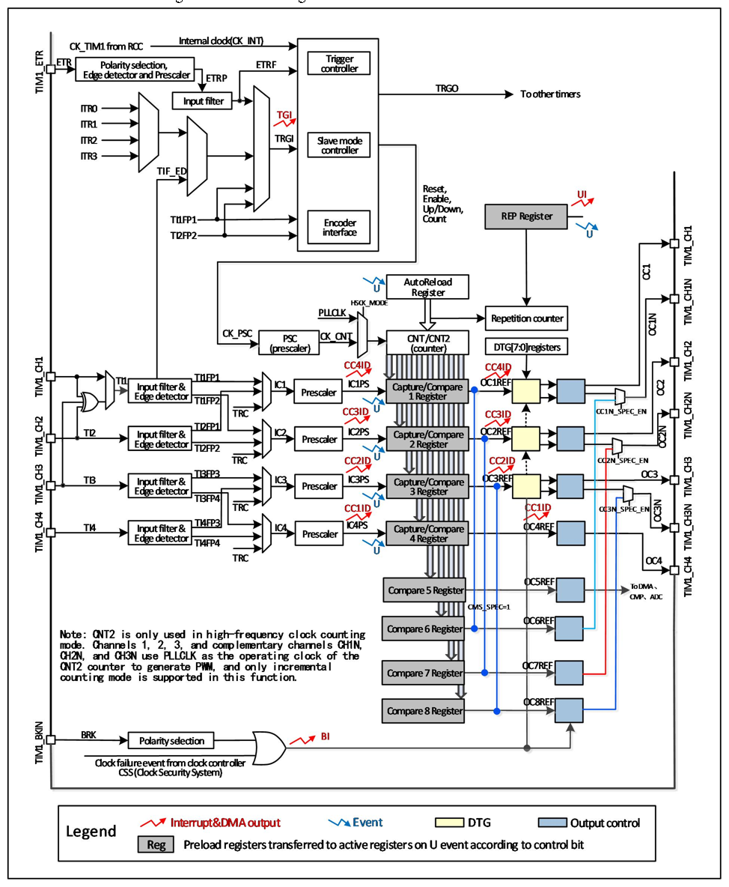

<!-- source-page: 103 -->

[← p.102](0102.md) · [index](../README.md) · [PDF p.103](https://ch32-riscv-ug.github.io/CH32M030/datasheet_en/CH32M030RM.PDF#page=103) · [p.104 →](0104.md)

<!-- header: CH32M030 Reference Manual https://wch-ic.com -->
input and output modes. The input of each channel of the compare capture register supports filtering, frequency  
division, edge detection and other operations, and supports mutual triggering between channels, and can also  
provide a clock for the core counter CNT. Each comparison capture channel has a set of compare capture registers  
(CHxCVR), which support comparison with the main counter (CNT) and output pulses.  

Figure 9-1 Block diagram of advanced-control timer structure  
 <!-- rendered from the PDF; verify at https://ch32-riscv-ug.github.io/CH32M030/datasheet_en/CH32M030RM.PDF#page=103 -->

🖼 Text parsed from the figure above

<!-- image: p103-draw-image-00002 inside the figure -->

<!-- image: p103-draw-image-00001 bbox=[515.52, 783.36, 535.44, 793.92] -->
<!-- footer: V1.2 108 -->
