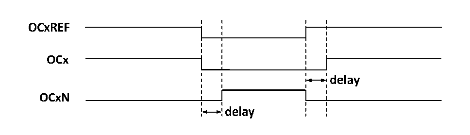

<!-- source-page: 110 -->

[← p.109](0109.md) · [index](../README.md) · [PDF p.110](https://ch32-riscv-ug.github.io/CH32M030/datasheet_en/CH32M030RM.PDF#page=110) · [p.111 →](0111.md)

<!-- header: CH32M030 Reference Manual https://wch-ic.com -->
bit dead-time generator. OCx and OCxN are generated by the OCxREF association. If both OCx and OCxN are  
high active, then OCx is the same as OCxREF except that the rising edge of OCx is equivalent to OCxREF with a  
delay, and OCxN is the opposite of OCxREF in that its rising edge will have a delay relative to the falling edge of  
the reference signal. If the delay is greater than the effective output width, the corresponding pulse will not be  
generated.  
The relationship between OCx and OCxN and OCxREF is illustrated in Figure 12-4, which shows the dead-time.  

Figure 9-4 Complementary outputs and dead-time insertion  
 <!-- rendered from the PDF; verify at https://ch32-riscv-ug.github.io/CH32M030/datasheet_en/CH32M030RM.PDF#page=110 -->

🖼 Text parsed from the figure above

<!-- image: p110-draw-image-00002 inside the figure -->
<!-- image: p110-draw-image-00003 inside the figure -->
<!-- image: p110-draw-image-00006 inside the figure -->
<!-- image: p110-draw-image-00004 inside the figure -->
<!-- image: p110-draw-image-00005 inside the figure -->

### 9.3.7 Dead-time Asymmetry

On the basis of complementary output configuration and dead-time control, by configuring the DT_VLU2 register  
(the configuration value should be greater than 0 and less than the number of TDTGs set in the TIM1_BDTR  
register DTG[7:0]), the DTP_MODE bit or DTN_MODE bit is configured to select the dead-time of DT_VLU2  
configuration to occur on the rising or falling edge of OCXREF. The dead time asymmetry is realized by this  
method.  

### 9.3.8 Brake Signal

When the brake signal is generated, the output enable signal and invalid level are modified according to the MOE,  
OIS, OISN, OSSI, and OSSR bits. However, OCx and OCxN will not be at the active level at any time. The  
source of the brake event can come from the brake input pin or it can be a clock failure event which is generated  
by the CSS (Clock Safety System).  
After system reset, the brake function is disabled by default (MOE bit is low), and setting the BKE bit enables the  
brake function. The polarity of the input brake signal can be set by setting BKP, and the BKE and BKP signals can  
be written at the same time, and there is a delay of one HB clock before the actual writing, so you need to wait for  
one HB cycle to read the written value correctly.  
At the presence of the selected level on the brake pin the system will generate the following actions.  
1) The MOE bit is cleared asynchronously, setting the output to an invalid, idle or reset state, depending on the  
setting of the SOOI bit.  
2) After the MOE has been cleared, each output channel outputs a level determined by OISx.  
3) When using complementary outputs: the outputs are placed in a null state, depending on the polarity.  
4) If the BIE is set, an interrupt is generated when the BIF is set; if the BDE bit is set, a DMA request is  
generated.  
5) If the AOE is set, the MOE bit is automatically set at the next update event UEV.  
<!-- image: p110-draw-image-00001 bbox=[515.52, 783.36, 535.44, 793.92] -->
<!-- footer: V1.2 115 -->
