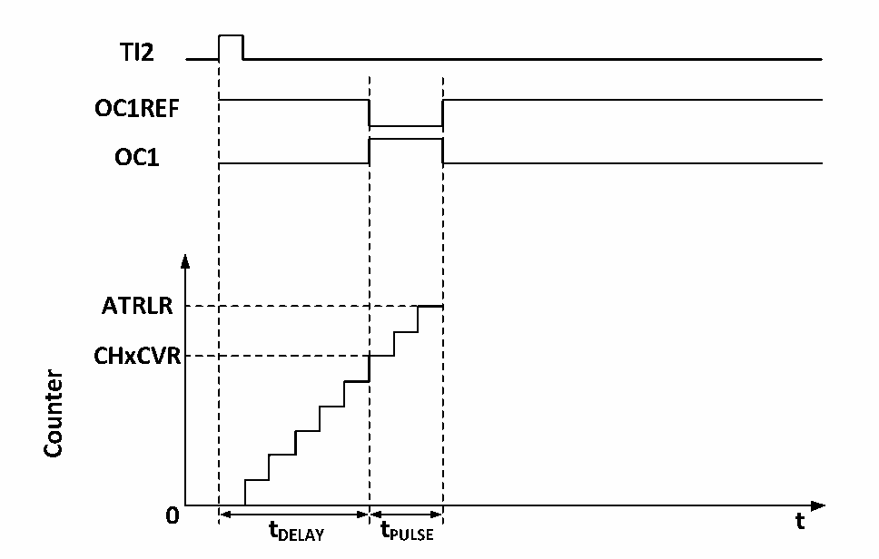

<!-- source-page: 111 -->

[← p.110](0110.md) · [index](../README.md) · [PDF p.111](https://ch32-riscv-ug.github.io/CH32M030/datasheet_en/CH32M030RM.PDF#page=111) · [p.112 →](0112.md)

<!-- header: CH32M030 Reference Manual https://wch-ic.com -->

### 9.3.9 One-pulse Mode

One-pulse mode (OPM) can be used to allow the microcontroller to respond to a specific event by causing it to  
generate a pulse after a delay, with the delay and width of the pulse programmable. Placing the OPM bit allows  
the core counter to stop when the next update event UEV is generated (Counter flips to 0).  
As shown in Figure 9-5, a positive pulse of length Tpulse needs to be generated on OC1 after a delay Tdelay at the  
beginning of a rising edge detected on the TI2 input pin.  

Figure 9-5 Generation of one pulse mode  
 <!-- rendered from the PDF; verify at https://ch32-riscv-ug.github.io/CH32M030/datasheet_en/CH32M030RM.PDF#page=111 -->

🖼 Text parsed from the figure above

<!-- image: p111-draw-image-00003 inside the figure -->
<!-- image: p111-draw-image-00002 inside the figure -->
<!-- image: p111-draw-image-00004 inside the figure -->
<!-- image: p111-draw-image-00005 inside the figure -->
<!-- image: p111-draw-image-00006 inside the figure -->
<!-- image: p111-draw-image-00007 inside the figure -->
<!-- image: p111-draw-image-00008 inside the figure -->
<!-- image: p111-draw-image-00015 inside the figure -->
<!-- image: p111-draw-image-00016 inside the figure -->
<!-- image: p111-draw-image-00017 inside the figure -->
<!-- image: p111-draw-image-00009 inside the figure -->
<!-- image: p111-draw-image-00014 inside the figure -->
<!-- image: p111-draw-image-00010 inside the figure -->
<!-- image: p111-draw-image-00012 inside the figure -->
<!-- image: p111-draw-image-00013 inside the figure -->
<!-- image: p111-draw-image-00011 inside the figure -->

1) Set TI2 to trigger. Setting the CC2S field to 01b to map TI2FP2 to TI2; setting the CC2P bit to 0b to set  
TI2FP2 as rising edge detection; setting the TS field to 110b to set TI2FP2 as trigger source; setting the SMS  
field to 110b to set TI2FP2 to be used to start the counter.  
2) Tdelay is determined by the value of the Compare Capture Register, and Tpulse is determined by the value of  
the Auto Reload Value Register and the Compare Capture Register.  

### 9.3.10 Encoder Mode

The encoder mode is a typical application of the timer and can be used to access the biphasic output of the encoder.  
The counting direction of the core counter is synchronized with the direction of the encoder&#x27;s rotation axis, and  
each pulse output from the encoder will cause the core counter to add or subtract one. To use the encoder, set the  
SMS field to 001b (Count only on TI2 edge), 010b (Count only on TI1 edge) or 011b (Count on both TI1 and TI2  
edges), connect the encoder to the input of comparison capture channels 1 and 2, and set a value for the reload  
value register, which can be set to a larger value. When in encoder mode, the internal compare capture register,  
prescaler, repeat count register, etc. of the timer are working normally. The following table shows the relationship  
between the counting direction and the encoder signal.  
<!-- image: p111-draw-image-00001 bbox=[515.52, 783.36, 535.44, 793.92] -->
<!-- footer: V1.2 116 -->
